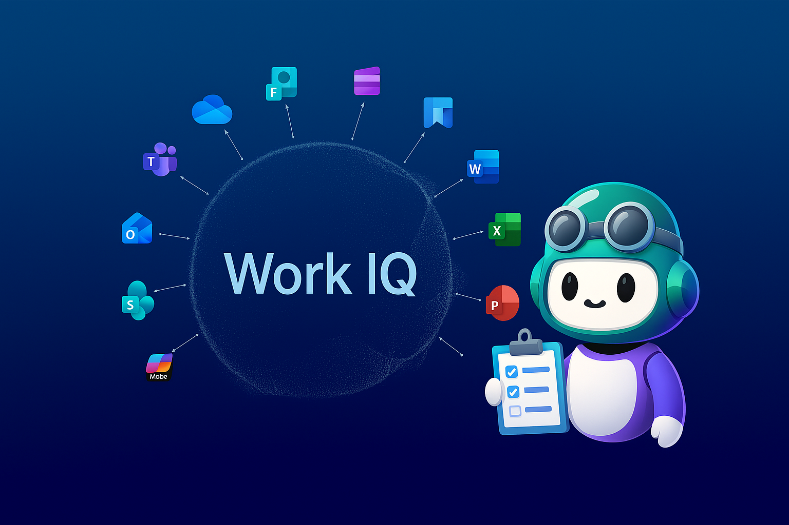

# MCAPS Copilot Tools

> **Your AI-powered sales operations toolkit for MCAPS.**
> Talk to Copilot in plain English to manage MSX opportunities, milestones, and tasks — no coding required.

MCAPS Copilot Tools connects GitHub Copilot (in VS Code) to your MSX CRM and Microsoft 365 data through [MCP (Model Context Protocol)](https://modelcontextprotocol.io/) servers. Instead of clicking through MSX screens, you describe what you need in the Copilot chat window and the tools do it for you.

**What can it do?**

- **Read MSX data** — look up opportunities, milestones, tasks, and ownership.
- **Update MSX records** — create tasks, close milestones, update statuses (with confirmation before any write).
- **Search M365 evidence** — find relevant Teams chats, meeting transcripts, emails, and documents via WorkIQ.
- **Role-aware guidance** — the system knows MCAPS roles (SE, CSA, CSAM, Specialist) and tailors its behavior accordingly.

---

## Quick Start (5 Minutes)

> **Prerequisites:**
> - **Connected to the Microsoft corporate VPN** (required to reach internal CRM endpoints)
> - A **Microsoft corp account** (used for `az login` authentication)
> - A GitHub Copilot-compatible IDE such as [VS Code](https://code.visualstudio.com/) (or [VS Code Insiders](https://code.visualstudio.com/insiders/)) with the [GitHub Copilot extension](https://marketplace.visualstudio.com/items?itemName=GitHub.copilot-chat), **or** the [GitHub Copilot CLI](https://docs.github.com/en/copilot/github-copilot-in-the-cli/installing-github-copilot-in-the-cli)
> - [Node.js 18+](https://nodejs.org/)
> - [Azure CLI](https://learn.microsoft.com/cli/azure/install-azure-cli)

### Step 1: Clone and install
```bash
git clone https://github.com/JinLee794/mcaps-copilot-tools.git
cd mcaps-copilot-tools/mcp/msx
npm install
```

### Step 2: Sign in to Azure

The MSX CRM tools authenticate through Azure CLI. Make sure you are **connected to the Microsoft VPN** and sign in with your **Microsoft corp account**:

```bash
az login
```

> **Important:** You must be on the corporate VPN and use a Microsoft account (e.g., `your-alias@microsoft.com`). Personal or third-party accounts will not have access to MSX CRM.

### Step 3: Open the repo in VS Code

```bash
# from the repo root
code .
```

### Step 4: Start the MCP servers

1. Open the file `.vscode/mcp.json` in VS Code. You should see a **"Start"** button above each server definition.
2. Click **Start** on `msx-crm` (required) and `workiq` (optional, for M365 searches).
3. That's it — the tools are now available inside Copilot chat.

### Step 5: Open Copilot and start chatting

Open the GitHub Copilot chat panel (`Ctrl+Shift+I` / `Cmd+Shift+I`) and try one of the example prompts below.

---

## Example Prompts to Get Started

Copy-paste any of these into the Copilot chat window after you've started the MCP servers.

### Getting oriented

| What you want | Prompt to try |
|---|---|
| Check your CRM identity | `Who am I in MSX? Use crm_whoami to check.` |
| See your role | `What's my MSX role?` |
| Understand what tools are available | `What MCP tools do I have available for MSX?` |

### Reading CRM data

| What you want | Prompt to try |
|---|---|
| List your opportunities | `Show me my active opportunities for Contoso.` |
| Check milestones for an opportunity | `What milestones are on the Contoso Azure Migration opportunity?` |
| Find milestones that need tasks | `Which of my milestones across Contoso and Fabrikam are missing tasks?` |
| View a milestone timeline | `Show me a timeline view of milestones for Contoso.` |

### Writing CRM data (with confirmation)

> **⚠️ Write operations are disabled by default.** The tools below (create, update, close) are included in the codebase but should be considered **experimental**. They use a staged approval flow — changes are previewed before anything touches CRM — but CRM is production data shared across your account team. **Enable write operations at your own risk.** Always review staged changes carefully before approving, and use AI responsibly. See [Write Operations & Responsible AI Use](#write-operations--responsible-ai-use) for details.

| What you want | Prompt to try |
|---|---|
| Create a task | `Create a task under the "Cloud Assessment" milestone for Contoso: "Schedule architecture review with customer" due next Friday.` |
| Close a task | `Close the "Schedule architecture review" task for Contoso — it's done.` |
| Update a milestone | `Update the Cloud Assessment milestone status to "On Track".` |

> **Note:** All write operations use a **Stage → Review → Execute** flow. Nothing is written to CRM until you explicitly approve.

### Searching M365 evidence (WorkIQ)

| What you want | Prompt to try |
|---|---|
| Find meeting notes | `What was discussed in my last meeting with the Contoso team?` |
| Search Teams chats | `Find recent Teams messages about the Fabrikam deal.` |
| Look up emails | `Show me recent emails from the Contoso stakeholders about the migration timeline.` |

### Role-based workflows

| What you want | Prompt to try |
|---|---|
| Work as a Solution Engineer | `I'm a Solution Engineer. What milestones should I focus on for Contoso this week?` |
| Work as a CSAM | `As a CSAM, walk me through my milestone hygiene for this quarter.` |
| Weekly milestone review | `Run a weekly milestone hygiene check across all my active customers.` |

---

## Optional: Enable Obsidian Vault Integration

If you use [Obsidian](https://obsidian.md/) as a local knowledge base, you can connect it as an additional MCP server. This gives Copilot read/write access to your vault for durable customer notes, prior findings, and session context.

### How to enable it

1. Open `.vscode/mcp.json` in your editor.
2. Find the commented-out `"mcp-obsidian"` block (around line 23).
3. Uncomment the entire block so it looks like this:

```jsonc
"mcp-obsidian": {
    "command": "npx",
    "args": [
        "@mauricio.wolff/mcp-obsidian@latest",
        "${input:obsidianVaultPath}"
    ]
},
```

4. When prompted, enter the absolute path to your Obsidian vault (e.g., `/Users/yourname/Documents/MyVault`).
   - Alternatively, set the `OBSIDIAN_VAULT_PATH` environment variable and it will use that as the default.
5. Click **Start** on `mcp-obsidian` in VS Code just like the other servers.

> **Don't use Obsidian?** No worries — everything works without it. The system operates statelessly (CRM-only) and you can bring your own persistence layer if desired.

---

## Project Layout

| Folder | What's inside | Editable? |
|---|---|---|
| `.github/copilot-instructions.md` | Global Copilot behavior — the "system prompt" | **Yes** — your main customization lever |
| `.github/instructions/` | Operational rules loaded by keyword match | **Yes** — add your team's workflow gates |
| `.github/skills/` | Role-specific playbooks (SE, CSA, CSAM, Specialist) | **Yes** — tailor to your operating model |
| `.github/prompts/` | Reusable prompt templates (slash commands) | **Yes** — create workflows you repeat often |
| `.vscode/mcp.json` | MCP server definitions (CRM, WorkIQ, Obsidian) | **Yes** — add/remove data sources |
| `mcp/msx/` | Node.js MCP server source code (the engine) | Optional — works out of the box |
| `docs/` | Architecture docs and supporting material | Reference only |

> **Start here:** Open any file in `.github/` and read it. They're all plain Markdown. See the [Customization](#customization--make-it-yours) section for step-by-step examples.

## What's Included

### MSX CRM MCP Tools

These tools let Copilot interact with MSX CRM on your behalf:

| Tool | What it does |
|---|---|
| Tool | What it does |
|---|---|
| `crm_whoami` | Checks who you are in MSX (validates authentication) |
| `crm_query` | Runs read-only OData queries against CRM |
| `crm_get_record` | Fetches a specific CRM record by ID |
| `list_opportunities` | Lists opportunities, filterable by customer |
| `get_milestones` | Lists milestones for an opportunity or owner |
| `find_milestones_needing_tasks` | Finds milestones across customers that need task attention |
| `view_milestone_timeline` | Returns a timeline view of milestones |
| `view_opportunity_cost_trend` | Returns cost trend data for an opportunity |
| `create_task` | ⚠️ Creates a new task under a milestone *(write — staged)* |
| `update_task` / `close_task` | ⚠️ Updates or closes an existing task *(write — staged)* |
| `update_milestone` | ⚠️ Updates milestone status or details *(write — staged)* |

### Role Skills

The system includes pre-built role definitions that shape how Copilot approaches your workflows:

- **[Solution Engineer](.github/skills/Solution_Engineer_SKILL.md)** — technical win execution, architecture reviews, proof-of-concept work
- **[Cloud Solution Architect](.github/skills/Cloud_Solution_Architect_SKILL.md)** — cloud architecture, migration planning, technical design
- **[Customer Success Account Manager](.github/skills/CSAM_SKILL.md)** — milestone delivery, consumption tracking, customer health
- **[Specialist](.github/skills/Specialist_SKILL.md)** — deal qualification, pipeline support, solution area depth

You don't need to memorize these — just tell Copilot your role and it will apply the right behavior.

### WorkIQ (M365 Evidence Retrieval)

WorkIQ connects Copilot to your Microsoft 365 data. It can search across:

- **Teams** — chat/thread decisions, channel updates, action ownership
- **Meetings** — transcript evidence, decisions, blockers, next steps
- **Outlook** — stakeholder communication trail, commitments, follow-ups
- **SharePoint/OneDrive** — latest proposal/design docs and revision context

Learn more: [WorkIQ overview (Microsoft Learn)](https://learn.microsoft.com/en-us/microsoft-365-copilot/extensibility/workiq-overview)

---

## Write Operations & Responsible AI Use

> **CRM is shared production data.** Incorrect writes can affect your entire account team and customer-facing records. Use AI-assisted write operations responsibly.

### Current status: writes are experimental

The write tools (`create_task`, `update_task`, `close_task`, `update_milestone`) are included in the MCP server but should be treated as **experimental**. They are designed with safety guardrails, but you should understand the risks before relying on them.

### How write safety works

All write operations use a **Stage → Review → Execute** pattern (see [STAGED_OPERATIONS.md](mcp/msx/STAGED_OPERATIONS.md) for technical details):

1. **Stage** — When you ask Copilot to create/update/close a record, the change is validated and staged locally. **Nothing is written to CRM yet.**
2. **Review** — Copilot shows you a before/after diff of the proposed change and asks for your approval.
3. **Execute** — Only after you explicitly approve does the change get sent to CRM. You can cancel at any time.

Staged operations expire automatically after 10 minutes if not acted on.

### Responsible AI guidelines

- **Always review before approving.** Read the staged diff carefully. Verify field values, dates, and record IDs.
- **Don't batch-approve blindly.** If Copilot stages multiple operations, review each one. Use `cancel_operation` to discard any you're unsure about.
- **Verify the right record.** CRM GUIDs can look similar. Confirm the opportunity/milestone name matches what you expect.
- **Start with reads.** Before writing, use read tools (`crm_query`, `get_milestones`) to confirm the current state of the record.
- **You are accountable.** AI suggests changes, but you own the approval. Treat every write approval as if you were making the change manually in MSX.

---

## How It Works (Under the Hood)

```
You (Copilot Chat)
  │
  ├── asks about CRM data ──→ msx-crm MCP server ──→ MSX Dynamics 365
  ├── asks about M365 data ──→ workiq MCP server  ──→ Teams / Outlook / SharePoint
  └── asks about notes     ──→ mcp-obsidian (optional) ──→ Your Obsidian Vault
```

1. You type a question or action in Copilot chat.
2. Copilot reads the role skills and instruction files in this repo to understand how to behave.
3. It routes your request to the right MCP server (CRM, WorkIQ, or Obsidian).
4. For read operations, it returns the results directly.
5. For write operations, it shows you what it plans to change and waits for your approval.

---

## Configuration

### Authentication

All CRM operations authenticate through Azure CLI. You must be **connected to the Microsoft corporate VPN** and use your **Microsoft corp account**:

```bash
az login
```

Make sure you're on VPN and signed in with your Microsoft corp account (e.g., `your-alias@microsoft.com`) before starting the MCP servers.

### MCP Server Config

The file [.vscode/mcp.json](.vscode/mcp.json) defines which MCP servers are available to Copilot. Each server exposes tools that Copilot can call on your behalf. Out of the box, it includes:

| Server | Status | Purpose | Tools It Provides |
|---|---|---|---|
| `msx-crm` | **Enabled** | MSX CRM operations | `crm_whoami`, `crm_query`, `list_opportunities`, `get_milestones`, `create_task`, etc. |
| `workiq` | **Enabled** | Microsoft 365 evidence retrieval | `ask_work_iq` (Teams, Outlook, SharePoint) |
| `mcp-obsidian` | Commented out | Obsidian vault integration | `read_note`, `write_note`, `search_notes`, etc. |

You can add any MCP-compatible server to this file. See the [Customization](#customization--make-it-yours) section for examples.

## Customization — Make It Yours

This repo is designed to be forked and tailored. The `.github/` directory is where all of Copilot's behavior is defined — in plain Markdown files you can edit directly. No code changes required.

> **Think of `.github/` as your team's operating manual for Copilot.**
> Every file in it shapes what Copilot knows, how it reasons, and what it says. Edit freely — you can't break CRM by editing a Markdown file.

### How GitHub Copilot Custom Instructions Work

GitHub Copilot looks for special files in your repo's `.github/` folder and loads them automatically:

| File / Folder | What Copilot Does With It |
|---|---|
| `.github/copilot-instructions.md` | **Always loaded.** The "system prompt" — top-level rules Copilot follows on every turn. |
| `.github/instructions/*.instructions.md` | **Loaded when relevant.** Each file has a `description` in its YAML frontmatter. Copilot loads it when your request matches those keywords. |
| `.github/skills/*_SKILL.md` | **Loaded on demand.** Deep role/domain playbooks. Copilot picks the right one based on `name` and `description` in frontmatter. |
| `.github/prompts/*.prompt.md` | **Reusable prompt templates.** Appear in Copilot's slash-command menu (`/`) so you can trigger complex workflows with one click. |

You don't need to register these files anywhere — just create or edit them and Copilot picks them up automatically.

### What's in `.github/` Right Now

Here's what ships out of the box and what each piece does:

```
.github/
├── copilot-instructions.md          ← Global behavior: MCP routing, role detection, response style
├── instructions/
│   ├── intent.instructions.md       ← "Why does this agent exist?" — strategic intent
│   ├── msx-role-and-write-gate.md   ← Confirmation gates before any CRM write
│   ├── crm-entity-schema.md         ← CRM field names so Copilot builds correct queries
│   ├── connect-hooks.md             ← Evidence capture for Connect impact reporting
│   └── obsidian-vault.md            ← Vault integration conventions
├── skills/
│   ├── Solution_Engineer_SKILL.md   ← SE workflows: proofs, architecture, technical wins
│   ├── Cloud_Solution_Architect_SKILL.md ← CSA workflows: design, migration, delivery
│   ├── CSAM_SKILL.md                ← CSAM workflows: milestone health, adoption, renewal
│   ├── Specialist_SKILL.md          ← Specialist workflows: pipeline, deal shaping
│   ├── WorkIQ_Query_Scoping_SKILL.md ← How to scope M365 searches effectively
│   └── Skill_Authoring_Best_Practices_SKILL.md ← Guide for writing your own skills
├── prompts/
│   ├── prepare-meeting.prompt.md    ← Pre-populate meeting notes from vault + CRM
│   ├── process-meeting-notes.prompt.md ← Structure raw notes into formatted vault entries
│   ├── weekly-digest.prompt.md      ← Weekly summary across customers + CRM
│   ├── project-status.prompt.md     ← Project status from vault + CRM validation
│   ├── create-person.prompt.md      ← Create a People note from meeting context
│   └── sync-project-from-github.prompt.md ← Pull GitHub activity into vault
└── documents/                       ← Reference docs (never auto-loaded, read on demand)
```

### Quick Customization Examples

#### 1. Change how Copilot talks to you

Edit `.github/copilot-instructions.md` — this is the master prompt. For example, to make responses more concise:

```markdown
## Response Expectations

- Keep outputs concise and action-oriented.
- Use bullet points, not paragraphs.
- Lead with the answer, then context.
```

#### 2. Add your team's workflow rules

Create a new file in `.github/instructions/` with a descriptive YAML header. Copilot will load it whenever your request matches the `description` keywords.

**Example:** `.github/instructions/deal-review-checklist.instructions.md`

```markdown
---
description: "Deal review checklist and qualification gates. Use when preparing for deal reviews, pipeline calls, or qualification discussions."
---

# Deal Review Checklist

Before any deal review, verify:
- [ ] Customer pain confirmed in their own words
- [ ] Technical win plan documented (or N/A for renewals)
- [ ] Competitor landscape noted
- [ ] Next steps have owners and dates
```

#### 3. Customize a role skill for your team

The skills in `.github/skills/` define how Copilot approaches each role. Open any `*_SKILL.md` file and adjust it. The YAML frontmatter controls when it activates:

```yaml
---
name: csam-msx-ops
description: 'Customer Success Account Manager operating skill for MSX/MCEM...'
argument-hint: 'Provide opportunity/milestone IDs, customer health signals...'
---
```

- `name` — internal identifier
- `description` — **the trigger**: Copilot matches this against your request to decide whether to load the skill. Make it keyword-rich.
- `argument-hint` — tells Copilot what inputs to ask for

**Tip:** You can duplicate a skill and create a variation for a sub-team (e.g., a `CSAM_FastTrack_SKILL.md` with FastTrack-specific milestone patterns).

#### 4. Create reusable prompt templates

Files in `.github/prompts/` appear as slash commands in Copilot chat. Create one for any multi-step workflow you repeat often.

**Example:** `.github/prompts/quarterly-review-prep.prompt.md`

```markdown
---
description: "Prepare a quarterly business review deck by pulling CRM pipeline data, milestone status, and customer health signals."
---

# Quarterly Review Prep

## Workflow

1. Use `list_opportunities` for {customer} — get all active opportunities.
2. Use `get_milestones` for each opportunity — summarize status and blockers.
3. Use `ask_work_iq` — find recent executive emails or meeting decisions.
4. Format as a QBR summary: pipeline, delivery, risks, asks.
```

After saving, type `/` in Copilot chat to see it in the menu.

#### 5. Add a new MCP server

> [!CAUTION]
> **This workspace handles live MSX sales data — customer names, deal values, pipeline status, internal stakeholders, and engagement history. Treat every MCP server you connect as having full visibility into that data.**
>
> **Before adding any MCP server, verify ALL of the following:**
>
> - **Runs locally.** Prefer servers that execute entirely on your machine via `stdio` (like `msx-crm` and `workiq` in this repo). A local process never sends your data to a third party.
> - **No network-facing servers.** Do NOT expose MCP servers over HTTP/SSE to the network. A network-listening MCP server is an open door to your CRM data for anyone who can reach the port.
> - **Trusted source only.** Only install MCP servers from publishers you trust — your own org, Microsoft, or packages you have personally reviewed. Random community servers can exfiltrate data, inject prompts, or modify CRM records.
> - **Review what it does.** Before running `npx some-unknown-package`, read its source or README. Understand what tools it registers and what data it accesses.
> - **No secrets in plain text.** Never hardcode API keys, tokens, or credentials in `mcp.json`. Use `${input:...}` prompts or environment variables instead.
> - **Principle of least privilege.** Only connect servers that need access to what you're working on. Don't add a server "just in case."
>
> **If you wouldn't paste your pipeline data into a random website, don't pipe it through a random MCP server.**

Edit `.vscode/mcp.json` to connect additional data sources. Each server gets its own tools that Copilot can call.

```jsonc
{
  "servers": {
    // Existing servers...

    "my-custom-server": {
      "type": "stdio",
      "command": "npx",
      "args": ["-y", "@my-org/my-mcp-server"],
      "env": {
        "API_KEY": "${input:myApiKey}"
      }
    }
  }
}
```

Browse the [MCP Server Registry](https://github.com/modelcontextprotocol/servers) for community servers, or build your own following the [MCP spec](https://spec.modelcontextprotocol.io/). **Always vet servers against the security checklist above before connecting them.**

### The Context Loading Model

Understanding the loading tiers helps you decide where to put new content:

| Tier | Location | When Copilot Loads It | Best For |
|---|---|---|---|
| **Tier 0** | `copilot-instructions.md` | Every single turn | Global rules, routing, response style (~80 lines max) |
| **Tier 1** | `instructions/*.instructions.md` | When request matches `description` keywords | Operational contracts, workflow gates, schemas |
| **Tier 2** | `skills/*_SKILL.md` | When request matches `name`/`description` | Deep role playbooks, domain expertise |
| **Tier 3** | `documents/` | Only when explicitly read via tool call | Large reference material, specs, protocol docs |

**Rule of thumb:** Put universals in Tier 0, conditionals in Tier 1, role-specific depth in Tier 2, and bulky references in Tier 3.

---

## Frequently Asked Questions

**Do I need to know how to code?**
No. The primary interface is the Copilot chat window — you type in plain English and Copilot does the rest. The code in this repo powers the tools behind the scenes.

**Is it safe to use? Will it change my CRM data without asking?**
No write operation happens without your explicit approval. Every create, update, or close action shows you a confirmation prompt first.

**What if I don't have an Obsidian vault?**
Everything works fine without it. Obsidian integration is entirely optional.

**Can I use this outside VS Code?**
The MCP servers can work with any MCP-compatible client, but VS Code with GitHub Copilot is the recommended and best-supported experience.

**How do I write a good skill or instruction file?**
See [Skill_Authoring_Best_Practices_SKILL.md](.github/skills/Skill_Authoring_Best_Practices_SKILL.md) for a full checklist. The short version: keep the `description` keyword-rich so Copilot finds it, structure the body as a step-by-step workflow, and don't exceed ~150 lines per file.

**I edited a file in `.github/` but Copilot doesn't seem to use it.**
Check the `description` field in the YAML frontmatter — Copilot matches against those keywords. If the description doesn't overlap with how you phrase your request, it won't load. Try adding more trigger phrases to the description.

**What if `az login` fails or my token expires?**
Run `az login` again. The MCP server uses Azure CLI tokens, so keeping your session active is all you need.

---

Big thanks to the original microsoft/MSX-Helper project for the foundation and inspiration that helped shape this into an MCP server.

## License

MIT (see `mcp/msx/package.json`)
