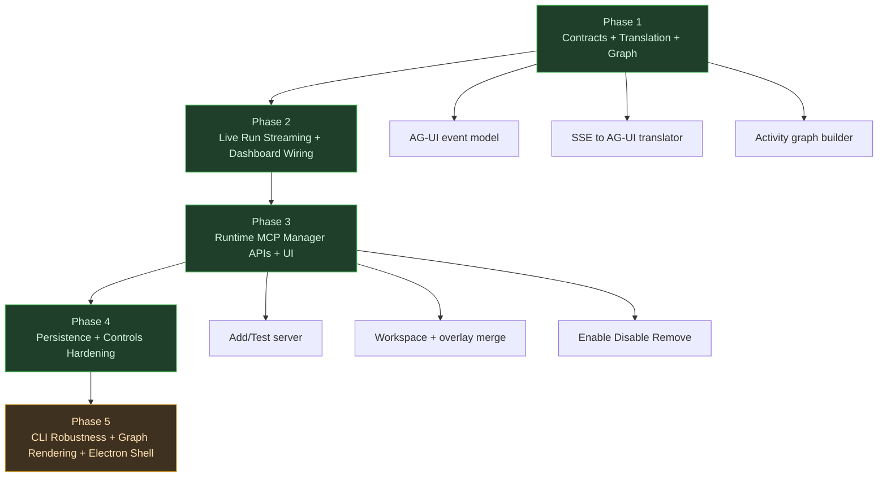
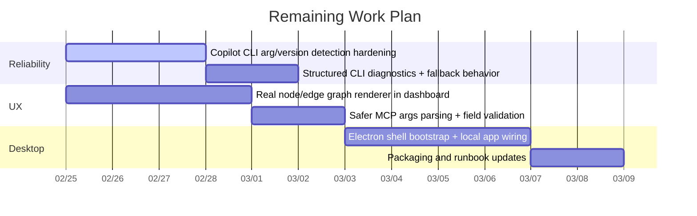
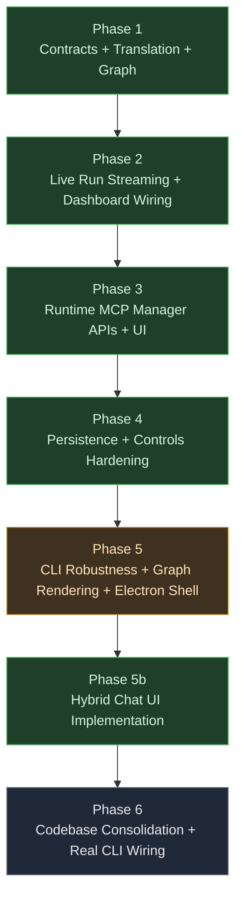
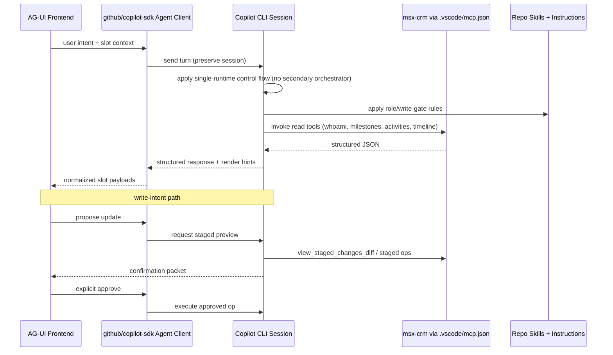
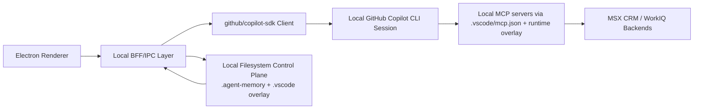
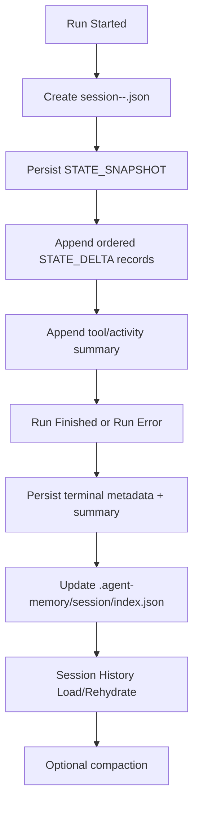

# Agentic Frontend Spec (AG-UI + Copilot SDK)

## Objective

Add an agentic frontend experience for this repository that:

- Presents role-specific information in dedicated UI slots.
- Uses modern, structured AG-UI components.
- Integrates with `github/copilot-sdk` to interact with the underlying GitHub Copilot CLI session.
- Reuses this repo’s built-in skills and MCP server wiring from `.vscode/mcp.json`.
- Binds selected UI role to the corresponding local skill file at `.github/skills/<Role>_SKILL.md`.
- Preserves MCP-first and write-confirmation safety patterns already defined in this codebase.
- Uses **Electron as the only target app runtime** (no Next.js runtime in target architecture).
- Aligns UX to **CopilotKit hybrid chat + generative UI patterns** (researcher-style interaction model).
- Exposes a flexible **WorkIQ Context Explorer** so users can inspect the context/evidence the Copilot runtime is inferring.

## Architecture Decision: Electron over Next.js

When Electron and Next.js conflict, **Electron wins**.

- Next.js is treated as a transitional prototype surface only.
- Target production architecture is Electron main + preload + renderer + local orchestration services.
- New features should be implemented against Electron IPC/BFF contracts, not new Next.js routes/pages.
- Existing Next.js routes are migration sources and should be retired after parity.

## Complexity Verdict (AG-UI + Copilot SDK)

AG-UI adds justifiable complexity for this project **only** when treated as a thin event/UI protocol layer.

- **Good complexity**
  - Real-time UX with normalized run/tool/activity events.
  - Responsive activity components driven by `ACTIVITY_SNAPSHOT` and `ACTIVITY_DELTA`.
  - Tool-call visualization for operator trust and reviewability.
- **Bad complexity (disallowed)**
  - Re-implementing orchestration/control flow already handled by Copilot SDK + Copilot CLI.
  - Introducing a second execution runtime or duplicate planner.

### Complexity Guardrail (Mandatory)

- AG-UI = presentation/event contract.
- Copilot SDK + Copilot CLI = single execution runtime of record.
- All control-flow, tool execution, and policy enforcement stay in Copilot runtime + repo instructions/skills.

## Runtime Integration Points (Source of Truth)

1. **Runtime config source of truth**
  - Load MCP servers from `.vscode/mcp.json`.
  - Merge runtime overlay for add/test servers (persisted overlay file).
2. **Execution path**
  - Renderer (CopilotKit chat + reactive panels) → local BFF/IPC → Copilot SDK/CLI adapter (with additional MCP config) → MCP servers (`msx-crm`, `workiq`, optional `copilotkit`).
3. **Event normalization boundary**
  - Map Copilot stream events into AG-UI lifecycle/event categories defined in this spec and AG-UI reference doc (`ag-ui.txt`).
4. **Safety boundary**
  - Keep role/write confirmation behavior aligned with `.github/instructions/msx-role-and-write-gate.instructions.md`.
5. **Session cache boundary**
  - Persist run/session snapshots under `.agent-memory/session` and expose cached Copilot CLI sessions in UI.
6. **Role-skill boundary**
  - Selected role must resolve to a local skill file under `.github/skills/` and be included in the execution context stack shown to users.

## Environment Requirement: CopilotKit MCP Usage

For this repository/environment, `copilotkit` MCP is currently enabled and should be treated as required during UI buildout iterations.

- Use the enabled `copilotkit` MCP server in runtime config for UI buildout tasks, tool-assisted UI scaffolding, and interactive validation flows.
- Keep `copilotkit` alongside `msx-crm` and `workiq` in merged runtime config unless explicitly disabled by operator action.
- Surface `copilotkit` availability in Execution diagnostics and MCP Manager status views.
- If `copilotkit` becomes unavailable, degrade gracefully and show explicit diagnostics; do not silently remove it from active server set.

## Decision Resolution (2026-02-24)

The following architecture choices are resolved for MVP execution.

1. **Transport contract (1A)**
  - Keep SSE framing in compatibility mode.
  - Standardize a transport-agnostic canonical event envelope so SSE and streamable HTTP can share schema.

2. **Reconnect semantics (2A)**
  - Use replay + live-tail reconnect semantics.

3. **Session identity model (3A)**
  - Primary identity is Copilot session/thread/run.
  - MCP identifiers are trace metadata only.

4. **`STATE_DELTA` strategy (4A)**
  - Emit one baseline `STATE_SNAPSHOT`.
  - Emit ordered JSON Patch-compatible `STATE_DELTA` updates thereafter.

5. **Agent memory integration (5A)**
  - Persist run summary + snapshot + delta log + metadata under `.agent-memory/session`.
  - Rehydrate UI session state from persisted snapshot + deltas.

6. **Same-thread concurrency (6A)**
  - Keep same-thread FIFO globally for MVP deterministic behavior.

7. **Write-gate enforcement (7B)**
  - Use dual enforcement: UI approval controls + runtime pre-tool guard (`onPreToolUse`).

8. **Scope control (8A)**
  - Ship MVP core first; keep expanded UX refinements post-MVP.

## Role-to-Skill Binding Contract (Normative)

UI role selection is not just a label; it determines which local skill contract is applied for planning and tool behavior.

### Supported Role Mappings

- `Solution Engineer` → `.github/skills/Solution_Engineer_SKILL.md`
- `Cloud Solution Architect` → `.github/skills/Cloud_Solution_Architect_SKILL.md`
- `Customer Success Account Manager` → `.github/skills/CSAM_SKILL.md`
- `Specialist` → `.github/skills/Specialist_SKILL.md`

### Required Runtime Behavior

- On role switch, resolve the mapped skill file path and mark it as active in run context.
- If mapped skill file is missing/unreadable, block workflow execution and show actionable error in Execution view.
- Inject role identity and selected skill path reference into run context before first tool call.
- Display active role and resolved skill file in a user-visible Context Stack panel.

### Non-Goals

- Do not auto-select role from CRM profile inference.
- Do not silently substitute one role skill file for another.

## Local Filesystem-Orchestrated Control Plane (Normative)

Because Copilot CLI runs in the same local repo, local files are a first-class orchestration substrate, not a secondary cache.

### Filesystem Sources of Truth

- `.vscode/mcp.json` = workspace MCP seed config (authoritative baseline)
- `.vscode/mcp.runtime.overlay.json` = runtime server overlay (operator-controlled deltas)
- `.agent-memory/session/*` = run/session continuity + replay summaries
- `.agent-memory/working/*` = in-progress operational knowledge
- `.agent-memory/durable/*` = promoted stable memory facts/decisions

### Environment MCP Baseline (Current)

- Treat `copilotkit` MCP as part of the expected active server baseline for UI buildout in this environment.
- Runtime checks and smoke tests should include `copilotkit` presence and basic reachability, in addition to `msx-crm` and `workiq`.

### Ownership Model

- Copilot CLI + repo instructions/skills own tool orchestration decisions.
- Local orchestration layer owns file IO, merge, and hydration mechanics.
- Renderer owns presentation only; it must not write orchestration files directly.

### Write Safety Rules (Required)

- Use atomic write semantics for orchestration artifacts: write temp file in same directory, then rename.
- Use per-resource lock files for concurrent write paths (`threadId` and config file scope).
- On lock contention, queue same-thread updates and reject cross-thread conflicting writes with actionable errors.
- All file reads/writes must stay within workspace root; reject path traversal and symlink escapes.

### Degraded-Mode Behavior

- If `.agent-memory` is unavailable, runs continue without persistence and UI shows `persistence degraded` status.
- If overlay file is unreadable/corrupt, continue with `.vscode/mcp.json` only and surface explicit diagnostics.
- Any degraded mode must be explicit in Execution view and run diagnostics metadata.

## High-Level Architecture (Word Art)

```text
┌─────────────────────────────────────────────────────────────────────────────┐
│ Electron Desktop (Renderer)                                                 │
│ Chat (CLI-like) | Tool Trace | Activity Graph | MCP Manager UI              │
└───────────────┬─────────────────────────────────────────────────────────────┘
           │ AG-UI-compatible event stream
           ▼
┌─────────────────────────────────────────────────────────────────────────────┐
│ Local Orchestration Layer (BFF/IPC)                                         │
│ 1) Session + thread state                                                    │
│ 2) Copilot stream → AG-UI event mapper                                       │
│ 3) MCP config merge (workspace seed + runtime overlay)                       │
│ 4) MCP server test/add diagnostics                                           │
└───────────────┬─────────────────────────────────────────────────────────────┘
           │
           ▼
┌─────────────────────────────────────────────────────────────────────────────┐
│ GitHub Copilot SDK + Copilot CLI                                             │
│ (single execution runtime of record)                                         │
└───────────────┬─────────────────────────────────────────────────────────────┘
           │ --additional-mcp-config
           ▼
┌─────────────────────────────────────────────────────────────────────────────┐
│ MCP Servers: msx-crm | workiq | copilotkit (+ runtime added)                │
└─────────────────────────────────────────────────────────────────────────────┘
```

## Consolidated Mapping to Current Frontend (Verified)

This section verifies that the implemented frontend maps to the target layered structure.

### Layer-by-Layer Mapping

1. **Electron Desktop (Renderer)**
  - **Target contract**: chat + tool trace + activity graph + MCP manager UI.
  - **Current implementation**: Next.js dashboard renderer currently hosts these UI surfaces.
  - **Files**:
    - `frontend/src/app/dashboard/page.tsx` (chat stream, tool results, event counters, activity feed, MCP manager controls)
  - **Status**: **Functionally mapped; platform migration required (Next.js renderer → Electron renderer)**.

2. **Local Orchestration Layer (BFF/IPC)**
  - **Target contract**:
    1) session + thread state
    2) Copilot stream → AG-UI mapper
    3) MCP config merge (workspace seed + runtime overlay)
    4) MCP test/add diagnostics
  - **Current implementation**:
    - Session/thread IDs are carried in request payload and stream envelope.
    - SSE stream events are translated to AG-UI events.
    - Runtime registry merges `.vscode/mcp.json` + `.vscode/mcp.runtime.overlay.json`.
    - MCP server `test/add/enable/disable/remove/list` APIs are implemented.
  - **Files**:
    - `frontend/src/app/api/copilot/run/route.ts`
    - `frontend/src/lib/copilot/client.ts`
    - `frontend/src/lib/copilot/translate.ts`
    - `frontend/src/lib/mcp/runtime-registry.ts`
    - `frontend/src/lib/backend/mcp-overlay-store.ts`
    - `frontend/src/app/api/mcp/servers/route.ts`
    - `frontend/src/app/api/mcp/servers/test/route.ts`
  - **Status**: **Mapped**.

3. **GitHub Copilot SDK + Copilot CLI (runtime of record)**
  - **Target contract**: single execution runtime.
  - **Current implementation**: BFF invokes Copilot CLI with `--additional-mcp-config`; no second orchestrator runtime is introduced.
  - **Files**:
    - `frontend/src/lib/backend/copilot-cli.ts`
    - `frontend/src/app/api/copilot/run/route.ts`
  - **Status**: **Mapped**.

4. **MCP Servers (workspace + runtime-added)**
  - **Target contract**: `msx-crm | workiq | copilotkit (+ runtime added)`.
  - **Current implementation**: workspace servers loaded from `.vscode/mcp.json`; runtime overlay add/test lifecycle persisted in `.vscode/mcp.runtime.overlay.json`.
  - **Files**:
    - `frontend/src/lib/mcp/runtime-registry.ts`
    - `frontend/src/lib/backend/mcp-overlay-store.ts`
    - `frontend/src/app/api/mcp/servers/route.ts`
  - **Status**: **Mapped**.

### Verification Summary

- The current implementation follows the requested four-layer architecture.
- The primary gap is runtime host: renderer and BFF are currently Next.js-hosted and must be migrated to native Electron modules.
- Complexity guardrail is preserved: AG-UI event/UI layer does not replace Copilot SDK/CLI orchestration.

## AG-UI Usage Alignment (from `.github/documents/ag-ui.txt`)

The implementation and spec should explicitly follow AG-UI guidance as a lightweight, event-driven interaction protocol.

### Protocol Usage Rules (Normative)

1. **AG-UI is the user interaction layer, not execution runtime**
  - Keep AG-UI at the UI/protocol boundary.
  - Keep tool orchestration and policy enforcement in Copilot runtime.

2. **Lifecycle boundaries are explicit**
  - Emit `RUN_STARTED` first and terminal `RUN_FINISHED` or `RUN_ERROR` exactly once.

3. **Tool lifecycle follows AG-UI sequence**
  - Use `TOOL_CALL_START` → `TOOL_CALL_ARGS` → `TOOL_CALL_END` for streamed tool trace.

4. **State sync uses snapshot/delta model**
  - Use `STATE_SNAPSHOT` for baseline and `STATE_DELTA` for incremental updates (JSON Patch-compatible payload shape).

5. **Activity rendering is snapshot/delta-first**
  - Use `ACTIVITY_SNAPSHOT` and `ACTIVITY_DELTA` for non-chat progress updates and graph hydration.

6. **Transport remains SSE-compatible and protocol-agnostic**
  - Keep BFF stream transport-agnostic in design while using SSE for current implementation.

### Current Code Alignment to AG-UI Reference

- Event taxonomy includes lifecycle, text, tool, state, activity, and custom events:
  - `frontend/src/lib/ag-ui/events.ts`
- SSE envelope → AG-UI typed event normalization:
  - `frontend/src/lib/copilot/translate.ts`
- UI stream consumers derive chat/tool/activity/graph state from AG-UI events:
  - `frontend/src/app/dashboard/page.tsx`
  - `frontend/src/lib/activity/graph.ts`

## CopilotKit Hybrid Experience Alignment

This spec adopts CopilotKit as the renderer interaction layer for a researcher-demo-like hybrid UX:

- Conversational chat remains the user control surface and supports true back-and-forth dialogue with the Copilot CLI agent.
- Reactive UI components render live tool progress, activity state, and structured outputs.
- Agent/tool transparency is first-class (traceable tool lifecycle in-session).
- AG-UI remains the canonical event protocol boundary for streaming state to UI.

### UX Pattern (Researcher-Style)

1. **Chat-led workflow**
  - User prompts, clarifying follow-ups, and iterative revisions happen in CopilotKit chat UI.
  - Agent can ask clarifying questions, request missing identifiers, and receive user responses in-thread before proceeding.
2. **Reactive side panels**
   - Tool Trace panel updates from `TOOL_CALL_*` events.
   - Activity Graph panel updates from `ACTIVITY_*` + lifecycle events.
   - State/Artifacts panel updates from `STATE_SNAPSHOT`/`STATE_DELTA`.
  - WorkIQ Context Explorer updates from scoped WorkIQ retrieval results and inferred context deltas.
3. **In-thread human approval**
   - Write-intent review/approve controls are presented in-session before execution.

### Event-to-UI Mapping (CopilotKit + AG-UI)

- `RUN_STARTED` / `RUN_FINISHED` / `RUN_ERROR`
  - Drives session lifecycle banners, run status indicators, and disable/enable of send controls.
- `TEXT_MESSAGE_*`
  - Drives streaming user/assistant turn rendering in CopilotKit chat timeline.
  - Must support multi-turn continuation without resetting context panels.
- `TOOL_CALL_START` / `TOOL_CALL_ARGS` / `TOOL_CALL_END`
  - Drives Tool Trace cards with live args stream + completion/error state.
- `STATE_SNAPSHOT` / `STATE_DELTA`
  - Drives structured shared-state widgets and slot hydration.
- `ACTIVITY_SNAPSHOT` / `ACTIVITY_DELTA`
  - Drives activity cards/graph nodes for non-text progress telemetry.
- WorkIQ evidence payloads (from tool results/custom events)
  - Drives grouped M365 evidence cards and context attribution in WorkIQ Context Explorer.

### CopilotKit Styling Contract (from customization guide)

Use CopilotKit built-in UI customization primitives instead of ad-hoc component forks.

1. **CSS variables first (preferred)**
   - Define and version these tokens at app theme root:
     - `--copilot-kit-primary-color`
     - `--copilot-kit-contrast-color`
     - `--copilot-kit-background-color`
     - `--copilot-kit-secondary-color`
     - `--copilot-kit-secondary-contrast-color`
     - `--copilot-kit-separator-color`
     - `--copilot-kit-muted-color`
2. **Class overrides second**
   - Apply scoped overrides for key built-in classes:
     - `.copilotKitMessages`, `.copilotKitInput`, `.copilotKitUserMessage`, `.copilotKitAssistantMessage`, `.copilotKitHeader`, `.copilotKitButton`, `.copilotKitWindow`
3. **Icons and labels for product fit**
   - Configure CopilotKit `icons` and `labels` props for role-appropriate language and controls.
4. **Headless escalation path**
   - If built-in customizations are insufficient, use CopilotKit custom sub-components/headless UI while preserving AG-UI event contracts.

### CopilotKit Guardrails

- Do not duplicate AG-UI stream parsing logic across multiple UI components; keep one translation pipeline.
- Do not bypass write gate UX through custom renderer shortcuts.
- Do not couple CopilotKit UI directly to raw CLI output; bind to normalized AG-UI/Copilot envelopes only.

## Checkpoint (2026-02-24)

This section captures implemented scope, validated behavior, and the remaining plan from the current build-out.

### Implemented So Far

- AG-UI event contract + translation path
- Added AG-UI event types and stream normalization from SSE envelopes.
- Established a single translation boundary so UI components consume normalized AG-UI events.

- Execution activity graph model
- Added graph builder that derives run/tool/activity nodes and edge modes: `sequential`, `parallel`, `background`.

- Live Copilot run streaming endpoint
- `/api/copilot/run` streams ordered run lifecycle events for dashboard consumption.
- Provider mode supports `copilot-sdk` and `msx-crm` flow paths.

- Runtime MCP server management (workspace + overlay)
- Added API routes: `GET /api/mcp/servers`, `POST /api/mcp/servers`, `PATCH /api/mcp/servers`, `DELETE /api/mcp/servers`, `POST /api/mcp/servers/test`.
- Added dashboard controls for test/add/refresh and overlay enable/disable/remove.

- Persistent overlay storage
- Runtime overlay servers persist to `.vscode/mcp.runtime.overlay.json`.
- API route root resolution hardened to support startup from either repo root or frontend root.

- Validation status
- Unit tests pass (`translate`, `graph`, `runtime-registry`).
- Frontend production build passes.
- MCP API smoke coverage executed for add/disable/enable/remove.

### Current Implementation Plan (Checkpoint Diagram)



### Remaining Work Plan (Execution Timeline)



### Remaining Scope (Priority Backlog)

#### P0 - Reliability

- Harden Copilot CLI invocation strategy for installed CLI variants.
- Add deterministic diagnostics (exit code, stderr class, retryability markers).
- Define clear fallback run behavior when SDK/CLI invocation fails.

#### P1 - UX Completion

- Replace graph counters with actual rendered node-edge graph.
- Improve MCP form safety: argument parsing with quote-awareness, inline validation messaging, invalid command guardrails.
- Add compact activity timeline panel synchronized with graph updates.

#### P2 - Desktop Packaging

- Introduce Electron shell around local frontend runtime.
- Document local startup and packaging workflow.
- Add desktop smoke checklist for run stream + MCP management.

### Plan Delta (AG-UI Emphasis)

- Add an explicit AG-UI integration phase focused on event mapping fidelity and activity/tool UX.
- Add a complexity guardrail checkpoint: verify AG-UI remains protocol/UI-only and does not duplicate Copilot orchestration.
- Track this delta in session planning notes at `/memories/session/plan.md`.

### Checkpoint Risks / Notes

- Existing local dev-server state can become stale (`.next` artifacts); clean restart remains the reliable workaround.
- MCP server testing currently validates launch success, not protocol-level health semantics.
- Overlay persistence is local-file based and intentionally simple for MVP.

## Checkpoint 2 (2026-02-24 — Post Hybrid UI + CLI Audit)

### Summary

This checkpoint captures three significant findings since Checkpoint 1:

1. **Hybrid chat UI was implemented** in the Electron renderer layer.
2. **Copilot CLI wiring was audited and found to be scaffold-only** — not a real integration.
3. **A structural codebase inconsistency was discovered** between the Next.js active project and orphaned Electron files.

### Actual Codebase Layout (Verified)

```text
frontend/                              ← package.json is Next.js (msx-agentic-frontend)
  src/
    app/                               ← Next.js App Router (TypeScript)
      api/copilot/run/route.ts         ← SSE streaming endpoint
      api/mcp/servers/route.ts         ← MCP server management
      api/mcp/servers/test/route.ts    ← MCP server test
      api/mcp/servers/tools/route.ts   ← MCP tools list
      dashboard/page.tsx               ← Dashboard page
      globals.css, layout.tsx, page.tsx
    lib/                               ← TypeScript library modules
      ag-ui/events.ts                  ← AG-UI event type definitions
      copilot/client.ts                ← Copilot SDK client
      copilot/translate.ts             ← SSE → AG-UI event translation
      copilot/types.ts                 ← Copilot type definitions
      activity/graph.ts                ← Activity graph builder
      mcp/runtime-registry.ts          ← MCP runtime registry + overlay merge
      backend/copilot-cli.ts           ← Copilot CLI invocation
      backend/mcp-overlay-store.ts     ← Overlay persistence
      backend/mcp-health-check.ts      ← Health check utilities
      backend/mcp-tools-list.ts        ← Tool listing
    renderer/                          ← Orphaned Electron renderer files
      app.js                           ← ✅ Hybrid chat UI (modified this session)
      styles.css                       ← ✅ Hybrid chat CSS (modified this session)
      (index.html MISSING — never created or lost)

frontend.electron-backup/              ← Standalone Electron project (separate package.json)
  src/
    main/                              ← Electron main process (JS)
      main.js, preload.js, server.js, copilot-adapter.js,
      copilot-sdk-adapter.local.js, runtime-registry.js
    renderer/                          ← Original Electron renderer
      app.js, index.html, styles.css
    shared/                            ← Shared modules
      ag-ui-events.js, roles.js
```

**Key finding**: The spec mandates "Electron wins" but the active build system is Next.js. The Electron files are either orphaned in `frontend/src/renderer/` (no build pipeline) or in a separate `frontend.electron-backup/` directory. There is no `frontend/src/main/` or `frontend/src/shared/` in the active project.

### Hybrid Chat UI — What Was Implemented

The following files in `frontend/src/renderer/` were rewritten:

**`app.js`** — Full hybrid chat experience:
- Persistent session state: `threadId`, `clientSessionId`, `activeRunId`
- Multi-turn conversation with grouped chat turns (user/assistant)
- Inline AG-UI cards rendered in the chat stream (tool calls, state deltas, diagnostics, errors)
- Typing indicator with animated dots
- Auto-grow textarea with Enter-to-send / Shift+Enter for newline
- Side-panel reactive updates from AG-UI events:
  - Tool Trace panel updates from `TOOL_CALL_*` events
  - Context Stack panel shows role/provider/thread metadata
  - Activity Graph panel accumulates graph nodes from activity events
  - Activity Timeline panel renders chronological event log
  - MCP Manager panel lists servers with refresh
  - WorkIQ Evidence panel shows structured evidence cards
- Run status indicator (running/error/idle)

**`styles.css`** — Complete dark theme rewrite:
- Chat bubble system (`.chat-turn`, `.chat-bubble`, `.chat-card`)
- Inline AG-UI card styles (color-coded borders: warn/ok/error/accent)
- Typing indicator animation
- Collapsible panel sections using `<details>` elements
- Auto-grow prompt bar
- Two-column hybrid layout grid

**`index.html`** — Was designed but is MISSING from the directory:
- The hybrid layout HTML (two-column: chat surface left, collapsible side panels right) needs to be created.
- Controls in topbar, `<details>`-based collapsible panels for Context Stack, Tool Trace, Activity Graph, MCP Manager, WorkIQ Explorer.

### Copilot CLI Wiring Audit — Findings

| Aspect | Expected | Actual |
|---|---|---|
| CLI binary available | ✅ | ✅ v0.0.415 at `VS Code globalStorage/copilotCli/copilot` |
| `copilot-adapter.js` loads SDK/CLI adapter | ✅ | ✅ via `COPILOT_SDK_ADAPTER_MODULE` env var |
| `copilot-sdk-adapter.local.js` spawns CLI | ✅ | ⚠️ Spawns `copilot chat --message <prompt>` — one-shot only |
| Real-time streaming from CLI | ✅ | ❌ Captures stdout in buffer, returns after exit |
| `--additional-mcp-config` passed | ✅ | ❌ No MCP config injection |
| Structured output parsing | ✅ | ❌ Raw stdout returned as-is |
| Multi-turn session support | ✅ | ❌ No session/thread continuity across calls |
| CLI fallback in `server.js` | ✅ | ❌ `runCopilotCliFlow()` returns CANNED responses, never actually spawns CLI |
| BFF streams events in real-time | ✅ | ❌ Batch-emits AG-UI events after adapter returns |

**Verdict**: The integration is a scaffold/stub. The local bridge (`copilot-sdk-adapter.local.js`) can spawn the CLI binary one-shot, but no streaming, no MCP injection, no output parsing, and no multi-turn. The server fallback path uses hardcoded canned responses.

### Tests Status

- All vitest tests pass: `translate`, `graph`, `runtime-registry` (Next.js TypeScript layer)
- Electron main process tests (`copilot-adapter.test.js`, `server.test.js`) exist only in `frontend.electron-backup/`
- The hybrid UI renderer files have no automated tests (manual verification only)

### Checkpoint 2 Diagram



### Priority Backlog — Pre-SDK Wiring Tasks

#### P0 — Codebase Consolidation (BLOCKING)

The dual-codebase structure must be resolved before SDK wiring can proceed.

1. **Decide primary runtime location**
   - Option A: Consolidate into Electron project (`frontend.electron-backup/` becomes `frontend/`, retire Next.js)
   - Option B: Keep Next.js for dev iteration, wire Electron as build/packaging target only
   - **Recommendation**: Option A aligns with spec mandate ("Electron wins")
2. **Merge hybrid UI work into Electron project**
   - Copy modified `app.js` and `styles.css` from `frontend/src/renderer/` into the consolidated Electron `src/renderer/`
   - Create the missing `index.html` with the hybrid two-column layout
3. **Port essential Next.js TypeScript modules to Electron**
   - `translate.ts` → `translate.js` (or keep TS with build step)
   - `graph.ts` → `graph.js`
   - `runtime-registry.ts` → `runtime-registry.js`
   - `copilot-cli.ts` → Merge into existing `copilot-adapter.js`
4. **Establish unified test runner**
   - Decide: vitest (current Next.js) vs `node:test` (current Electron) vs both
   - Move/adapt test fixtures and assertions

#### P0 — Real CLI Streaming Adapter

Replace the scaffold CLI integration with a real streaming adapter.

1. **Streaming CLI invocation**
   - Replace one-shot `copilot chat --message` with streaming output consumption
   - Parse CLI stdout line-by-line as events arrive (not buffer-then-return)
2. **MCP config injection**
   - Pass `--additional-mcp-config` with merged MCP config (workspace + overlay)
   - Generate temp config file from `runtime-registry` merge output
3. **Structured output parsing**
   - Parse CLI output into AG-UI events in real-time
   - Map tool invocation markers to `TOOL_CALL_START/ARGS/END`
   - Map text content to `TEXT_MESSAGE_DELTA`
4. **BFF real-time streaming**
   - `server.js` must emit SSE events as they arrive from CLI, not batch after completion

#### P1 — Multi-Turn Session Continuity

1. **Session threading**
   - Maintain thread identity across prompts (if CLI supports `--session-id` or equivalent)
   - Fall back to context injection if CLI doesn't support native sessions
2. **Context carry-forward**
   - Include previous turn summary or key entities in subsequent prompts
   - Respect token budget constraints

#### P1 — Missing index.html

1. Create `index.html` for the hybrid layout:
   - Two-column grid: chat surface (left) + collapsible side panels (right)
   - Topbar with role selector, provider selector, run status
   - `<details>`-based collapsible panels for: Context Stack, Tool Trace, Activity Graph + Timeline, MCP Manager, WorkIQ Evidence

#### P2 — Test Coverage for Real Integration

1. **Adapter contract tests**
   - Mock CLI process spawning and validate event emission sequence
   - Test streaming timeout and error recovery paths
2. **Integration smoke tests**
   - Validate end-to-end: prompt → CLI spawn → event stream → renderer update
   - Requires actual CLI binary (gate behind `CI` env flag)

#### P2 — Electron Packaging + Startup

1. Bootstrap Electron shell with proper `main.js` → `preload.js` → `renderer` chain
2. Verify BFF (Express) starts correctly within Electron main process
3. Document local startup workflow and prerequisites

### Checkpoint 2 Risks

- **Codebase drift**: The longer both Next.js and Electron codebases exist, the harder consolidation becomes. Prioritize P0 consolidation.
- **CLI API instability**: Copilot CLI (v0.0.415) may change output format or flags between versions. Adapter should detect version and degrade gracefully.
- **Missing index.html**: The hybrid UI is incomplete — `app.js` and `styles.css` exist but the HTML entry point was never created in `frontend/src/renderer/`.
- **No streaming test harness**: Current tests use mock adapters; there is no way to validate real CLI streaming behavior without manual testing.

## Design Principles

- **MCP-first orchestration**: frontend never bypasses MCP tools for CRM/WorkIQ operations.
- **Role-first UX**: all views are grounded in selected/resolved role context.
- **Explicit role selection**: role is always user-selected in UI; never auto-selected from CRM profile inference.
- **Structured slots over freeform output**: each panel has a clear data contract and intent.
- **Evidence transparency**: inferred context should be inspectable as structured WorkIQ/M365 evidence, not hidden in chat-only output.
- **Write safety by default**: write-intent always goes through confirmation packet + explicit approval.
- **Adapter-based rendering**: tool payloads are normalized to frontend view models.

## Recommended UI/UX Stack (Popular Libraries)

Use a modern, proven stack so the app feels polished while staying maintainable.

### Core UI Foundation

- **Electron** for desktop app shell (main process + preload + renderer).
- **React + Vite** (or equivalent Electron-compatible renderer bundling) for renderer UI.
- **CopilotKit React UI + runtime bindings** for hybrid chat + generative/reactive components.
- **IPC + local service adapters** for run-stream and MCP manager operations (replacing framework API routes).
- **Tailwind CSS** for utility-first styling and fast iteration.
- **shadcn/ui** (Radix primitives + Tailwind) for high-quality accessible components.
- **AG-UI** components where agent-focused interaction widgets are needed.

### Data & Interaction Experience

- **Zustand (or `useReducer`)** for push-based event-stream state in MVP.
- **React Hook Form + Zod** for robust, typed form handling in review/approval flows.
- **Framer Motion** for subtle transitions (panel open/close, slot refresh) to improve perceived quality.

Note: event-stream state is push-based from Copilot SDK/AG-UI events. `TanStack Query` is optional later for non-stream pull endpoints only.

### Visual Components for This Use Case

- **Timeline / scheduling visuals**: `react-calendar-timeline` or a maintained alternative (`nivo` timeline/custom SVG), avoiding unmaintained timeline packages.
- **Charts/KPIs**: `Recharts` for trend lines and compact KPI visual cards.
- **Data table/diff**: `TanStack Table` for before/after diff rendering with sortable fields.

### Suggested Design Tokens

- Use one neutral palette + role accent colors only via theme tokens.
- Keep typography and spacing consistent via Tailwind scale.
- Prefer card-based layout with clear section headings and status badges.

## Information Architecture

### Primary Screens

1. **Dashboard** (`/dashboard`)
   - Role context and workflow status
   - Milestone timeline
   - Action queue
2. **Milestone Detail** (`/milestone/:id`)
   - Milestone facts, activities, cost trend
   - Role-aware recommendations
3. **Review & Execute** (`/review`)
   - Before/after diffs
   - Confirmation packet
   - Explicit approve/revise controls

### Core Slots

1. **Role Header Slot**
   - Resolved role, confidence, user identity
   - Workflow checks (pass/fail)
2. **Timeline Slot**
   - Milestone events by date
   - Opportunity lane grouping
3. **Action Queue Slot**
   - Recommended tasks and next steps
   - Priority + owner context
4. **Task Slot**
   - Task list/status metadata for selected milestone
5. **Diff Review Slot**
   - Render-friendly before/after fields
6. **Confirmation Packet Slot**
   - Role, customer, opportunity, milestone/task IDs
   - Current values, proposed values, intent, impact/risk
7. **WorkIQ Context Explorer Slot**
  - Structured evidence cards grouped by source system
  - Source filters and recency cues
  - Confidence/attribution hints for inferred context
8. **Context Stack Slot (Collapsible)**
  - Shows role → skill file mapping used for current run
  - Shows key runtime context inputs: system constraints, prompt blocks, selected entities, scope chips, and MCP server set
  - Shows provenance tags (`user input`, `repo instruction`, `skill`, `derived`) and recency
  - Can be collapsed to compact summary (`N context items loaded`)

### Dynamic Panel Visibility + Semantic Grouping

Panels are grouped by domain and rendered only when data exists for the active session intent.

- **MSX Group**: milestones, opportunities, tasks, timeline
- **WorkIQ Group**: Teams, meetings, Outlook, SharePoint, Loop evidence
- **Execution Group**: tool trace, activity graph, run state, diagnostics

Rules:

- If a group has no data, it is not rendered (no empty placeholder cards).
- Group order is intent-sensitive:
  - milestone/opportunity questions → prioritize MSX Group first
  - M365 context questions → prioritize WorkIQ Group first
  - runtime/debug questions → prioritize Execution Group first
- Group headers should show source + freshness metadata when available.

### WorkIQ Context Explorer (M365 Evidence Scope)

The WorkIQ slot should support structured display of evidence from:

- Teams chats and channel messages
- Teams meetings and meeting transcripts/notes
- Outlook emails
- Outlook meeting invites/calendar events
- SharePoint documents
- Loop notes/pages/components
- Other M365 artifacts returned by WorkIQ retrieval

Each evidence card should include, when available:

- Source type and title/subject
- Participants/owners
- Timestamp or date range
- Relevance/explanation snippet
- Link/reference handle for drill-down

## Dynamic Views, Toolbars, and Layout System

To better organize context and keep the UI adaptive, the app should use a view system plus task-oriented toolbars.

### Core View Types

1. **Session View (default)**
  - Dedicated vertical CopilotKit chat + dynamic context dashboard.
  - Best for ongoing conversation and progressive context discovery.
2. **MSX Operational View**
  - Prioritizes milestone/opportunity/task/timeline panels.
  - Collapses or hides WorkIQ-heavy panels unless explicitly requested.
3. **WorkIQ Evidence View**
  - Prioritizes WorkIQ Context Explorer with source filters and evidence cards.
  - Keeps MSX summary compact but visible when linked to current ask.
4. **Execution/Debug View**
  - Prioritizes tool trace, activity graph, state snapshots, and MCP server health.
  - Intended for troubleshooting and operator transparency.

### Toolbar Architecture

1. **Global Top Toolbar**
  - Quick actions: `New Thread`, `Switch Role`, `Refresh Context`, `Run Diagnostics`.
  - View selector: `Session`, `MSX`, `WorkIQ`, `Execution`.
  - Context scope chips: account/opportunity/time range/thread.
2. **Context Toolbar (Dashboard Pane)**
  - Semantic group toggles: `MSX`, `WorkIQ`, `Execution`.
  - Panel density controls: `Compact`, `Comfortable`, `Detailed`.
  - Evidence mode: `Inferred + Retrieved` or `Retrieved Only`.
  - Context stack toggle: `Show Context Stack` / `Hide Context Stack`.
3. **Panel Local Toolbars**
  - Sorting (`recent`, `relevance`, `source`).
  - Grouping (`by source`, `by entity`, `by time`).
  - Pin/unpin panel and collapse/expand controls.

### Dynamic Rendering Rules

- Panels render only when data exists and relevance is above threshold.
- If a panel has stale data, show it with a stale badge rather than silently hiding.
- For mixed-domain queries, render multiple groups ranked by active intent score.
- Keep chat always visible; dynamic behavior applies to surrounding context panes.
- When no contextual data is available, show one concise "No context found yet" state with next actions.
- Context Stack is collapsible and defaults to expanded in `Execution` view, collapsed in other views.
- Context Stack must always include currently active role skill mapping for live runs.

### Suggested Dynamic Signals

- `intentScore` per domain (`msx`, `workiq`, `execution`)
- `relevanceScore` per panel/card
- `freshnessMs` and `sourceTimestamp`
- `confidence` (`high|medium|low`) for inferred context
- `provenanceType` (`retrieved|inferred|derived`)

### Persistence / Personalization

- Persist last selected view per thread.
- Persist pinned panels and density preference per user session.
- Do not persist sensitive evidence payloads beyond session policy boundaries.

## Visual Mock Addendum: Session Memory + Reconnect (MVP Core)

```text
┌──────────────────────────────────────────────────────────────────────────────┐
│ SESSION HISTORY + RECONNECT STATUS                                          │
├──────────────────────────────────────────────────────────────────────────────┤
│ Session #128   thread:t-128  lastRun:r-442  status:complete   [Load] [Pin] │
│ Session #127   thread:t-127  lastRun:r-437  status:error      [Load]        │
│                                                                              │
│ Reconnect                                                                    │
│ - Last applied seq: 184                                                      │
│ - Replay window: seq 185..201                                                │
│ - Live tail: resumed                                                         │
│                                                                              │
│ Hydration source:                                                            │
│ .agent-memory/session/session-t-128-r-442.json                              │
│ Rebuild basis: STATE_SNAPSHOT + ordered STATE_DELTA                         │
└──────────────────────────────────────────────────────────────────────────────┘
```

### Recommended Layout Presets

- **Operator preset**: chat + execution heavy.
- **Account planning preset**: MSX + WorkIQ balanced.
- **Evidence review preset**: WorkIQ first with detailed metadata.
- **Write approval preset**: review drawer expanded + execution context condensed.

## UI Vision Diagram

```mermaid
flowchart TB
  A[Global Toolbar<br/>View: Session or MSX or WorkIQ or Execution | Role | Scope Chips | Refresh] --> B

  subgraph B[Primary Workspace]
    direction LR
    C[CopilotKit Chat Column - Dedicated Vertical<br/>Always visible<br/>User-agent turn timeline<br/>Clarifying questions and follow-ups<br/>Context chips and inline mini visuals]

    subgraph D[Context Dashboard - Dynamic]
      direction TB
      D0[Context Toolbar<br/>Group toggles | Density | Evidence mode]
      D1[MSX Group<br/>Milestones | Opportunities | Tasks | Timeline]
      D2[WorkIQ Group<br/>Teams | Meetings | Outlook | SharePoint | Loop]
      D3[Execution Group<br/>Tool Trace | Activity Graph | State and Diagnostics]
      D5[Context Stack Group<br/>Role skill | Prompt blocks | Context inputs | Provenance]
      D4[Conditional Rendering<br/>Show group only if data + relevance threshold]
    end
  end

  R[Semantic Intent Router<br/>intentScore msx workiq execution] --> D1
  R --> D2
  R --> D3
  R --> D5

  D --> E[MCP Manager Utility Panel<br/>Runtime servers | Add-Test | Overlay controls]
  D --> F[Review and Execute Drawer<br/>Diff | Confirmation Packet | Approve gate]
```

## UX Challenges / Holes to Resolve

The following are deliberate pressure-test items before implementation:

1. **Intent classification reliability**
  - How do we classify user intent (MSX vs WorkIQ vs Execution) without flicker or incorrect panel switching?
2. **Context provenance and trust**
  - How do we clearly label inferred context vs directly retrieved evidence to avoid over-trust?
3. **Empty-state strategy**
  - If all optional panels are hidden, what minimal fallback should remain besides chat?
4. **Cross-domain overlap**
  - How should a mixed ask (e.g., “milestone risk from emails + meetings”) merge MSX and WorkIQ panels?
5. **Latency vs responsiveness**
  - Should panels appear progressively (partial evidence) or only when a group reaches completeness threshold?
6. **Session drift**
  - What triggers stale panel invalidation as thread context changes over long sessions?

## Visual Mock (ASCII, Markdown-Friendly)

Use this text mock for quick UX alignment in plain markdown previews.

```text
┌──────────────────────────────────────────────────────────────────────────────────────────────┐
│ MCAPS Agentic Workspace (Electron + CopilotKit)                                             │
│ Role: Solution Engineer | Account: Contoso | Opportunity: AI Copilot Rollout | Run: active │
└──────────────────────────────────────────────────────────────────────────────────────────────┘

┌──────────────────────────────────────────────────────────────────────────────────────────────┐
│ GLOBAL TOOLBAR                                                                               │
│ View: [Session] [MSX] [WorkIQ] [Execution] | Scope: [Role][Account][Opp][Time] | [Refresh] │
└──────────────────────────────────────────────────────────────────────────────────────────────┘

┌────────────────────────────────────┬─────────────────────────────────────────────────────────┐
│ COPILOTKIT CHAT (DEDICATED)        │ CONTEXT DASHBOARD (SEMANTIC GROUPS)                  │
│ Vertical window, always visible     │ Populates by current intent + available data          │
├────────────────────────────────────┼─────────────────────────────────────────────────────────┤
│ SESSION HISTORY                     │ ACTIVE GROUPS: [MSX] [WORKIQ] [EXECUTION]             │
│ - Session #128  (today)             │ (hide group if empty)                                  │
│ - Session #127  (yesterday)         │                                                         │
│ [Load] [Compare] [Pin]              │                                                         │
│                                     │                                                         │
│ You: "Summarize milestone blockers"│ ACTIVE GROUPS: [MSX] [WORKIQ] [EXECUTION]             │
│ Agent: "Need opp id/date window?"  │ (hide group if empty)                                  │
│ You: "Opp=AI Copilot, last 30 days"│                                                         │
│ Agent: "Great, pulling CRM + M365" │                                                         │
│ [streaming multi-turn TEXT_MESSAGE_*]│                                                        │
│                                     │ MSX GROUP (shown only if MSX data exists)             │
│ Context chips                       │ - Milestones / Opportunities / Tasks / Timeline        │
│ [Role][Account][Opp][Thread]        │ - e.g., atRisk:2 blocked:1 nextMilestone:02-24         │
│                                     │                                                         │
│ Inline visuals when appropriate:    │ WORKIQ GROUP (shown only if WorkIQ data exists)        │
│ - compact tool chips                │ - Teams chats, Meetings, Outlook, SharePoint, Loop     │
│ - mini evidence snippets            │ - evidence cards + timestamps + participants            │
│ - approval prompt cards             │                                                         │
│                                     │ EXECUTION GROUP (shown only if execution data exists)  │
│                                     │ - Tool Trace (TOOL_CALL_*)                             │
│                                     │ - Activity Graph (ACTIVITY_* + RUN_*)                  │
│                                     │ - Run diagnostics/state snapshot                        │
└────────────────────────────────────┴─────────────────────────────────────────────────────────┘

┌──────────────────────────────────────────────────────────────────────────────────────────────┐
│ CONTEXT TOOLBAR                                                                              │
│ Groups: [MSX✓] [WorkIQ✓] [Execution✓] | Density: [Compact|Comfortable|Detailed]             │
│ Evidence Mode: [Inferred + Retrieved] [Retrieved Only]                                       │
│ Context Stack: [Show/Hide]                                                                   │
└──────────────────────────────────────────────────────────────────────────────────────────────┘

┌──────────────────────────────────────────────────────────────────────────────────────────────┐
│ CONTEXT STACK (COLLAPSIBLE)                                                                  │
├──────────────────────────────────────────────────────────────────────────────────────────────┤
│ Role Binding                                                                                 │
│ - Selected Role: Solution Engineer                                                           │
│ - Active Skill: .github/skills/Solution_Engineer_SKILL.md                                   │
│                                                                                              │
│ Loaded Context Inputs                                                                         │
│ - System constraints: role-write-gate + MCP-first                                            │
│ - Prompt blocks: latest user ask + preserved thread summary                                  │
│ - Scope chips: account/opportunity/time/thread                                                │
│ - Runtime config: mcp.json + runtime overlay snapshot                                         │
│                                                                                              │
│ Provenance: [user input] [repo instruction] [skill] [derived]                                │
│ [Collapse] -> compact summary: "8 context items loaded"                                     │
└──────────────────────────────────────────────────────────────────────────────────────────────┘

┌──────────────────────────────────────────────────────────────────────────────────────────────┐
│ MCP MANAGER (always available utility panel)                                                 │
│ Runtime Servers: msx-crm, workiq, copilotkit(overlay) | [Test] [Add] [Enable/Disable]       │
└──────────────────────────────────────────────────────────────────────────────────────────────┘

┌──────────────────────────────────────────────────────────────────────────────────────────────┐
│ WORKIQ CONTEXT EXPLORER (Structured Evidence)                                               │
├──────────────────────────────────────────────────────────────────────────────────────────────┤
│ Filters: [All] [Teams Chats] [Meetings] [Outlook Email] [Invites] [SharePoint] [Loop]      │
│                                                                                              │
│ [Teams Chat] "Pilot blockers this week"           Participants: Alex, Priya   2026-02-23   │
│   Evidence: "Security sign-off pending from customer legal..."                              │
│                                                                                              │
│ [Meeting Transcript] "Weekly Exec Sync"          Organizer: Jin Lee          2026-02-22   │
│   Evidence: "Decision: move milestone date from 02-18 to 02-24"                             │
│                                                                                              │
│ [Outlook Email] "Re: Copilot rollout dependencies" Subject Owner: Contoso PM 2026-02-21   │
│   Evidence: "SharePoint architecture review required before pilot."                          │
│                                                                                              │
│ [SharePoint Doc] "Pilot Readiness Checklist"      Owner: CSA Team             2026-02-20   │
│   Evidence: "4/6 controls complete. Remaining: Sec + Compliance."                           │
│                                                                                              │
│ [Loop Note] "Account Plan Working Notes"          Edited by: SE + CSAM        2026-02-19   │
│   Evidence: "Customer requested revised timeline and usage target."                          │
└──────────────────────────────────────────────────────────────────────────────────────────────┘

┌──────────────────────────────────────────────────────────────────────────────────────────────┐
│ REVIEW & EXECUTE DRAWER (in-thread human approval)                                          │
├─────────────────────────────────────────────┬────────────────────────────────────────────────┤
│ BEFORE / AFTER DIFF                         │ CONFIRMATION PACKET                            │
│ msp_milestonedate: 02-18 -> 02-24           │ Role: Solution Engineer                         │
│ msp_monthlyuse: 45000 -> 50000              │ Account/Opp/Milestone IDs: present              │
│ comments: blocked -> approved               │ Why: customer dependency                        │
│                                             │ Impact: aligns pilot, Risk: medium              │
├─────────────────────────────────────────────┴────────────────────────────────────────────────┤
│ [Revise] [Approve] [Execute]  -> Execute enabled only after explicit Approve                │
└──────────────────────────────────────────────────────────────────────────────────────────────┘
```

```text
Intent Variant A (milestone/opportunity ask)
- Active group order: MSX > WorkIQ > Execution
- Hidden if empty: WorkIQ

Intent Variant B (M365 context ask)
- Active group order: WorkIQ > MSX > Execution
- Hidden if empty: MSX
```

## Runtime Orchestration Diagram



## SDK Event → AG-UI Event Translation Contract (Critical)

The BFF is responsible for translating Copilot SDK stream payloads into AG-UI-compatible event envelopes consumed by the browser.

### Translation Rules

- SDK run start → AG-UI `RUN_STARTED`
- SDK assistant token/content chunks → AG-UI `TEXT_MESSAGE_CONTENT`
- SDK tool invocation lifecycle → AG-UI `TOOL_CALL_START` / `TOOL_CALL_ARGS` / `TOOL_CALL_END`
- SDK state updates → AG-UI `STATE_DELTA` or `STATE_SNAPSHOT`
- SDK run completion/failure → AG-UI `RUN_FINISHED` / error event

### Contract Owner

- `frontend/src/app/api/copilot/run/route.ts` emits SSE envelopes.
- `frontend/src/lib/copilot/translate.ts` performs AG-UI normalization.
- UI never binds directly to raw SDK event internals.

## Local Runtime Architecture (Copilot SDK Requirement)

This app runs locally and uses a desktop-hosted renderer with a local BFF/IPC layer that talks to a local Copilot CLI session.



### Why Local-Only

- Keeps credentials and MCP tooling in the user’s trusted local environment.
- Reuses existing workspace-level MCP configuration without extra hosting.
- Maintains parity with current Copilot CLI + skills workflow.

### Runtime Boundary Rules

- Renderer/BFF own UX state shaping and protocol mapping only.
- Copilot SDK/CLI owns orchestration, tool execution sequencing, and tool policy checks.
- Overlay merge is applied before run invocation via additional MCP config.
- Filesystem layer owns persistence/merge/lock semantics and exposes typed read-models to BFF.

### Local Startup Model (MVP)

1. Start MCP servers from `.vscode/mcp.json`.
2. Start Electron desktop app (main + preload + renderer).
3. Renderer calls local orchestration services through IPC.
4. Orchestration service streams assistant/tool responses back to renderer slots.
5. UI adapters normalize payloads into role/timeline/task/review components.

## Transition Rule: Next.js Route Compatibility

Until Electron parity is complete, existing Next.js endpoints may be used as compatibility shims:

- `POST /api/copilot/run`
- `GET/POST/PATCH/DELETE /api/mcp/servers`
- `POST /api/mcp/servers/test`

These are temporary and should be replaced by Electron IPC handlers with equivalent contracts.

## BFF → Browser SSE Contract (Required)

The browser receives one ordered SSE stream per run.

### Endpoint

- `POST /api/copilot/run` starts run and returns `text/event-stream`.

### SSE Event Types

- `run_started`
- `text_start`
- `text_delta`
- `text_end`
- `tool_call_start`
- `tool_call_args`
- `tool_call_end`
- `state_delta`
- `state_snapshot`
- `run_finished`
- `run_error`

### SSE Payload Shape

```json
{
  "id": "evt_...",
  "seq": 42,
  "runId": "run_...",
  "threadId": "thread_...",
  "clientSessionId": "session_...",
  "timestamp": "2026-02-23T00:00:00.000Z",
  "event": "tool_call_start",
  "data": { "toolName": "view_staged_changes_diff" }
}
```

### Reliability Rules

- Preserve order per run.
- Include periodic keepalive pings.
- Emit terminal event (`run_finished` or `run_error`) exactly once.
- Support replay + live-tail reconnect for long-running streams.
- Reconnect contract:
  - Client sends last applied sequence (preferred) or `Last-Event-ID` compatibility token.
  - Server replays missed events in sequence order, then resumes live stream.
  - If replay window is unavailable, server returns restart-required + snapshot hint.

### Canonical Envelope (Transport-Agnostic)

Regardless of wire transport (SSE now, streamable HTTP later), use this logical envelope:

- `id`
- `seq`
- `runId`
- `threadId`
- `clientSessionId`
- `timestamp`
- `event`
- `data`

## Copilot SDK Integration Model

### Responsibilities

- **Frontend (AG-UI)**
  - Manages screen state and slot composition.
  - Sends user intents and contextual state to SDK client.
  - Renders normalized models returned by the adapter layer.

- **Copilot SDK Client Layer**
  - Maintains conversation/session with Copilot CLI.
  - Streams assistant/tool messages back to UI.
  - Applies local adapter transforms from assistant payloads to slot view models.
  - Enables `infiniteSessions` for long CRM workflows with automatic compaction.

- **Write-Gate Hook (Critical)**
  - Use Copilot SDK `onPreToolUse` to intercept write-intent tool calls (`create_task`, `update_task`, `close_task`, `update_milestone`).
  - Block tool execution until confirmation packet fields are complete and user explicitly approves.
  - Enforce gate in two layers: UI workflow controls and runtime pre-tool guard.

- **Copilot CLI + Repo Skills**
  - Enforces role routing and write gates.
  - Uses `.github/skills/*` and instruction files as behavior contracts.
  - Invokes MCP tools configured in `.vscode/mcp.json`.
  - Receives explicit role context in `systemMessage` at run start (do not rely on implicit role inference only).
  - Resolves selected role to local `.github/skills/<Role>_SKILL.md` mapping before execution.

- **MCP Servers (`msx-crm`, WorkIQ)**
  - Return source-of-truth data and operation results.

### Session Lifecycle

1. Initialize Copilot SDK client.
2. Load recent cached session metadata from `.agent-memory/session` for optional resume.
3. Start/reuse a Copilot CLI session bound to this workspace with `infiniteSessions` enabled.
4. Derive `mcpServers` directly from `.vscode/mcp.json` (single source of truth) and hot-reload changes.
5. Require explicit user role selection before workflow guidance.
6. Resolve selected role to local skill file path and validate it is available.
7. Inject selected role, skill-path reference, and workflow constraints into `systemMessage` for each run.
8. Build and expose Context Stack (role skill + active prompt/context blocks) to UI before first tool call.
9. Load read-model slots.
10. Persist run summary + `STATE_SNAPSHOT` + ordered `STATE_DELTA` log to `.agent-memory/session` at run end.
11. For write-intent:
   - Stage/preview
   - Show confirmation packet
   - Require explicit approval
   - Execute and verify

## Session Cache Layer (`.agent-memory/session`)

### Purpose

- Maintain lightweight history of prior Copilot CLI sessions for continuity and context recall.
- Let users re-open previous sessions from UI and compare inferred context across runs.

### Storage Model

- Location: `.agent-memory/session`
- Write mode: append new run/session records; do not mutate old records except optional compaction/index refresh.
- Suggested files:
  - `index.json` (ordered list of cached sessions for fast UI listing)
  - `session-<threadId>-<runId>.json` (session/run detail)

### Write/Read Reliability Contract

- Writes are append-oriented and atomic (temp + rename) to avoid partial JSON files.
- `index.json` updates are idempotent and can be rebuilt from `session-*.json` if missing/corrupt.
- Record schema version is included (`schemaVersion`) for forward-compatible migration.
- Startup performs integrity pass:
  - malformed records are skipped,
  - invalid records are quarantined to `.agent-memory/_archive/session-invalid/`.

### Suggested Cached Record Shape

- `sessionId`, `threadId`, `runId`
- `role`, `provider`, `startedAt`, `endedAt`
- `promptSummary`, `assistantSummary`
- `intentScores` (`msx`, `workiq`, `execution`)
- `entities` (account/opportunity/milestone/task/workiq facets)
- `toolTraceSummary` (tool names, states, durations)
- `contextSummary` (key inferred/retrieved facts)
- `artifacts` (optional references to evidence card IDs)

### UI Integration Requirements

- Add `Session History` block in dedicated chat column.
- Support actions: `Load`, `Compare`, `Pin`.
- Loading a prior session restores panel ordering/context chips and rehydrates cached summaries.
- Cached session view must clearly indicate `historical` vs `live` context.
- If cached record is stale or incomplete, show badge and allow user-triggered refresh.

### Agent Memory Lifecycle (MVP)

1. **Run start**
  - Create run shell record with status `running` and base identifiers.
2. **Baseline persist**
  - Persist initial `STATE_SNAPSHOT`.
3. **Delta append**
  - Append ordered `STATE_DELTA` entries and key tool/activity summaries.
4. **Terminal persist**
  - On `run_finished`/`run_error`, persist terminal metadata and assistant summary.
5. **Index refresh**
  - Update `.agent-memory/session/index.json` for recency-sorted Session History.
6. **Rehydrate**
  - `Load` reconstructs UI state from snapshot + ordered deltas, then optionally tails live stream.
7. **Compaction hygiene**
  - Optional compaction refreshes snapshot from long delta chains while preserving audit provenance.

### Agent Memory Lifecycle Diagram



## AG-UI Documentation Mapping (What to Integrate)

This section maps specific AG-UI docs areas from `Concepts → Agents` to concrete buildout tasks in this app.

### 1) Agent Foundation

**Docs areas to reference**
- `What is an Agent?`
- `Agent Architecture`
- `Agent Types`

**Integration decisions**
- Use `HttpAgent` as the default frontend agent client abstraction.
- Keep a custom wrapper (`CopilotCliAgentAdapter`) to bridge AG-UI agent calls to the local Copilot SDK/CLI runtime.
- Preserve AG-UI thread/state semantics even when backend orchestration is Copilot SDK.

**Buildout**
- `frontend/src/lib/copilot/client.ts`: constructs AG-UI-compatible agent instance.
- `frontend/src/lib/copilot/session.ts`: manages `agentId`, `threadId`, and per-run IDs.
- `frontend/src/lib/copilot/mcp-config.ts`: reads `.vscode/mcp.json`, resolves runtime `mcpServers`, and hot-reloads on file changes.

### 2) Event-Driven Streaming UI

**Docs areas to reference**
- `Implementing Agents` (event emission pattern)
- `Agent Capabilities → Interactive Communication`
- `Using Agents` (subscription + event handling)

**Integration decisions**
- Treat AG-UI events as the source of truth for UI progression.
- Render streaming assistant output incrementally.
- Surface lifecycle states in UI (`RUN_STARTED`, content events, `RUN_FINISHED`).

**Buildout**
- `frontend/src/lib/copilot/stream.ts`: event reducer/dispatcher.
- `Tool Call Stream` slot: visualizes active and completed tool events.
- Loading/progress indicators in each slot tied to run lifecycle events.
- `frontend/src/lib/copilot/translate.ts`: Copilot SDK event → AG-UI event mapper.

### 3) Tool Call UX (Human-in-the-Loop)

**Docs areas to reference**
- `Agent Capabilities → Tool Usage`
- `Agent Capabilities → Human-in-the-Loop Workflows`

**Integration decisions**
- Map AG-UI tool-call events directly to review controls.
- Use tool-call event sequence (`TOOL_CALL_START`, `TOOL_CALL_ARGS`, `TOOL_CALL_END`) to drive progressive disclosure in the review panel.
- Require explicit user confirmation before invoking write-intent MCP tools.
- Enforce confirmation using SDK `onPreToolUse`.

**Buildout**
- `Diff Review Slot` binds to `view_staged_changes_diff` payloads.
- `Confirmation Packet Slot` binds to role/write-gate required fields.
- `Approve/Revise` actions return user decision back into the agent run context.

### 4) Structured State + Slot Hydration

**Docs areas to reference**
- `Agent Capabilities → State Management`
- `Agent Configuration`
- `Agent State Management`

**Integration decisions**
- Maintain a typed shared state object for slot hydration.
- Support both incremental updates (`STATE_DELTA`) and full refresh (`STATE_SNAPSHOT`).
- Persist lightweight local session state for smoother UX between runs.

**Buildout**
- `frontend/src/lib/contracts/slots.ts`: canonical slot state contracts.
- `frontend/src/lib/adapters/*`: deterministic transforms from tool payloads to state deltas.
- Optional local persistence for selected context (`role`, `customer`, `opportunity`, `time range`).

### 5) Conversation Memory + Context Control

**Docs areas to reference**
- `Agent Capabilities → Conversational Memory`

**Integration decisions**
- Keep AG-UI message history visible and queryable in a side panel.
- Attach structured context blocks (selected milestone/opportunity IDs) to each run.
- Add context compaction strategy for long sessions.

**Buildout**
- `Conversation Panel` with run-scoped message list.
- Context composer that injects selected slot context into new runs.

### 6) Metadata, Traceability, and Operator Trust

**Docs areas to reference**
- `Agent Capabilities → Metadata and Instrumentation`

**Integration decisions**
- Emit and render run metadata: timing, tool counts, confidence, and references.
- Distinguish clearly between `CRM facts` and `M365 evidence` in the UI.

**Buildout**
- `Run Diagnostics` expandable section in dashboard/review screens.
- Structured telemetry events for debugging local Copilot SDK + MCP interactions.

### 7) Multi-Agent Readiness (Future)

**Docs areas to reference**
- `Agent Capabilities → Multi-Agent Collaboration`

**Integration decisions**
- Keep agent abstraction pluggable so role-specialized agents can be introduced later.
- Preserve thread/state continuity across role handoff.

**Buildout (future)**
- `Role Router` that can hand off from general planner agent to specialist role agent.

## AG-UI Component Priorities for MVP

### Must-Have

1. Event stream renderer (run lifecycle + text/content deltas)
2. Tool call stream renderer (start/args/end)
3. Shared state reducer (`STATE_DELTA` + `STATE_SNAPSHOT`)
4. Confirmation gate actions (`Approve`, `Revise`) integrated as tool/human feedback

### Should-Have

1. Conversation memory panel
2. Metadata/diagnostics panel
3. Context composer for selected customer/opportunity/milestone

### Later

1. Multi-agent handoff UI indicators
2. Rich run replay/debug timeline

## Data Contract Mapping (Initial)

- `crm_auth_status` / `crm_whoami` → Role Header Slot (identity seed)
- `get_milestones` → Timeline + Milestone Summary Slot
- `get_milestone_activities` → Task Slot
- `view_milestone_timeline` → Timeline Slot (includes render hints)
- `view_opportunity_cost_trend` → KPI + Trend Slot
- `view_staged_changes_diff` → Diff Review Slot
- `workiq_*` retrieval tools (scoped) → WorkIQ Context Explorer Slot (grouped M365 evidence cards)
- `.agent-memory/session/index.json` + `session-*.json` → Session History block (load/compare/pin)

## Frontend Package Structure (Proposed)

```text
frontend/
  src/
    app/
      dashboard/
      milestone/
      review/
      api/
        copilot/
          route.ts
    components/
      slots/
        RoleHeaderSlot.tsx
        TimelineSlot.tsx
        ActionQueueSlot.tsx
        TaskSlot.tsx
        DiffReviewSlot.tsx
        ConfirmationPacketSlot.tsx
    lib/
      session-cache/
        index.ts
        schema.ts
        store.ts
        hydrate.ts
      slots/
        contracts/
          role.ts
          timeline.ts
          task.ts
          diff.ts
        adapters/
          role.adapter.ts
          timeline.adapter.ts
          task.adapter.ts
          diff.adapter.ts
      copilot/
        client.ts
        session.ts
        stream.ts
        translate.ts
        mcp-config.ts
      ui/
        theme.ts
        tokens.ts
```

## Session Concurrency / Multi-Tab Behavior

- One active run per `threadId` at a time; additional requests are queued in FIFO order.
- Each browser tab gets a unique `clientSessionId`.
- Tabs may share `threadId` only when explicitly selected by user.
- SSE stream includes `threadId`, `runId`, and `clientSessionId` for strict event routing.
- Server cancels orphaned runs when tab disconnects and no listeners remain.

### Selected Policy (Decided)

- **Queue same-thread runs** to preserve intent order and deterministic outcomes for internal operational workflows.

### Policy Options and Tradeoffs

| Policy | Pros | Cons | Best For |
|---|---|---|---|
| Queue same-thread runs | Preserves user intent order; no lost actions | Higher latency; can feel unresponsive under heavy interaction | Deterministic operational workflows |
| Reject second run (busy) | Simple mental model; easiest correctness | Users must retry manually; can feel strict | MVP safety-first rollout |
| Auto-fork to new thread | High responsiveness; supports parallel exploration | Context drift, fragmented history, harder write-gate auditing | Research-style or exploratory usage |

Recommendation for MVP: use queue globally; avoid auto-fork until audit and UX controls are mature.

## Adapter Testing Strategy

- Capture real Copilot SDK event payloads as JSON fixtures from local runs.
- Add deterministic tests for `translate.ts` and slot adapters using fixture replay.
- Validate event ordering, idempotency, and terminal-state behavior (`run_finished` / `run_error`).
- Validate write-gate interception paths (`onPreToolUse`) for allowed vs blocked operations.

## UX Behavior Rules

- Always show role state and confidence before actionable recommendations.
- Always separate output sections into:
  - CRM facts
  - M365/WorkIQ evidence
- For write-intent actions, block execution controls until confirmation packet is complete.
- Show immutable identifiers (account/opportunity/milestone/task IDs) in review state.

## Non-Goals (MVP)

- No custom analytics backend.
- No direct CRM calls from frontend.
- No bypass of Copilot CLI skill routing.
- No write execution without explicit user approval.
- No duplicate orchestration runtime beyond Copilot SDK + CLI.
- No Next.js runtime dependency in the target desktop build.

## Implementation Phases

### MVP Core Scope (Resolved)

MVP includes:

- Canonical event envelope + SSE transport compatibility
- Replay + live-tail reconnect semantics
- Copilot-first session identity model
- `STATE_SNAPSHOT` + ordered `STATE_DELTA` state updates
- `.agent-memory/session` persistence + Session History rehydrate
- Global same-thread FIFO
- Dual write-gate enforcement (UI + runtime pre-tool guard)

Post-MVP includes:

- Advanced dynamic panel orchestration refinements and additional UX polish
- Optional alternate transport adapters (for example streamable HTTP wire mode)

### Phase 0 — Platform Consolidation (Electron-First)

- Stand up Electron main/preload/renderer runtime as the primary app entrypoint.
- Port Next.js API route logic to Electron orchestration modules and IPC handlers.
- Port dashboard screen from Next.js page to Electron renderer route.
- Integrate CopilotKit chat shell and bind reactive side panels to AG-UI event stream.
- Freeze new feature work in Next.js routes/pages except parity-critical fixes.
- Define and execute decommission plan for Next.js runtime after parity validation.

### Phase 1 — Skeleton + Read-Only Slots

- Scaffold Electron renderer shell + route structure.
- Install and configure UI stack (Tailwind, shadcn/ui, AG-UI, chart/timeline/table libs).
- Implement Copilot SDK connectivity and session plumbing.
- Implement startup health checks (`crm_auth_status`, MCP connectivity) and render explicit failure states.
- Implement IPC/BFF stream endpoint and SDK→AG-UI translation layer.
- Render Role Header, Timeline, Task, Action Queue from read-only tools.
- Validate `copilotkit` MCP availability in startup/runtime health and expose status in MCP manager diagnostics.

### Phase 2 — Review & Execute Flow

- Implement Diff Review + Confirmation Packet slots.
- Add explicit approve/revise controls.
- Connect staged write preview and execute flow.

### Phase 3 — Hardening

- Add loading/error/empty states for each slot (if not complete from Phase 1).
- Add trace logging for agent turn + tool invocations.
- Add fixture-based contract tests for event translation + adapters.

## Acceptance Criteria

- User can open dashboard and see role-scoped timeline/tasks within one flow.
- User sees clear startup health status; auth/connectivity failures never produce a blank dashboard.
- User can trigger a proposed write and view a structured confirmation packet.
- No write is executed until explicit approval action is performed.
- Copilot SDK interactions route through Copilot CLI session that uses repo skills and `.vscode/mcp.json` MCP configuration.
- Slot rendering is deterministic from adapter-normalized payloads.
- CopilotKit chat remains synchronized with reactive tool/activity/state components in the same user session.
- CopilotKit look-and-feel is customized through documented CSS variables/classes/icons/labels without forking core CopilotKit UI internals.
- View switching between `Session`, `MSX`, `WorkIQ`, and `Execution` updates panel priority without losing chat continuity.
- Dynamic panel rendering hides empty groups, shows stale indicators for old data, and surfaces a concise fallback when no context is available.
- Session history from `.agent-memory/session` is visible in UI and supports load/compare of previous Copilot CLI sessions.

## Open Questions / Assumptions

The following items should be confirmed before implementation starts.

### Open Questions

1. **Copilot SDK API surface**
  - Confirm exact SDK primitives to use for:
    - `onPreToolUse` interception
    - `infiniteSessions` session config
    - streaming event subscription model

2. **Role source of truth**
  - **Decided**: role is explicit user selection only.
  - CRM-derived role hints may be displayed as non-binding suggestions but must never auto-select role.

3. **SSE reconnect policy**
  - **Decided**: replay + live-tail reconnect semantics.
  - Remaining implementation detail: replay retention window and eviction policy.

4. **mcp.json update behavior**
  - **Decided**: hot-reload `.vscode/mcp.json` changes.
  - Recompute `mcpServers` and apply to subsequent runs without full app restart.

5. **Write-gate UX strictness**
  - **Decided**: all write-intent tools are always gated in UI and runtime pre-tool checks.
  - No bypass path for dry-run-only write actions.

6. **Session concurrency policy**
  - **Decided**: queue when a second tab starts a run on the same `threadId`.
  - Queue discipline: FIFO, single active run per thread.

7. **Fixture governance**
  - Confirm where Copilot SDK fixture payloads live and who approves fixture updates when SDK behavior changes.

### Assumptions

- The app is hosted in a local desktop shell (renderer + BFF/IPC) and Electron is the primary runtime.
- Backend-for-frontend runs locally and is the AG-UI event normalization boundary.
- AG-UI event shape is the browser contract; SDK events are internal and translated.
- `crm_auth_status` is called during startup and failures are shown as first-class UI states.
- Role constraints are injected per run via `systemMessage` and not left to implicit resolution.
- Role is explicitly selected by user in UI before any workflow execution.
- `.vscode/mcp.json` remains the only configuration source for MCP server wiring.
- `.vscode/mcp.json` changes are hot-reloaded and applied to subsequent runs.
- Runtime overlay is merged with `.vscode/mcp.json` for add/test servers before execution.
- Write-intent operations (`create_task`, `update_task`, `close_task`, `update_milestone`) are always gated with explicit user approval.
- Same-thread multi-tab runs are queued (FIFO) to preserve deterministic intent.
- Canonical session identity uses Copilot session/thread/run; MCP IDs remain trace metadata.
- Session rehydrate uses persisted snapshot + ordered delta log from `.agent-memory/session`.

## Phase 1 Implementation Task List (Execution-Ready)

Use these as initial tickets for MVP implementation.

### Ticket 1 — Frontend App Skeleton

**Goal**
- Create Electron renderer scaffold and route shells for dashboard, milestone, and review screens.

**Files / TODOs**
- `frontend/package.json`
  - Add scripts for Electron app lifecycle (`dev`, `build`, `start`, `test`).
- `frontend/src/electron/main.ts`
  - Main process bootstrap and app lifecycle.
- `frontend/src/electron/preload.ts`
  - IPC bridge contracts for run stream + MCP manager actions.
- `frontend/src/renderer/App.tsx`
  - Global shell layout and top navigation placeholders.
- `frontend/src/renderer/copilotkit/CopilotShell.tsx`
  - CopilotKit provider/chat container with extension points for tool/activity/state panels.
- `frontend/src/renderer/screens/DashboardScreen.tsx`
  - Slot container layout placeholders.
- `frontend/src/renderer/screens/MilestoneScreen.tsx`
  - Milestone detail shell.
- `frontend/src/renderer/screens/ReviewScreen.tsx`
  - Review shell with disabled action controls.

**Acceptance**
- Electron renderer screens render and show static placeholders for all core slots.

### Ticket 2 — Streaming BFF Endpoint

**Goal**
- Implement run lifecycle streaming via Electron orchestration + IPC.

**Files / TODOs**
- `frontend/src/electron/services/copilot-run-service.ts`
  - Start Copilot SDK/CLI run.
  - Stream events in required contract order.
  - Emit terminal event exactly once.
  - Add keepalive heartbeat semantics for long-running operations.
- `frontend/src/electron/ipc/channels.ts`
  - Define run stream channel contracts.
- `frontend/src/lib/copilot/session.ts`
  - Create/reuse session with `infiniteSessions`.

**Acceptance**
- Renderer can subscribe and receive ordered run events (`run_started` → ... → `run_finished`).

### Ticket 3 — SDK→AG-UI Translation Layer

**Goal**
- Normalize SDK events into AG-UI-compatible event envelopes.

**Files / TODOs**
- `frontend/src/lib/copilot/translate.ts`
  - Map SDK lifecycle/content/tool/state events to AG-UI event schema.
- `frontend/src/lib/copilot/stream.ts`
  - Add event reducer and dispatch hooks for UI state updates.
- `frontend/src/renderer/copilotkit/CopilotEventBindings.ts`
  - Bind normalized events to CopilotKit chat timeline and reactive panels.

**Acceptance**
- Translation outputs deterministic AG-UI event types for fixture and live streams.

### Ticket 4 — mcp.json Runtime Derivation + Hot Reload

**Goal**
- Resolve `mcpServers` from `.vscode/mcp.json` and hot-reload config changes.

**Files / TODOs**
- `frontend/src/lib/copilot/mcp-config.ts`
  - Parse `.vscode/mcp.json`.
  - Export resolved `mcpServers` payload.
  - Watch file changes and apply updates for subsequent runs.

**Acceptance**
- Updating `.vscode/mcp.json` changes server config without restarting app.

### Ticket 5 — Startup Health Gate

**Goal**
- Check CRM/MCP health on app startup and show explicit status panels.

**Files / TODOs**
- `frontend/src/renderer/screens/DashboardScreen.tsx`
  - Add startup gate state (`checking`, `healthy`, `error`).
- `frontend/src/renderer/components/slots/RoleHeaderSlot.tsx`
  - Render auth/connectivity status.
- `frontend/src/lib/copilot/client.ts`
  - Execute startup checks (including `crm_auth_status`).
- `frontend/src/renderer/copilotkit/theme.css`
  - Implement CopilotKit CSS variable theming and scoped class overrides.

**Acceptance**
- Dashboard never renders as blank when auth or connectivity fails.

### Ticket 6 — Slot Contracts + Co-Located Adapters

**Goal**
- Define typed slot contracts and co-located adapter transforms.

**Files / TODOs**
- `frontend/src/lib/slots/contracts/role.ts`
- `frontend/src/lib/slots/contracts/timeline.ts`
- `frontend/src/lib/slots/contracts/task.ts`
- `frontend/src/lib/slots/contracts/diff.ts`
- `frontend/src/lib/slots/adapters/role.adapter.ts`
- `frontend/src/lib/slots/adapters/timeline.adapter.ts`
- `frontend/src/lib/slots/adapters/task.adapter.ts`
- `frontend/src/lib/slots/adapters/diff.adapter.ts`

**Acceptance**
- Tool payloads map to slot view models with no UI component-side data shaping.

### Ticket 7 — Write Gate Interception

**Goal**
- Enforce always-gated write operations via SDK pre-tool hook.

**Files / TODOs**
- `frontend/src/lib/copilot/client.ts`
  - Implement `onPreToolUse` interception.
  - Block `create_task`, `update_task`, `close_task`, `update_milestone` until explicit approval state is present.
- `frontend/src/renderer/screens/ReviewScreen.tsx`
  - Add explicit `Approve`/`Revise` transitions.

**Acceptance**
- No write-intent tool call executes without explicit approval packet completion.

### Ticket 8 — FIFO Queue for Same-Thread Multi-Tab Runs

**Goal**
- Ensure deterministic execution order for concurrent same-thread requests.

**Files / TODOs**
- `frontend/src/electron/services/copilot-run-service.ts`
  - Add per-`threadId` FIFO queue.
  - Enforce one active run per thread.
  - Tag events with `clientSessionId`.

**Acceptance**
- Concurrent same-thread requests execute in FIFO order; event routing remains correct per tab.

### Ticket 9 — Fixture-Based Adapter/Translation Tests

**Goal**
- Add repeatable tests using captured SDK event fixtures.

**Files / TODOs**
- `frontend/src/lib/copilot/__fixtures__/` (new fixture files)
- `frontend/src/lib/copilot/translate.test.ts`
- `frontend/src/lib/slots/adapters/*.test.ts`

**Acceptance**
- Tests validate event ordering, translation determinism, and terminal-state behavior.

## Phase 1 Definition of Done

- Electron app runs with dashboard/milestone/review renderer screens.
- IPC/BFF run stream operational with documented event contract.
- Startup health gate implemented with explicit error states.
- `mcp.json` hot-reload operational.
- Write tools always gated via `onPreToolUse`.
- Same-thread multi-tab runs processed in FIFO queue.
- Translation and adapter tests pass on fixture replay.

---

## Checkpoint 3 — Electron Consolidation Complete

**Date**: 2026-02-24

### What was done

The codebase was fully consolidated onto the Electron runtime. The Next.js
project was archived to `frontend.nextjs-archive/` and the Electron
project (`frontend.electron-backup/`) was promoted to `frontend/`.

#### Directory swap
- `frontend/` → `frontend.nextjs-archive/` (preserved as reference)
- `frontend.electron-backup/` → `frontend/` (active target)

#### Hybrid chat UI merged into Electron renderer
- **index.html** — rewritten as two-column hybrid layout (`hybrid-layout` grid:
  `1fr 340px`). Left column: chat surface with chat log + auto-grow
  prompt bar. Right column: collapsible `<details>` side-panels
  (Context Stack, Tool Trace, Activity Graph, MCP Manager, WorkIQ Evidence).
- **styles.css** — full dark theme (356 lines) with chat bubbles, inline AG-UI
  cards (color-coded by event type), typing indicator animation,
  collapsible panel sections, SVG graph node/edge styles.
- **app.js** — persistent session state, multi-turn chat, inline AG-UI card
  rendering, activity graph SVG, MCP server list with tools discovery,
  streaming text via `EventSource`.

#### Modules ported from TypeScript → JavaScript (ESM, no types)
| New file | Source | Purpose |
|---|---|---|
| `src/main/mcp-health-check.js` | `src/lib/backend/mcp-health-check.ts` | Spawn MCP server, 1.5 s health probe |
| `src/main/mcp-tools-list.js` | `src/lib/backend/mcp-tools-list.ts` | Full JSON-RPC MCP handshake → `tools/list` |
| `src/main/copilot-cli.js` | `src/lib/backend/copilot-cli.ts` | `buildMcpConfigPath`, `buildArgCandidates`, `getCopilotModel`, multi-attempt `runCopilotCli` with streaming |
| `src/shared/activity-graph.js` | `src/lib/activity/graph.ts` | `buildActivityGraph()` — nodes/edges from AG-UI events |

#### Server endpoints wired
- `POST /api/mcp/servers/test` — now calls real `testMcpServer()` (was stub).
- `POST /api/mcp/servers/tools` — **new** — calls `listMcpServerTools()` for
  JSON-RPC tool discovery.

#### Tests
- 4 new `node:test` tests for `buildActivityGraph` (parallel/sequential edges,
  background nodes, run lifecycle, error status).
- All 9 tests pass: 5 existing (adapter + server E2E) + 4 new.

### Current file inventory (`frontend/`)

```
src/main/
  main.js                    Electron main process
  preload.js                 contextBridge (orchestrationBaseUrl)
  server.js                  Express BFF — /health, /api/mcp/*, /api/copilot/run
  copilot-adapter.js         Dual-provider SDK/CLI adapter + fallback
  copilot-cli.js             ★ NEW — real CLI integration with MCP config
  copilot-sdk-adapter.local.js  Local bridge spawning copilot CLI
  mcp-health-check.js        ★ NEW — spawn-based health probe
  mcp-tools-list.js          ★ NEW — JSON-RPC tools/list handshake
  runtime-registry.js        File-locked MCP config CRUD
  copilot-adapter.test.js    3 adapter tests
  server.test.js             2 server E2E tests
  __fixtures__/
    mock-sdk-success.js
    mock-sdk-run-fail.js
src/renderer/
  index.html                 ★ REWRITTEN — hybrid two-column layout
  app.js                     ★ MERGED — hybrid chat UI
  styles.css                 ★ MERGED — dark theme (356 lines)
src/shared/
  ag-ui-events.js            AG_UI_EVENT enum + createEvent factory
  roles.js                   ROLE_SKILL_MAP + resolveRoleSkill
  activity-graph.js          ★ NEW — buildActivityGraph()
  activity-graph.test.js     ★ NEW — 4 tests
```

### Remaining backlog (not yet started)

| Priority | Item | Notes |
|---|---|---|
| P1 | Wire `copilot-cli.js` into `copilot-adapter.js` | Replace simulated CLI flow with real `runCopilotCli()` + streaming |
| P1 | Streaming text in `/api/copilot/run` | Currently buffers full response then emits; needs chunk-by-chunk SSE |
| P2 | Port `runtime-registry.test.ts` | Electron API differs (CRUD vs parse/build); needs new test approach |
| P2 | MCP hot-reload | File watcher on `.vscode/mcp.json` → auto-refresh overlay |
| P3 | Multi-tab FIFO queue | Per-threadId run queuing (Ticket 8) |
| P3 | `@github/copilot-sdk` integration | Pending SDK package availability |
