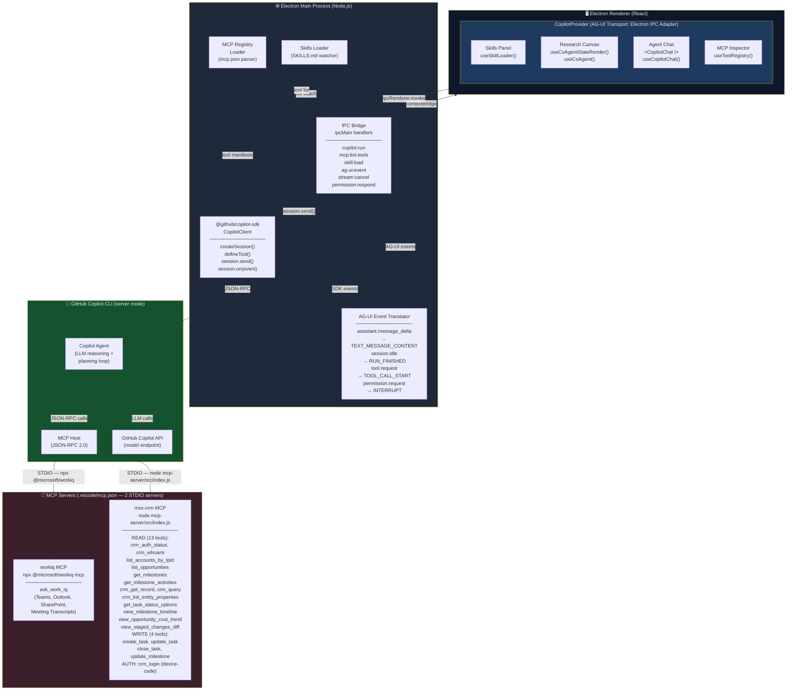
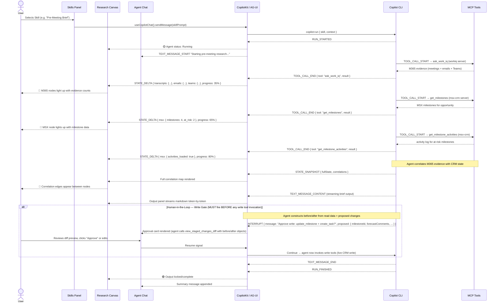
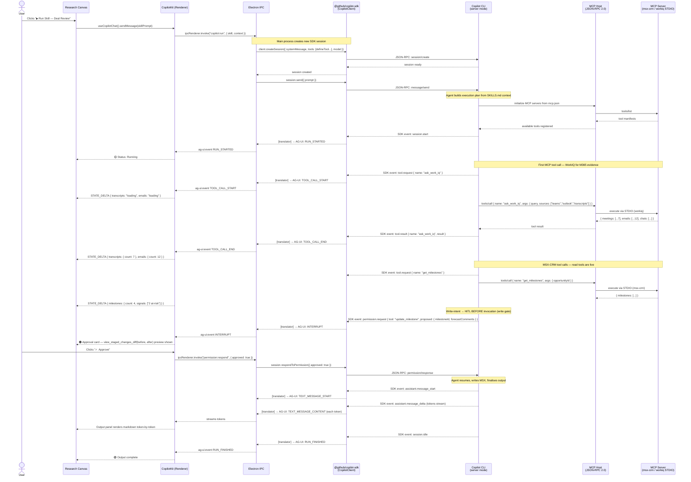
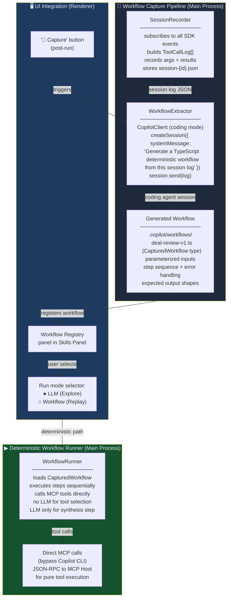
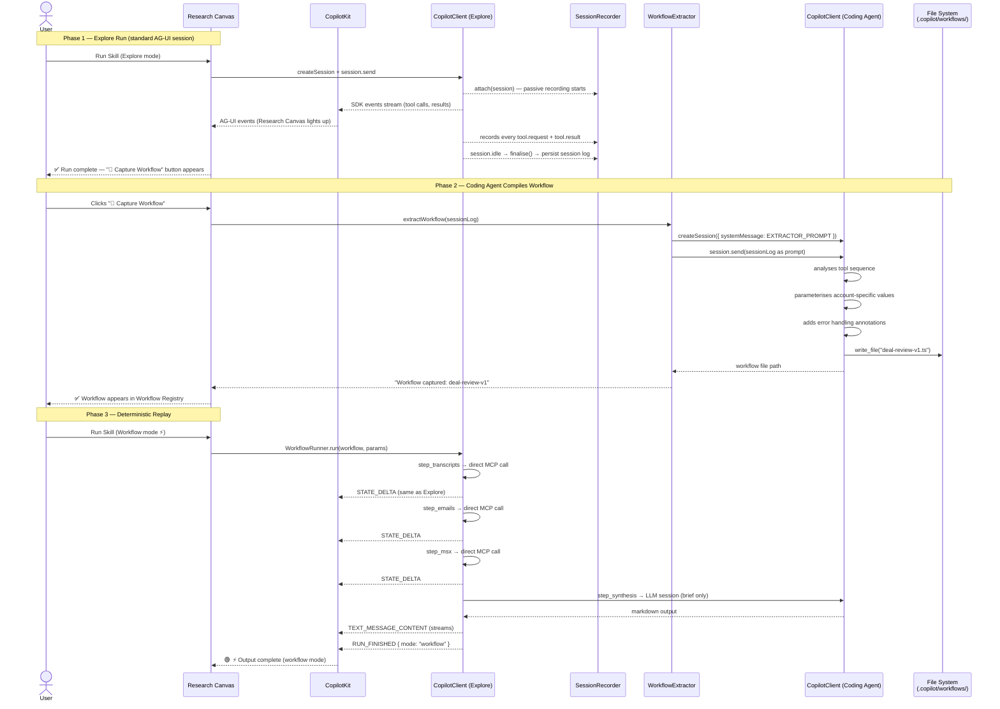

# Electron Copilot Sales Assistant — UI/UX Architecture & Flow Design

> **Target Users:** Solution Engineers, Cloud Solutions Architects, Sales Specialists
> **Stack:** Electron · React · CopilotKit (AG-UI) · `@github/copilot-sdk` · GitHub Copilot CLI · Microsoft WorkIQ MCP · MSX MCP
> **Internal Data Sources:** Microsoft 365 (Teams, Outlook, SharePoint via WorkIQ MCP) · MSX/Dynamics 365 (accounts, opportunities, engagement milestones, tasks)
> **Pattern Inspiration:** AG-UI Researcher Demo — live streaming, shared state, generative UI
> **Top-Level Flow:** `Renderer (CopilotKit/AG-UI)` → `IPC` → `Copilot SDK (CopilotClient)` → `Copilot CLI (server mode)` → `MCP Servers`
>
> _Note: Schema-level mappings for WorkIQ and MSX data stores are deferred to a separate design phase. This document covers the integration architecture and UI/UX flow._

---

## 1. Design Philosophy

The app acts as a **personal AI sales operations layer** — one that learns how each rep works through `SKILLS.md` files they author themselves, then automates the tedious data-gathering and correlation tasks that eat into selling time.

Three core design principles drive every decision:

**Transparency over magic.** Users see exactly which MCP tools are running, what data is being pulled, and how the agent is reasoning. No black box — every tool call surfaces as a visible node in the Research Canvas.

**Skills-first personalization.** A Solution Engineer and a Cloud Architect use the same app but describe completely different workflows in their `SKILLS.md`. The UI adapts to their skill — not the other way around.

**Progressive trust.** The agent runs autonomously by default, but pauses for human-in-the-loop confirmation at key moments (e.g. before writing MSX updates, before sending follow-up drafts). Trust is earned through visible accuracy over time.

---

## 2. System Architecture

### 2.1 High-Level Stack

The three-tier flow runs as follows, with each arrow representing a distinct protocol boundary:

```
┌─────────────────────────────────────────────────────────────────┐
│  TIER 1 — RENDERER (React + CopilotKit / AG-UI)                 │
│  AG-UI events ← → IPC contextBridge                             │
└────────────────────────────┬────────────────────────────────────┘
                             │ Electron IPC (ipcMain / ipcRenderer)
┌────────────────────────────▼────────────────────────────────────┐
│  TIER 2 — MAIN PROCESS (Node.js)                                 │
│  @github/copilot-sdk  ←  CopilotClient  →  SDK event adapter    │
│  SDK events → AG-UI event translation → IPC → Renderer          │
└────────────────────────────┬────────────────────────────────────┘
                             │ JSON-RPC 2.0 (managed by SDK)
┌────────────────────────────▼────────────────────────────────────┐
│  TIER 3 — COPILOT CLI (server mode)                              │
│  Agent runtime → MCP Host → MCP Servers (mcp.json tools)        │
└─────────────────────────────────────────────────────────────────┘
```

### 2.2 Full Architecture Diagram



---

## 2.3 GitHub Copilot SDK — Role in the Architecture

The `@github/copilot-sdk` (TypeScript) lives entirely in the **Electron main process**. It is the single point of contact between the application and the Copilot CLI agent runtime — replacing any direct `child_process` spawning.

**What the SDK manages:**

- **CLI process lifecycle** — starts and stops the Copilot CLI in server mode; or connects to an already-running CLI via `cliUrl` (useful for dev mode)
- **Session lifecycle** — one session per skill run; destroyed on cancel or completion
- **Tool registration** — MCP tools from `mcp.json` are registered as SDK tools via `defineTool()`, so the agent can call them natively
- **Permission requests** — the SDK surfaces `permission.request` events before sensitive tool executions, which the translator maps to AG-UI `INTERRUPT` events

**SDK → AG-UI Event Translation Map:**

| SDK Event | AG-UI Event | Notes |
|---|---|---|
| `session.start` | `RUN_STARTED` | Emitted when CLI begins processing |
| `session.idle` | `RUN_FINISHED` | Emitted when agent has no more work |
| `assistant.message_start` | `TEXT_MESSAGE_START` | First token of a new message |
| `assistant.message_delta` | `TEXT_MESSAGE_CONTENT` | Each streaming token chunk |
| `assistant.message_end` | `TEXT_MESSAGE_END` | Message complete |
| `tool.request` | `TOOL_CALL_START` | Agent wants to call a tool |
| `tool.result` | `TOOL_CALL_END` | Tool execution completed |
| `permission.request` | `INTERRUPT` | Requires user approval (HITL) |
| `state.update` | `STATE_DELTA` | Custom: emitted by skill tools |

**SDK session creation per skill run:**

```typescript
// In Electron main process — copilot-client.ts
import { CopilotClient, defineTool } from "@github/copilot-sdk";
import { z } from "zod";

const client = new CopilotClient(); // connects to CLI server mode

async function runSkill(skill: SkillDefinition, context: SkillContext) {
  // Register each MCP tool listed in the skill's SKILLS.md
  const tools = skill.mcpTools.map(toolName =>
    defineTool(toolName, {
      description: mcpRegistry.getDescription(toolName),
      parameters: z.object(mcpRegistry.getSchema(toolName)),
      handler: async (args) => mcpRegistry.invoke(toolName, args),
    })
  );

  const session = await client.createSession({
    model: "gpt-4.5",                  // or from skill config
    systemMessage: skill.systemPrompt, // built from SKILLS.md
    tools,
    streaming: true,
  });

  // Translate SDK events → AG-UI and forward to renderer via IPC
  session.on((event) => agUiTranslator.translate(event, ipcMain));

  await session.send({ prompt: context.userPrompt });
}
```

### IPC Channel Reference

| Channel | Direction | Payload |
|---|---|---|
| `copilot:run` | Renderer → Main | `{ skill, prompt, context }` |
| `copilot:stream` | Main → Renderer | AG-UI event stream (SSE-compatible chunks) |
| `copilot:cancel` | Renderer → Main | `{ runId }` |
| `mcp:list-tools` | Renderer → Main | `{}` → `{ tools[] }` |
| `mcp:tool-result` | Main → Renderer | `{ toolName, result, status }` |
| `skill:list` | Renderer → Main | `{}` → `{ skills[] }` |
| `skill:load` | Renderer → Main | `{ skillId }` → `{ skill }` |
| `skill:save` | Renderer → Main | `{ skillId, content }` |
| `ag-ui:event` | Main → Renderer | Raw AG-UI event object |

---

## 3. AG-UI Event Flow — Sales Workflow Lifecycle



---

## 4. Master Screen Layout — Wireframe

```
┌─────────────────────────────────────────────────────────────────────────────────────┐
│  ◉ ◎ ⊙  Copilot Sales Assistant                        [SE: Jin Lee ▾] [● Connected]│
├────────────────────────────────────────────────────────────────────────────────────-│
│                                                                                      │
│  ┌────────────────┐  ┌──────────────────────────────────┐  ┌─────────────────────┐  │
│  │  SKILLS        │  │  RESEARCH CANVAS                 │  │  AGENT CHAT         │  │
│  │  ─────────     │  │  ─────────────────────────────   │  │  ─────────────────  │  │
│  │  [My Skills▾]  │  │                                  │  │  [thread history]   │  │
│  │                │  │  ┌──────┐    ┌──────┐            │  │                     │  │
│  │  ○ Pre-Meet    │  │  │Emails│───▶│Correl│            │  │  ┌───────────────┐  │  │
│  │  ● Deal Review │  │  │ 12   │    │Engine│            │  │  │ Agent         │  │  │
│  │  ○ Follow-Up   │  │  └──────┘    │      │◀──┐        │  │  │ "Analysing    │  │  │
│  │  ○ QBR Prep    │  │              │      │   │        │  │  │  3 signals... │  │  │
│  │  ○ Renewal     │  │  ┌──────┐    └──────┘   │        │  │  └───────────────┘  │  │
│  │  ─────────     │  │  │Trans-│    ▲     ▲    │        │  │                     │  │
│  │  [+ New Skill] │  │  │cripts│────┘     │    │        │  │  [Tool Call Log]    │  │
│  │                │  │  │  7   │          │    │        │  │  ─────────────────  │  │
│  │  ─────────     │  │  └──────┘     ┌────┴──┐ │        │  │  ✓ ask_work_iq     │  │
│  │  SKILL TUNER   │  │               │ MSX   │─┘        │  │  ✓ list_opps       │  │
│  │  ─────────     │  │  ┌──────┐     │ Data  │          │  │  ⟳ get_milestones  │  │
│  │  Context:      │  │  │Teams │     └───────┘          │  │                     │  │
│  │  [Account ▾]   │  │  │Teams │                        │  │  ─────────────────  │  │
│  │                │  │  │  24  │     ┌─────────────────┐│  │  Type a message...  │  │
│  │  Depth: [●○○]  │  │  └──────┘     │ OUTPUT          ││  │  ─────────────────  │  │
│  │  Tone:[Prof. ▾]│  │               │ ─────────────── ││  │  [        Send  ▶ ] │  │
│  │                │  │               │ # Deal Brief    ││  │                     │  │
│  │  [▶ Run Skill] │  │               │ **Acme Corp**   ││  │                     │  │
│  │                │  │               │ > Risk: medium  ││  │                     │  │
│  │  ─────────     │  │               │ > Champion: JD  ││  │                     │  │
│  │  [⚙ Edit .md]  │  │               │ > Next: demo    ││  │                     │  │
│  │  [🔌 MCP Tools]│  │               │ [Copy] [Export] ││  │                     │  │
│  └────────────────┘  └──────────────────────────────────┘  └─────────────────────┘  │
│                                                                                      │
│  [⬤ mcp.json: 26 tools active]  [● Copilot CLI v1.x]  [⚡ Last run: 2m ago]         │
└─────────────────────────────────────────────────────────────────────────────────────┘
```

**Panel proportions:** Skills Panel 20% · Research Canvas 50% · Agent Chat 30%

**Status bar** (bottom) is always visible — shows live MCP tool count, CLI connection state, and last run time.

---

## 5. Panel Deep-Dives

---

### 5.1 Skills Panel — Annotated Wireframe

```
┌────────────────────────────────┐
│  MY SKILLS          [+ New]    │
│  ──────────────────────────    │
│                                │
│  ○ Pre-Meeting Brief           │◀── Currently inactive skill
│  ● Deal Review        ▶ Run    │◀── Active skill (highlighted)
│  ○ Follow-Up Drafter           │
│  ○ QBR Preparation             │
│  ○ Renewal Risk Scan           │
│  ○ Competitor Intel            │
│                                │
│  [Import SKILLS.md]            │◀── Drop a file or paste URL
│                                │
│  ════════════════════════════  │
│  SKILL TUNER — Deal Review     │◀── Contextual tuner per skill
│  ──────────────────────────    │
│                                │
│  Account context:              │
│  [Acme Corp (MSX-1029)  ▾]    │◀── Pulls from MSX MCP
│                                │
│  Time window:                  │
│  [Last 30 days           ▾]    │
│                                │
│  Depth:                        │
│  Shallow ○──●──○ Deep          │◀── Maps to SKILLS.md depth param
│                                │
│  Output format:                │
│  [Exec Summary ▾]              │◀── Defined by SKILLS.md templates
│                                │
│  Include sources:              │
│  [✓] Transcripts               │
│  [✓] Emails                    │
│  [✓] Teams                     │
│  [✓] MSX Activity              │
│  [ ] Competitor signals        │
│                                │
│  ──────────────────────────    │
│  [▶  Run Skill]                │◀── Triggers RUN_STARTED event
│  [⚙  Edit SKILLS.md]          │◀── Opens in-app markdown editor
│  [🔌  MCP Tools (26 active)]   │◀── Opens MCP Inspector modal
└────────────────────────────────┘
```

**CopilotKit hooks used here:**
- `useCoAgent("sales_agent")` — reads/writes skill state to agent
- `useCopilotReadable()` — exposes current skill params to agent context
- `useCopilotAction("run_skill")` — fires when "Run Skill" clicked

---

### 5.2 Research Canvas — Annotated Wireframe

Inspired directly by the AG-UI Researcher demo's `useCoAgentStateRender` pattern. Each data source is a live node that activates as the agent calls its corresponding MCP tool.

```
┌──────────────────────────────────────────────────────────────────┐
│  RESEARCH CANVAS           [⬤ Running: Deal Review]  [✕ Cancel]  │
│  ────────────────────────────────────────────────────────────    │
│                                                                  │
│  DATA SOURCES                    CORRELATION ENGINE              │
│  ────────────────                ────────────────────            │
│                                                                  │
│  ┌──────────────┐                                                │
│  │ 📧 Emails    │──────────────────────────────►┐               │
│  │  12 threads  │   "champion frustrated with   ││               │
│  │  [●●●●●○○○]  │    procurement delays"        ││               │
│  └──────────────┘                               ▼│               │
│                                          ┌───────────────┐  ┌───┴──────────────┐│
│  ┌──────────────┐                        │ CORRELATION   │  │ OPPORTUNITY       ││
│  │ 🎙️ Transcripts│─────────────────────► │ ENGINE        │◄─│ .name             ││
│  │  7 sessions  │   "asked about         │               │  │ consumed: $420k   ││
│  │  [●●●●●●●○]  │    pricing 3x"         │ Risk: MEDIUM  │  │ msp_salesplay     ││
│  └──────────────┘                        │ Momentum: ↑   │  │ 4 milestones      ││
│                                          └───────────────┘  └──────────────────┘│
│  ┌──────────────┐                               ▲│               │
│  │ 💬 Teams     │──────────────────────────────►│               │
│  │  24 messages │   "CSM flagged blockers"       │               │
│  │  [●●●●●●●●]  │                               │               │
│  └──────────────┘                               │               │
│                                                 │               │
│  ┌───────────────────┐                          │               │
│  │ 🏢 Milestones     │─────────────────────────►┘               │
│  │  msp_milestonenumber                                         │
│  │  msp_milestonestatus†                                        │
│  │  msp_monthlyuse ($)                                          │
│  │  msp_commitmentrecommendation†                               │
│  │  msp_milestonedate                                           │
│  │  [●●●●○○○○]        │                                         │
│  └───────────────────┘                                          │
│  † OData formatted values via @OData.Community.Display.V1       │
│    .FormattedValue (e.g. "Active", "Committed")                 │
│                                                                  │
│  ┌───────────────────┐                                          │
│  │ 📋 Tasks           │                                          │
│  │  subject · statuscode                                        │
│  │  scheduledend (due)                                          │
│  │  msp_taskcategory  │                                         │
│  │  _regardingobjectid_value                                    │
│  │  (ordered: createdon desc)                                   │
│  │  [●●○○○○○○]        │                                         │
│  └───────────────────┘                                          │
│                                                                  │
│  ────────────────────────────────────────────────────────────   │
│  OUTPUT                                    [Copy] [Export .md]  │
│  ──────────────────────────────────────────────────────────     │
│                                                                  │
│  # Deal Brief — Acme Corp                                        │◀── Streams token-by-token
│  **Risk Level:** Medium — procurement blocker confirmed          │    via TEXT_MESSAGE_CONTENT
│  **ACR:** $420,000 (`msp_consumptionconsumedrecurring`)          │
│  **Sales Play:** `msp_salesplay`                                 │
│  **Est. Completion:** `msp_estcompletiondate`                    │
│  **Champion:** Jane Doe (VP Eng) — engaged, positive            │
│  **Commitment:** 2 uncommitted / 2 committed                    │    (`msp_commitmentrecommendation`†)
│    (`msp_commitmentrecommendation`†)                             │
│  **At-Risk Milestones:** 2 of 4 (`msp_milestonestatus`†)        │
│  **Forecast:** `msp_forecastcomments` excerpt                    │
│  **Key Signal:** Asked about pricing 3x in last 30 days         │
│  **Recommended Next Step:** Executive alignment call            │
│  † = OData formatted values available                            │
│                                                                  │
│  > Sources: 7 transcripts · 12 emails · 24 Teams msgs · MSX    │◀── Auto-cited from state
└──────────────────────────────────────────────────────────────────┘
```

**CopilotKit hooks used here:**
```jsx
// Renders live progress as agent emits STATE_DELTA events
useCoAgentStateRender({
  name: "sales_agent",
  render: ({ state, status }) => (
    <ResearchNode
      // WorkIQ sources (all from single ask_work_iq call)
      transcripts={state.transcripts}
      emails={state.emails}
      teams={state.teams}
      // MSX/Dynamics 365 sources — typed CRM records (see §7.2.1)
      // opportunities: CrmOpportunity[] (from list_opportunities)
      //   → opportunityid, name, msp_salesplay, msp_consumptionconsumedrecurring,
      //     msp_estcompletiondate, _ownerid_value, _parentaccountid_value
      opportunities={state.opportunities}
      // milestones: CrmMilestone[] (from get_milestones, ordered by msp_milestonedate)
      //   → msp_milestonenumber ("7-XXXXXXXXX"), msp_name, msp_milestonestatus†,
      //     msp_monthlyuse, msp_commitmentrecommendation†, msp_milestonedate,
      //     msp_forecastcomments, msp_forecastcommentsjsonfield
      //   † OData formatted values available via @OData.Community.Display.V1.FormattedValue
      milestones={state.milestones}
      // tasks: CrmTask[] (from get_milestone_activities, ordered by createdon desc)
      //   → activityid, subject, statuscode†, statecode, scheduledend, msp_taskcategory†,
      //     _regardingobjectid_value (links to parent milestone GUID), description
      tasks={state.tasks}
      // View tool outputs (with renderHints for auto-layout)
      timeline={state.timeline}       // view_milestone_timeline → TimelineData
      costTrend={state.costTrend}     // view_opportunity_cost_trend → CostTrendData
      // Correlation & output
      correlations={state.correlations}
      progress={state.progress}
      output={state.output}
    />
  )
});

// Shared state sync (agent can read app context, app can read agent state)
const { state, setState } = useCoAgent("sales_agent");
```

**Node states:** `idle` (grey) → `loading` (pulsing amber) → `loaded` (green, shows count) → `correlated` (teal, shows extracted signal)

---

### 5.3 Agent Chat Panel — Annotated Wireframe

```
┌─────────────────────────────────────────────┐
│  AGENT CHAT                         [Clear]  │
│  ─────────────────────────────────────────   │
│                                              │
│  ┌────────────────────────────────────────┐  │
│  │ You — 10:32am                          │  │
│  │ Run a deal review for Acme Corp        │  │
│  └────────────────────────────────────────┘  │
│                                              │
│  ┌────────────────────────────────────────┐  │
│  │ 🤖 Copilot — 10:32am                  │  │
│  │ Starting deal review for Acme Corp.   │  │
│  │ I'll pull transcripts, emails, Teams  │  │
│  │ and MSX activity from the last 30d.   │  │
│  └────────────────────────────────────────┘  │
│                                              │
│  TOOL CALL LOG                               │◀── Live feed of MCP calls
│  ─────────────────────────────────────────   │
│  ✓  ask_work_iq              [19]  1.4s      │
│  ✓  list_opportunities       [3]   0.6s      │
│  ⟳  get_milestones  ...                   │◀── Spinning = in progress
│  ○  get_milestone_activities   (queued)      │
│  ○  view_milestone_timeline    (queued)      │
│  ○  view_opportunity_cost_trend (queued)     │
│                                              │
│  ─────────────────────────────────────────   │
│                                              │
│  ┌────────────────────────────────────────┐  │
│  │ ⚠️ APPROVAL NEEDED                     │  │◀── INTERRUPT event renders this
│  │ I'd like to update forecast comments   │  │    via useLangGraphInterrupt()
│  │ (msp_forecastcomments) on milestone    │  │    (human-in-the-loop)
│  │ 7-123456789 and create a follow-up     │  │
│  │ task (msp_taskcategory: Workshop).     │  │
│  │                                        │  │
│  │ Diff preview (view_staged_changes_diff)│  │
│  │ ┌────────────────────────────────────┐ │  │
│  │ │ msp_forecastcomments               │ │  │
│  │ │  before: "On track for Q2"        │ │  │
│  │ │  after:  "At risk — blocker"      │ │  │
│  │ └────────────────────────────────────┘ │  │
│  │                                        │  │
│  │  [✗ Skip]  [✎ Edit]  [✓ Approve]      │  │
│  └────────────────────────────────────────┘  │
│                                              │
│  ─────────────────────────────────────────   │
│  Ask a follow-up or give instructions...     │
│  ─────────────────────────────────────────   │
│  [                                    ▶ ]    │
└─────────────────────────────────────────────┘
```

**CopilotKit hooks used here:**
```jsx
// Main chat component — handles streaming and history
<CopilotChat
  labels={{ initial: "What would you like to do?" }}
  instructions={skill.systemPrompt}
/>

// Human-in-the-loop interrupt handler
useLangGraphInterrupt({
  render: ({ event, resolve }) => (
    <ApprovalCard
      message={event.value}
      onApprove={() => resolve("approved")}
      onSkip={() => resolve("skip")}
      onEdit={(edited) => resolve(edited)}
    />
  )
});
```

---

### 5.4 MCP Tool Inspector — Modal Overlay

Opened via "🔌 MCP Tools" button. Shows which tools from `mcp.json` are active and lets users enable/disable them per skill run.

```
┌───────────────────────────────────────────────────────────────┐
│  MCP TOOL INSPECTOR                              [✕ Close]     │
│  ─────────────────────────────────────────────────────────    │
│                                                               │
│  CONFIG: .vscode/mcp.json  [Edit Raw] [Reload]                │
│                                                               │
│  ACTIVE SERVERS (2)                                           │
│  ─────────────────────────────────────────────────────────    │
│                                                               │
│  ● workiq              STDIO (npx @microsoft/workiq) ✓  9    │
│    └─ ask_work_iq                                             │
│       (Teams chats/channels · meeting transcripts ·           │
│        Outlook mail/calendar · SharePoint/OneDrive)           │
│                                                               │
│  ● msx-crm             STDIO (node mcp-server/src/) ✓ 17     │
│    READ: crm_auth_status · crm_whoami · list_accounts_by_tpid │
│          list_opportunities · get_milestones ·                │
│          get_milestone_activities · crm_get_record ·          │
│          crm_query · crm_list_entity_properties ·             │
│          get_task_status_options                               │
│    VIEW: view_milestone_timeline ·                            │
│          view_opportunity_cost_trend ·                        │
│          view_staged_changes_diff                             │
│    WRITE (live): create_task · update_task ·                  │
│          close_task · update_milestone                        │
│    AUTH: crm_login (device-code flow)                         │
│    ⚠️  Write tools are LIVE — HITL required BEFORE invocation │
│                                                               │
│  ─────────────────────────────────────────────────────────    │
│  [+ Add MCP Server]            [Test All Tools]               │
└───────────────────────────────────────────────────────────────┘
```

---

### 5.5 SKILLS.md In-App Editor

A split-pane editor invoked by "⚙ Edit SKILLS.md". Left pane is the raw markdown; right pane shows the parsed parameter preview.

```
┌────────────────────────────────────────────────────────────────────────────────┐
│  SKILLS.md Editor — Deal Review                  [Save] [Validate] [✕ Close]   │
├─────────────────────────────────────┬──────────────────────────────────────────┤
│  MARKDOWN SOURCE                    │  PARSED PARAMETERS PREVIEW               │
│  ─────────────────────────────────  │  ──────────────────────────────────────  │
│                                     │                                          │
│  ---                                │  name: "solution-engineer-msx-ops"       │
│  name: solution-engineer-msx-ops   │  description: "SE skill for MSX/MCEM     │
│  description: Solution Engineer     │    focused on day-to-day milestone task   │
│    operating skill for MSX/MCEM     │    updates, BANT-qualified uncommitted    │
│    focused on day-to-day...         │    handoff..."                            │
│  argument-hint: Provide             │  argument-hint: "Provide                 │
│    opportunity/milestone IDs,       │    opportunity/milestone IDs..."          │
│    commitment state, BANT status    │                                           │
│  ---                                │  mcp_servers:                            │
│                                     │    ✓ msx-crm  (17 tools, STDIO)          │
│  # Agent Skill Profile              │    ✓ workiq   (ask_work_iq, STDIO)       │
│  ...                                │                                           │
│                                     │  write_tools (LIVE — no dry-run):       │
│  ## Agent Skills (declarative MCP)  │    create_task · update_task ·           │
│                                     │    close_task · update_milestone         │
│  ### Skill: "Daily Hygiene"         │    ⚠️  Writes execute immediately         │
│  Trigger: Daily cadence             │    ⚠️  HITL approval required BEFORE call │
│  Flow:                              │                                           │
│  1. crm_auth_status                 │  4 declarative flows detected:           │
│  2. list_accounts_by_tpid →         │  ● Daily Hygiene                         │
│     list_opportunities              │  ● BANT-to-CSU Handoff                   │
│  3. get_milestones(oppId)           │  ● Committed Influenced Follow-through   │
│  4. get_milestone_activities(...)   │  ● M365 Evidence Companion               │
│  5. update_task/create_task (HITL)   │                                           │
│                                     │  ✓  Valid skill file format              │
│  Output: task_summary,              │  ✓  Both MCP servers connected           │
│    proposed_task_operations          │  ✓  Skill routing ID confirmed           │
│                                     │                                          │
└─────────────────────────────────────┴──────────────────────────────────────────┘
```

---

## 6. MCP Tool Call Sequence — Full Stack Flow

This sequence shows all five tiers from UI click down to MCP server and back, with the Copilot SDK as the authoritative bridge between the Electron process and the CLI agent runtime.



---

## 7. Skill File Format — Actual Repo Structure

Based on the existing backend at `JinLee794/mcaps-copilot-tools`, skill files follow GitHub Copilot's native skill format — not a custom SKILLS.md schema. This section documents the actual format and the 4 role skills that ship with the repo.

### 7.1 Skill File Format (YAML Frontmatter)

Skill files live in `.github/skills/` and use YAML frontmatter rendered as a table by GitHub. This is the format Copilot reads natively:

```markdown
---
name: <skill-kebab-name>
description: <one-sentence description used for skill selection>
argument-hint: <what context the caller must provide>
---

# Agent Skill Profile

> **Purpose**: ...
> **Scope**: Opportunity & milestone management, pipeline hygiene, role-to-role handoffs, cross-role orchestration.

---

## Shared definitions (applies to all roles)
...

---

## Role: <Role Name>

### Mission (in MCEM/MSX)
...

### Primary accountabilities by MCEM stage
...

### MSX ownership & hygiene expectations
...

### Cross-role communication
...

---

## Agent Skills (declarative MCP flows)

### Runtime contract (current server behavior)
- **Read tools are live** (13 tools): `crm_auth_status`, `crm_whoami`, `list_accounts_by_tpid`, `list_opportunities`, `get_milestones`, `get_milestone_activities`, `crm_get_record`, `crm_query`, `crm_list_entity_properties`, `get_task_status_options`, `view_milestone_timeline`, `view_opportunity_cost_trend`, `view_staged_changes_diff`
- **Write tools are currently LIVE** (4 tools): `create_task`, `update_task`, `close_task`, `update_milestone` execute real CRM writes (POST/PATCH) immediately — **there is no dry-run mock layer today**
- **Planned: staged write pattern** (not yet implemented): `STAGED_OPERATIONS.md` defines the target stage→review→execute flow where writes would validate+stage first, return a preview with before-state diff, and wait for explicit `execute_operation`/`cancel_operation` confirmation. Until this lands, write operations require HITL confirmation at the agent/UI layer before the tool is invoked.
- **Auth tool**: `crm_login` — device-code flow for Azure CLI authentication (call when `crm_auth_status` reports unauthenticated)

### WorkIQ MCP companion (M365 retrieval)
- Use `ask_work_iq` when evidence lives in M365 collaboration systems
- Primary sources: Teams chats/channels, meetings/transcripts, Outlook mail/calendar, SharePoint/OneDrive

### Skill: "<Skill Name>"

**Trigger**: ...

**Flow**:
1. Call `crm_auth_status`
2. Resolve scope via `list_accounts_by_tpid` → `list_opportunities`
3. Call `get_milestones(opportunityId)` and filter
4. Call `get_milestone_activities(milestoneId)` for evidence
5. Construct preview payloads for `update_milestone(...)` / `create_task(...)` — presented in HITL approval card before live execution

**Decision logic**: ...

**Output schema**:
- `output_field_1`
- `proposed_operations` (preview payloads for HITL approval)
```

### 7.2 The Two MCP Sources Pattern

Every skill in the repo follows this two-source design principle:

| Source | MCP Server | Tools | Key Fields Returned | Answers |
|---|---|---|---|---|
| MSX / CRM (Read) | `msx-crm` | `crm_query`, `list_opportunities`, `get_milestones`, `get_milestone_activities`, `crm_get_record`, `list_accounts_by_tpid`, `crm_list_entity_properties`, `get_task_status_options` | See [7.2.1 CRM Data Dictionary](#721-crm-data-dictionary) | Ownership, status, execution integrity, dates, entity metadata |
| MSX / CRM (View) | `msx-crm` | `view_milestone_timeline`, `view_opportunity_cost_trend`, `view_staged_changes_diff` | See [7.2.2 View Tool Output Shapes](#722-view-tool-output-shapes) | Timeline visualization, monthly consumption trends, before/after diff previews |
| MSX / CRM (Write) | `msx-crm` | `create_task`, `update_task`, `close_task`, `update_milestone` | Write payloads use the same field names as read schemas. OData bind syntax for lookups: `"ownerid@odata.bind": "/systemusers(guid)"` | Milestone & task CRUD (**LIVE writes** — HITL required BEFORE invocation) |
| MSX / CRM (Auth) | `msx-crm` | `crm_auth_status`, `crm_whoami`, `crm_login` | `UserId`, `fullname`, `internalemailaddress` | User identity, session health, device-code login |
| M365 / WorkIQ | `workiq` | `ask_work_iq` | Free-form results from Teams, Outlook, SharePoint, meeting transcripts | Discussion history, decision rationale, meeting/email evidence |

Skills use CRM read tools to establish structure, view tools for visualization, and WorkIQ to provide M365 evidence. The two sources are correlated but kept separate in output schemas.

---

#### 7.2.1 CRM Data Dictionary

All entity field names below are the **exact property names** returned by the MCP server. Lookup fields (foreign keys) follow the Dynamics 365 pattern: `_<fieldname>_value`.

##### Entity: `accounts` (entity set: `accounts`)

| CRM Field | Display Name | Type | Notes |
|---|---|---|---|
| `accountid` | Account ID | GUID | Primary key |
| `name` | Account Name | String | Display name |
| `msp_mstopparentid` | MS Top Parent ID (TPID) | String | Numeric string; used by `list_accounts_by_tpid`. **Not** `msp_accounttpid`. |

##### Entity: `opportunities` (entity set: `opportunities`)

| CRM Field | Display Name | Type | Notes |
|---|---|---|---|
| `opportunityid` | Opportunity ID | GUID | Primary key |
| `name` | Opportunity Name | String | |
| `estimatedclosedate` | Estimated Close Date | DateTime | |
| `msp_estcompletiondate` | Est. Completion Date | DateTime | Consumption/delivery completion |
| `msp_consumptionconsumedrecurring` | Consumed Recurring | Decimal | Monthly consumed recurring revenue ($) |
| `_ownerid_value` | Owner | Lookup → `systemusers` | System user GUID |
| `_parentaccountid_value` | Parent Account | Lookup → `accounts` | Account GUID |
| `msp_salesplay` | Sales Play | String | Solution area / sales motion |
| `statecode` | State | Int | `0` = Open |

##### Entity: `msp_engagementmilestones` (entity set: `msp_engagementmilestones`)

| CRM Field | Display Name | Type | Notes |
|---|---|---|---|
| `msp_engagementmilestoneid` | Milestone ID | GUID | Primary key |
| `msp_milestonenumber` | Milestone Number | String | Format: `7-XXXXXXXXX` |
| `msp_name` | Milestone Name | String | Workload + milestone description |
| `_msp_workloadlkid_value` | Workload | Lookup | Workload entity reference |
| `msp_commitmentrecommendation` | Commitment Recommendation | Int/OptionSet | Uncommitted vs Committed status |
| `msp_milestonecategory` | Milestone Category | Int/OptionSet | Category classification |
| `msp_monthlyuse` | Monthly Use | Decimal | Planned monthly consumption ($) |
| `msp_milestonedate` | Milestone Date | DateTime | Target completion date |
| `msp_milestonestatus` | Milestone Status | Int/OptionSet | Active, At Risk, Closed, etc. |
| `_ownerid_value` | Owner | Lookup → `systemusers` | Milestone owner GUID |
| `_msp_opportunityid_value` | Opportunity | Lookup → `opportunities` | Parent opportunity GUID |
| `msp_forecastcomments` | Forecast Comments | String | Free-text forecast notes |
| `msp_forecastcommentsjsonfield` | Forecast Comments (JSON) | String | Structured forecast data |

##### Entity: `tasks` (entity set: `tasks`)

| CRM Field | Display Name | Type | Notes |
|---|---|---|---|
| `activityid` | Task ID | GUID | Primary key |
| `subject` | Subject | String | Task title |
| `scheduledend` | Due Date | DateTime | Scheduled end / due date |
| `statuscode` | Status Reason | Int | See status options below |
| `statecode` | State | Int | `0` = Open, `1` = Completed, `2` = Cancelled |
| `_ownerid_value` | Owner | Lookup → `systemusers` | Assigned user GUID |
| `description` | Description | String | Task body/details |
| `msp_taskcategory` | Task Category | Int/OptionSet | See category codes below |
| `_regardingobjectid_value` | Regarding | Lookup → `msp_engagementmilestones` | Links task to parent milestone |

**Task Category Codes** (used by `create_task` `category` param):

| Code | Label |
|---|---|
| `606820005` | Technical Close/Win Plan |
| `861980004` | Architecture Design Session |
| `861980006` | Blocker Escalation |
| `861980008` | Briefing |
| `861980007` | Consumption Plan |
| `861980002` | Demo |
| `861980005` | PoC/Pilot |
| `861980001` | Workshop |

##### Entity: `systemusers` (entity set: `systemusers`)

| CRM Field | Display Name | Type | Notes |
|---|---|---|---|
| `systemuserid` | User ID | GUID | Primary key; same as `WhoAmI().UserId` |
| `fullname` | Full Name | String | |
| `internalemailaddress` | Email | String | Microsoft email address |
| `title` | Title | String | Job title (used for role inference) |
| `businessunitid` | Business Unit | GUID | Org unit reference |

##### Lookup Field Convention

All foreign-key fields follow the pattern `_<fieldname>_value` and resolve to a GUID. When writing (POST/PATCH), use the OData bind syntax instead:

```
// Read:  _ownerid_value → "a1b2c3d4-..."
// Write: "ownerid@odata.bind": "/systemusers(a1b2c3d4-...)"
```

##### OData Formatted Value Annotations

The MCP server's CRM client sends `Prefer: odata.include-annotations="*"`, which means all responses include **formatted value annotations** alongside raw integer/code values for OptionSet fields. The annotation key follows the pattern:

```
<fieldname>@OData.Community.Display.V1.FormattedValue
```

**Example: Milestone status in a `get_milestones` response:**

```json
{
  "msp_milestonestatus": 861980001,
  "msp_milestonestatus@OData.Community.Display.V1.FormattedValue": "Active",
  "msp_commitmentrecommendation": 861980000,
  "msp_commitmentrecommendation@OData.Community.Display.V1.FormattedValue": "Uncommitted",
  "msp_milestonecategory": 861980002,
  "msp_milestonecategory@OData.Community.Display.V1.FormattedValue": "Usage"
}
```

**UI implication:** The Research Canvas and Output Panel should prefer formatted values for display labels and fall back to raw int codes only when annotations are absent. The `view_milestone_timeline` tool already resolves the formatted status label at the server level (see `msp_milestonestatus@OData.Community.Display.V1.FormattedValue` usage in `tools.js`).

**Fields with formatted values available:**

| Field | Entity | Formatted Value Example |
|---|---|---|
| `msp_milestonestatus` | `msp_engagementmilestones` | "Active", "At Risk", "Closed", etc. |
| `msp_commitmentrecommendation` | `msp_engagementmilestones` | "Uncommitted", "Committed" |
| `msp_milestonecategory` | `msp_engagementmilestones` | Category label |
| `statuscode` | `tasks` | "Not Started", "In Progress", "Completed", etc. |
| `statecode` | `tasks` | "Open", "Completed", "Cancelled" |
| `msp_taskcategory` | `tasks` | "Workshop", "Demo", "PoC/Pilot", etc. |

---

#### 7.2.2 View Tool Output Shapes

These are the exact JSON shapes returned by the three view tools. The `renderHints` object tells the frontend how to visualize the data.

##### `view_milestone_timeline` → Timeline View

```json
{
  "count": 4,
  "events": [
    {
      "id": "msp_engagementmilestoneid GUID",
      "date": "2026-03-15",
      "title": "msp_name value",
      "milestoneNumber": "7-123456789",
      "status": "Active | At Risk | Closed (formatted or int)",
      "monthlyUse": 12000,
      "opportunityId": "opportunity GUID or null",
      "opportunityName": "Acme Corp — Azure Migration or null"
    }
  ],
  "renderHints": {
    "view": "timeline",
    "defaultSort": { "field": "date", "direction": "asc" },
    "dateField": "date",
    "titleField": "title",
    "laneField": "opportunityName",
    "statusField": "status"
  }
}
```

##### `view_opportunity_cost_trend` → Time-Series Chart

```json
{
  "opportunity": {
    "id": "opportunity GUID",
    "name": "Acme Corp — Azure Migration",
    "estimatedCloseDate": "2026-06-30",
    "estimatedCompletionDate": "2026-09-30",
    "consumedRecurring": 84000
  },
  "points": [
    { "month": "2026-01", "plannedMonthlyUse": 12000 },
    { "month": "2026-02", "plannedMonthlyUse": 18000 },
    { "month": "2026-03", "plannedMonthlyUse": 24000 }
  ],
  "kpis": {
    "consumedRecurring": 84000,
    "totalPlannedMonthlyUse": 54000,
    "latestPlannedMonthlyUse": 24000
  },
  "renderHints": {
    "view": "timeseries",
    "xField": "month",
    "yFields": ["plannedMonthlyUse"],
    "currency": "USD",
    "defaultChart": "line",
    "showTable": true
  }
}
```

##### `view_staged_changes_diff` → Diff Table (Approval Card)

**Input:** The agent constructs `before` and `after` objects from CRM read data and the proposed change, then passes them as parameters. This tool does *not* read from a staged operations store — it is a pure render utility.

```typescript
// Agent calls:
view_staged_changes_diff({
  before: { msp_forecastcomments: "On track for Q2 delivery", msp_milestonedate: null },
  after:  { msp_forecastcomments: "At risk — procurement blocker confirmed", msp_milestonedate: "2026-04-15" },
  context: "optional label"
})
```

**Output:**

```json
{
  "context": "optional label or null",
  "summary": { "changedFieldCount": 2 },
  "rows": [
    {
      "field": "msp_forecastcomments",
      "before": "On track for Q2 delivery",
      "after": "At risk — procurement blocker confirmed",
      "changeType": "updated"
    },
    {
      "field": "msp_milestonedate",
      "before": null,
      "after": "2026-04-15",
      "changeType": "added"
    }
  ],
  "renderHints": {
    "view": "diffTable",
    "columns": ["field", "before", "after", "changeType"],
    "emphasisField": "changeType"
  }
}
```

### 7.3 Role Skill Registry (Actual Repo)

| Skill File | Frontmatter `name` | Role | # Declarative Flows |
|---|---|---|---|
| `Solution_Engineer_SKILL.md` | `solution-engineer-msx-ops` | SE | 4 (Daily Hygiene, BANT-to-CSU Handoff, Committed Influenced Follow-through, M365 Evidence Companion) |
| `Cloud_Solution_Architect_SKILL.md` | `cloud-solution-architect-msx-ops` | CSA | 10 (Committed Milestone Execution Monitor, Stage 4-5 Value Realization Pack, Architecture-to-Execution Handoff Note, Execution Readiness vs Delivery Ownership Disambiguator, Stage 4 Readiness Gatekeeper, Unified Readiness Early Warning, Technical Truth vs Admin Noise Filter, M365 Execution Evidence Correlator, Escalation Classification Assistant, Expansion Signal Router) |
| `CSAM_SKILL.md` | `csam-msx-ops` | CSAM | 9 (Delivery Accountability Mapper, Commit Gate Enforcer (CSU), Execution Authority Clarifier, Unified Constraint Early Warning, Expansion Ownership Router, MSX Noise Suppression, Committed Milestone Health Review, Customer Success Plan → MSX Alignment, Customer Communication Evidence Pack, Usage/Adoption Excellence Coordination) |
| `Specialist_SKILL.md` | `specialist-msx-ops` | Specialist | 4 (Stage 2-3 Pipeline Builder, Handoff Readiness Check, Pipeline Hygiene Exceptions Triage, Stage 2 Signal Intake) |
| `WorkIQ_Query_Scoping_SKILL.md` | *(WorkIQ scoping guide)* | All | N/A — companion reference for scoping `ask_work_iq` queries |

### 7.4 Role Accountability Map

The skills share a common role alignment principle:

```
┌────────────────┬──────────────────────────────────────────────────────────┐
│ Specialist     │ Pipeline integrity (stage 2-3 ownership, commitment gate) │
├────────────────┼──────────────────────────────────────────────────────────┤
│ SE             │ Technical decision quality (BANT, proof, M365 evidence)   │
├────────────────┼──────────────────────────────────────────────────────────┤
│ CSA            │ Execution readiness & technical feasibility authority      │
├────────────────┼──────────────────────────────────────────────────────────┤
│ CSAM           │ Outcome orchestration & realized value (stages 4-5)       │
└────────────────┴──────────────────────────────────────────────────────────┘
```

### 7.5 Example — SE Skill: "Daily Hygiene Flow" (actual repo pattern)

```markdown
---
name: solution-engineer-msx-ops
description: Solution Engineer operating skill for MSX/MCEM focused on
  day-to-day milestone task updates, BANT-qualified uncommitted handoff,
  and influenced committed-milestone follow-through.
argument-hint: Provide opportunity/milestone IDs, commitment state, BANT
  status, and the outcome needed
---
```

**Flow A — Daily Hygiene:**

1. `crm_auth_status`
2. `list_accounts_by_tpid(tpids)` → `list_opportunities(accountIds)`
3. `get_milestones(opportunityId)` → filter SE-owned + near-term
4. `get_milestone_activities(milestoneId)` → check for stale tasks
5. `get_task_status_options()` → get valid status values
6. HITL-gated: `update_task(...)`, `create_task(...)`, `close_task(...)` — approval card shown before live execution

**Output schema:** `task_summary`, `proposed_task_operations`, `date_risk_flags`

---

### 7.6 Example — CSA Skill: "Stage 4 Readiness Gatekeeper" (actual repo pattern)

**Trigger:** Opportunity is approaching commitment or transitioning into Stage 4.

**Flow:**

1. `crm_get_record(entitySet='opportunities', id=opportunityId, select=...)`
2. `get_milestones(opportunityId)` for commitment-bound milestones
3. `get_milestone_activities(milestoneId)` for execution evidence
4. Validate: delivery motion, environment prerequisites, success metrics
5. HITL-gated: `update_milestone(...)` + `create_task(...)` gap-closure actions — approval card shown before live execution

**Decision logic:** Block readiness if any non-negotiable metadata is missing. Mark `ready_for_commit` only when CSA confirmation + all metadata are present.

**Output schema:** `readiness_gate_status`, `missing_requirements`, `proposed_gate_closures`

---

### 7.7 Write Gate Pattern (All Roles)

Write-intent operations follow a mandatory two-phase pattern across all roles. The `view_staged_changes_diff` tool renders a before/after comparison table for human review:

```
Phase 1 — PREVIEW (UI-layer gate, BEFORE tool invocation):
  Agent reads current CRM state via read tools (get_milestones, etc.)
  Agent constructs proposed changes as before/after objects
  Agent calls view_staged_changes_diff(before, after) for diff preview
  → HITL interrupt fires in Electron UI
  → Approval card shown in Agent Chat with full diff table

Phase 2 — EXECUTE (on user approval):
  User approves → agent invokes write tool (create_task/update_task/
  update_milestone/close_task) → LIVE CRM PATCH/POST executed

Phase 3 — STAGED PATTERN (planned, not yet implemented):
  STAGED_OPERATIONS.md defines target server-side stage→review→execute
  flow with execute_operation/cancel_operation. Until implemented,
  Phase 1 UI-layer gate is the sole safety mechanism.
```

This is the "write gate" defined in `.github/instructions/msx-role-and-write-gate.instructions.md`. The Electron UI's approval card should render the `view_staged_changes_diff` output as a before/after table before the user confirms.

---

## 8. CopilotKit Hook Map

| UI Component | CopilotKit Hook | AG-UI Events Consumed |
|---|---|---|
| Research Canvas nodes | `useCoAgentStateRender()` | `STATE_DELTA`, `STATE_SNAPSHOT` |
| Shared context (skill params) | `useCoAgent("sales_agent")` | `STATE_DELTA`, `STATE_SNAPSHOT` |
| Agent chat thread | `<CopilotChat />` | `TEXT_MESSAGE_*`, `RUN_*` |
| Tool call log | `useCopilotAction()` | `TOOL_CALL_START`, `TOOL_CALL_END` |
| Approval cards | `useLangGraphInterrupt()` | `INTERRUPT` |
| Skill context injection | `useCopilotReadable()` | (write → agent context) |
| MSX / account search | `useCopilotAction("search_msx")` | `TOOL_CALL_*` (triggers `list_accounts_by_tpid`) |
| Output panel streaming | internal to `<CopilotChat />` | `TEXT_MESSAGE_CONTENT` |
| Cancel button | `useCopilotChat().stop()` | sends `RUN_FINISHED` |
| Run status indicator | `useCoAgent().running` | `RUN_STARTED`, `RUN_FINISHED` |

---

## 9. State Shape — Snapshot & Delta Design

The agent maintains a single shared state object. The UI consumes it through AG-UI's snapshot/delta pattern, meaning only changed fields are re-rendered.

```typescript
// ── CRM Entity Interfaces (mirror actual tool return shapes) ──────────

/** Opportunity record from list_opportunities / crm_get_record */
interface CrmOpportunity {
  opportunityid: string;
  name: string;
  estimatedclosedate: string | null;        // ISO date
  msp_estcompletiondate: string | null;     // ISO date
  msp_consumptionconsumedrecurring: number; // $ consumed recurring
  _ownerid_value: string;                   // system user GUID
  _parentaccountid_value: string;           // account GUID
  msp_salesplay: string | null;             // solution area
}

/** Milestone record from get_milestones */
interface CrmMilestone {
  msp_engagementmilestoneid: string;
  msp_milestonenumber: string;              // "7-XXXXXXXXX"
  msp_name: string;
  _msp_workloadlkid_value: string | null;
  msp_commitmentrecommendation: number;     // option set int
  'msp_commitmentrecommendation@OData.Community.Display.V1.FormattedValue'?: string; // e.g. "Uncommitted", "Committed"
  msp_milestonecategory: number;            // option set int
  'msp_milestonecategory@OData.Community.Display.V1.FormattedValue'?: string;
  msp_monthlyuse: number | null;            // $ planned monthly use
  msp_milestonedate: string;                // ISO date
  msp_milestonestatus: number;              // option set int
  'msp_milestonestatus@OData.Community.Display.V1.FormattedValue'?: string; // e.g. "Active", "At Risk"
  _ownerid_value: string;                   // system user GUID
  _msp_opportunityid_value: string;         // opportunity GUID
  msp_forecastcomments: string | null;
  msp_forecastcommentsjsonfield: string | null;
}

/** Task record from get_milestone_activities */
interface CrmTask {
  activityid: string;
  subject: string;
  scheduledend: string | null;              // ISO date (due date)
  statuscode: number;                       // status reason int
  'statuscode@OData.Community.Display.V1.FormattedValue'?: string; // e.g. "Not Started", "In Progress"
  statecode: number;                        // 0=Open, 1=Completed, 2=Cancelled
  _ownerid_value: string;                   // system user GUID
  _regardingobjectid_value: string;         // parent milestone GUID (links task → milestone)
  description: string | null;
  msp_taskcategory: number | null;          // task category code (see §7.2.1)
  'msp_taskcategory@OData.Community.Display.V1.FormattedValue'?: string; // e.g. "Workshop", "Demo"
}

/** Account record from list_accounts_by_tpid */
interface CrmAccount {
  accountid: string;
  name: string;
  msp_mstopparentid: string;               // TPID (numeric string)
}

// ── View Tool Output Shapes ──────────────────────────────────────────

/** view_milestone_timeline return shape */
interface TimelineData {
  count: number;
  events: Array<{
    id: string;                              // msp_engagementmilestoneid
    date: string;                            // ISO date (msp_milestonedate)
    title: string;                           // msp_name
    milestoneNumber: string;                 // msp_milestonenumber
    status: string | number;                 // formatted label or msp_milestonestatus int
    monthlyUse: number | null;               // msp_monthlyuse
    opportunityId: string | null;            // _msp_opportunityid_value
    opportunityName: string | null;          // resolved from opportunity.name
  }>;
  renderHints: {
    view: "timeline";
    defaultSort: { field: "date"; direction: "asc" };
    dateField: "date";
    titleField: "title";
    laneField: "opportunityName";
    statusField: "status";
  };
}

/** view_opportunity_cost_trend return shape */
interface CostTrendData {
  opportunity: {
    id: string;                              // opportunityid
    name: string;                            // opportunity name
    estimatedCloseDate: string | null;       // estimatedclosedate → ISO date
    estimatedCompletionDate: string | null;  // msp_estcompletiondate → ISO date
    consumedRecurring: number;               // msp_consumptionconsumedrecurring
  };
  points: Array<{
    month: string;                           // "YYYY-MM" (aggregated from msp_milestonedate)
    plannedMonthlyUse: number;               // sum of msp_monthlyuse for that month
  }>;
  kpis: {
    consumedRecurring: number;
    totalPlannedMonthlyUse: number;
    latestPlannedMonthlyUse: number;
  };
  renderHints: {
    view: "timeseries";
    xField: "month";
    yFields: ["plannedMonthlyUse"];
    currency: "USD";
    defaultChart: "line";
    showTable: true;
  };
}

/** view_staged_changes_diff return shape (renders in Approval Card) */
interface DiffData {
  context: string | null;                    // staged operation ID
  summary: { changedFieldCount: number };
  rows: DiffRow[];
  renderHints: {
    view: "diffTable";
    columns: ["field", "before", "after", "changeType"];
    emphasisField: "changeType";
  };
}

interface DiffRow {
  field: string;                             // CRM field name (e.g. msp_forecastcomments)
  before: unknown;
  after: unknown;
  changeType: "added" | "updated" | "removed";
}

// ── Agent State (consumed by Research Canvas via AG-UI) ──────────────

interface SalesAgentState {
  // Run metadata
  runId: string;
  skill: string;
  status: "idle" | "running" | "paused" | "complete" | "error";
  progress: number; // 0–100

  // Data source nodes (each lights up as its MCP call completes)
  sources: {
    // WorkIQ — all populated from a single ask_work_iq call
    transcripts: SourceNode;
    emails: SourceNode;
    teams: SourceNode;
    sharepoint: SourceNode;
    // MSX/Dynamics 365 — populated from CRM read tools
    // Each node holds the typed CRM records plus loading state
    opportunities: SourceNode<CrmOpportunity>;   // list_opportunities
    milestones: SourceNode<CrmMilestone>;         // get_milestones
    tasks: SourceNode<CrmTask>;                   // get_milestone_activities
  };

  // Correlation engine output
  correlations: {
    signals: Signal[];
    riskLevel: "low" | "medium" | "high";
    momentum: "declining" | "stable" | "growing";
    champions: Contact[];
    blockers: string[];
    recommendations: string[];
  };

  // Timeline & trend visualizations (from view tools with renderHints)
  timeline?: TimelineData;           // view_milestone_timeline output
  costTrend?: CostTrendData;         // view_opportunity_cost_trend output

  // Final output
  output: {
    markdown: string;
    citations: Citation[];
    status: "streaming" | "complete";
  };

  // HITL state — approval preview before live write-intent tool execution
  interrupt?: {
    message: string;
    toolName: string;                // "update_milestone" | "create_task" | "update_task" | "close_task"
    proposedArgs: Record<string, unknown>;
    diffPreview?: DiffData;          // from view_staged_changes_diff
  };
}

interface SourceNode<T = unknown> {
  status: "idle" | "loading" | "loaded" | "error";
  count: number;
  records?: T[];                     // Typed CRM records (only for MSX sources)
  signals: string[];                 // Top extracted signals shown as tooltips
  lastFetched?: Date;
}
  field: string;
  before: unknown;
  after: unknown;
  changeType: "added" | "updated" | "removed";
}
```

---

## 10. Key UX Flows

### Flow 1 — First-Time User (SE onboarding)

```
App opens → Welcome modal: "Drop in your SKILLS.md to get started"
→ User drags SKILLS.md → Skills Panel populates
→ Skill Tuner shows first skill with "Set up your MCP tools" nudge
→ MCP Inspector opens → user points to internal servers
→ User clicks "Test All Tools" → green checks appear
→ User selects first skill → fills in Account context
→ Clicks Run → Research Canvas activates for first time
```

### Flow 2 — Daily Pre-Meeting Prep

```
User opens app → selects "Pre-Meeting Brief"
→ Types account name in Skill Tuner → MSX account search auto-suggests
→ Clicks Run → Canvas runs in 45–90 seconds
→ Reviews output → optional: edits output directly in Output panel
→ Clicks "Export .md" → saves to local folder or pushes to Notion/Confluence via MCP
```

### Flow 3 — Adding a New Skill Layer

```
User clicks "⚙ Edit SKILLS.md" in existing skill
→ Editor opens → duplicates existing skill as new section
→ Adds new data source: "- looker_dashboard: optional"
→ Validation panel shows ⚠️ "looker-analytics server disabled"
→ User opens MCP Inspector → enables looker-analytics server
→ Validation shows ✓ green
→ Saves → new skill appears in panel
```

### Flow 4 — Human-in-the-Loop Milestone Update

```
Agent finishes research → proposes milestone forecast comment update + follow-up task
→ INTERRUPT event fires → Approval Card appears in Agent Chat
→ "I'd like to update forecast comments on milestone 7-123456789 and create a follow-up task"
→ User clicks "✎ Edit" → sees HITL diff preview (view_staged_changes_diff output)
→ Modifies forecast comments text, clicks Approve
→ Agent resumes → calls update_milestone + create_task MCP tools
→ Tool call log shows ✓ update_milestone 0.4s · ✓ create_task 0.3s
→ Output panel appends: "Milestone updated, follow-up task created"
```

---

## 11. File Structure Reference

```
electron-copilot-sales/
├── package.json                  # @github/copilot-sdk, @copilotkit/react-core, electron
├── main/
│   ├── index.ts                  # Electron main entry, app lifecycle
│   ├── copilot-client.ts         # CopilotClient singleton, session factory
│   │                             # → createSession() with skill tools
│   │                             # → defineTool() registrations from mcp.json
│   │                             # → session.on() → agUiTranslator
│   ├── ag-ui-translator.ts       # SDK event → AG-UI event translation
│   │                             # Maps: session.start → RUN_STARTED
│   │                             #       tool.request → TOOL_CALL_START
│   │                             #       permission.request → INTERRUPT
│   │                             #       session.idle → RUN_FINISHED
│   ├── ipc/
│   │   ├── copilot-handlers.ts   # ipcMain handlers: copilot:run, stream:cancel
│   │   ├── mcp-registry.ts       # mcp.json loader, tool manifest, defineTool factory
│   │   └── skills-loader.ts      # SKILLS.md watcher + parser
│   └── preload.ts                # contextBridge definitions
│
├── renderer/
│   ├── App.tsx                   # CopilotProvider wrapper
│   ├── panels/
│   │   ├── SkillsPanel.tsx       # useCoAgent + useCopilotReadable
│   │   ├── ResearchCanvas.tsx    # useCoAgentStateRender
│   │   ├── AgentChat.tsx         # CopilotChat + useLangGraphInterrupt
│   │   └── McpInspector.tsx      # Tool registry UI
│   ├── components/
│   │   ├── SourceNode.tsx        # Individual data source node
│   │   ├── CorrelationGraph.tsx  # D3/canvas correlation viz
│   │   ├── ToolCallLog.tsx       # Live tool call feed
│   │   ├── ApprovalCard.tsx      # HITL interrupt card
│   │   ├── OutputPanel.tsx       # Markdown streaming output
│   │   └── SkillEditor.tsx       # Split-pane SKILLS.md editor
│   └── hooks/
│       ├── useSkillLoader.ts     # IPC-backed skill management
│       ├── useToolRegistry.ts    # IPC-backed MCP tool list (reads mcp.json via main)
│       └── useAgUiTransport.ts   # Electron IPC → AG-UI adapter (feeds CopilotProvider)
│
├── shared/
│   ├── types/
│   │   ├── SalesAgentState.ts    # Shared state type (see §9)
│   │   ├── SkillDefinition.ts    # SKILLS.md parsed type
│   │   ├── SdkEvent.ts           # @github/copilot-sdk event type mirrors
│   │   └── AgUiEvent.ts          # AG-UI event types (16 standard types)
│   └── skills-parser.ts          # SKILLS.md → SkillDefinition
│
└── .vscode/                          # Actual repo location for MCP config
    └── mcp.json                      # Two STDIO servers: msx-crm + workiq
                                      # {
                                      #   "servers": {
                                      #     "msx-crm": { "type": "stdio",
                                      #       "command": "node",
                                      #       "args": ["mcp-server/src/index.js"],
                                      #       "env": { "MSX_CRM_URL": "...", "MSX_TENANT_ID": "..." }
                                      #     },
                                      #     "workiq": { "command": "npx",
                                      #       "args": ["-y", "@microsoft/workiq", "mcp"],
                                      #       "type": "stdio" }
                                      #   }
                                      # }

## Backend repo: JinLee794/mcaps-copilot-tools

.github/
├── copilot-instructions.md           # Tier 0 — always loaded (~80 lines)
│                                     # Defines intent resolution, MCP routing,
│                                     # skill routing table, write gate
├── instructions/                     # Tier 1 — matched by description/applyTo
│   ├── intent.instructions.md
│   ├── crm-entity-schema.instructions.md
│   └── msx-role-and-write-gate.instructions.md
└── skills/                           # Tier 2 — matched by name/description/argument-hint
    ├── Solution_Engineer_SKILL.md    # name: solution-engineer-msx-ops
    ├── Cloud_Solution_Architect_SKILL.md  # name: cloud-solution-architect-msx-ops
    ├── CSAM_SKILL.md                 # name: csam-msx-ops
    ├── Specialist_SKILL.md           # name: specialist-msx-ops
    └── WorkIQ_Query_Scoping_SKILL.md # WorkIQ companion reference
mcp-server/
└── src/
    └── index.js                      # Local Node.js MCP server (msx-crm)
                                      # Serves all CRM read + write-intent tools
```

### SDK Dependency Note

`@github/copilot-sdk` is in **technical preview** as of early 2026. Pin the version and review the changelog before updates. Use the `cliUrl` option in dev mode to connect to an already-running CLI server so Electron hot-reload doesn't restart the agent process.

```json
{
  "dependencies": {
    "@github/copilot-sdk": "^0.x.x",
    "@copilotkit/react-core": "latest",
    "@copilotkit/react-ui": "latest",
    "electron": "latest",
    "zod": "^3.x"
  }
}
```

---

---

## 12. Design Decisions & Deferred Items

**Skill file format is native Copilot, not custom SKILLS.md**

The backend repo uses GitHub Copilot's native skill format (YAML frontmatter with `name`/`description`/`argument-hint` in `.github/skills/*.md`) rather than a custom SKILLS.md schema. The Electron app's Skills Loader must read and parse this format. The Skills Panel should display the `name` as the skill ID and `description` as the card tooltip.

**Two STDIO servers, not SSE/OAuth**

Both MCP servers in `.vscode/mcp.json` use STDIO transport. The `msx-crm` server is a local Node.js process (`mcp-server/src/index.js`) and `workiq` uses `npx @microsoft/workiq mcp`. Neither uses SSE or OAuth at the transport level — authentication to Microsoft services is handled inside the server implementations. The Electron app reads `.vscode/mcp.json` to register tools.

**Write gate is non-negotiable**

All write-intent tools (`create_task`, `update_task`, `close_task`, `update_milestone`) currently execute **live CRM writes** (POST/PATCH) — there is no server-side dry-run mock layer today. The Electron UI **must** implement HITL approval at the agent layer *before* invoking any write tool — not after. The approval card should use `view_staged_changes_diff` (passing constructed `before`/`after` objects as input parameters) to render a human-readable diff preview. The planned `execute_operation`/`cancel_operation` staged execution pattern (documented in `STAGED_OPERATIONS.md`) will move the safety gate server-side; until then, the UI layer is the sole write gate.

**Tiered context loading (Copilot-native)**

The backend uses Copilot's 4-tier context architecture. The Electron app does not need to implement this separately — it uses the same `.github/` directory structure, and the Copilot CLI handles tier loading automatically. The Electron UI's skill selection triggers the relevant Tier 2 skill file; Tier 0 and Tier 1 files are always loaded by the CLI.

**WorkIQ is a single tool, not per-source tools**

Unlike generic WorkIQ integrations, the actual `workiq` MCP server exposes a single `ask_work_iq` tool that accepts a natural-language query and returns results from Teams, Outlook, SharePoint, and meeting transcripts combined. The `SalesAgentState.sources` shape should reflect this: the `transcripts`, `emails`, `teams`, and `sharepoint` nodes are all populated from a single `ask_work_iq` call, not separate tool calls.

**Deferred to Phase 2 — MSX CRM Field Schema (Resolved in §7.2.1)**

The MSX entity field names (e.g., `msp_commitmentrecommendation`, `msp_milestonedate`, `msp_monthlyuse`) used by the skill flows are now fully documented in the [CRM Data Dictionary (§7.2.1)](#721-crm-data-dictionary). The `SalesAgentState` interface (§9) uses typed CRM interfaces (`CrmOpportunity`, `CrmMilestone`, `CrmTask`) that mirror the exact field names returned by `mcp-server/src/tools.js`. View tool output shapes (§7.2.2) document the `renderHints` contract for `view_milestone_timeline`, `view_opportunity_cost_trend`, and `view_staged_changes_diff`. Remaining Phase 2 work: mapping `view_staged_changes_diff` renderHints into the approval card UI components, and integrating `crm_list_entity_properties` for dynamic schema discovery in the SKILLS.md editor.

**Authentication**

`workiq` handles Microsoft OAuth internally via the `@microsoft/workiq` npm package. `msx-crm` connects to `https://microsoftsales.crm.dynamics.com` using `MSX_TENANT_ID` from the env block in `mcp.json`. Both auth flows are handled server-side — no token management needed in the Electron main process.

**Model Selection**

The default model is `gpt-4.5` via the GitHub Copilot API. The `createSession()` call accepts a `model` field, which can be made user-configurable in the Skill Tuner. BYOK mode (Anthropic or Azure AI Foundry keys) is also supported by the SDK if needed for specific deployments.

---

*Sources: [AG-UI Protocol — CopilotKit](https://www.copilotkit.ai/ag-ui) · [17 AG-UI Event Types](https://www.copilotkit.ai/blog/master-the-17-ag-ui-event-types-for-building-agents-the-right-way) · [AG-UI GitHub](https://github.com/ag-ui-protocol/ag-ui) · [Copilot SDK npm](https://www.npmjs.com/package/@github/copilot-sdk) · [Copilot SDK GitHub](https://github.com/github/copilot-sdk) · [GitHub Blog: Build an agent with Copilot SDK](https://github.blog/news-insights/company-news/build-an-agent-into-any-app-with-the-github-copilot-sdk/) · [Copilot SDK Technical Preview Changelog](https://github.blog/changelog/2026-01-14-copilot-sdk-in-technical-preview/) · [MCP Integration Architecture](https://deepwiki.com/github/copilot-cli/6.5-plugin-and-mcp-integration-architecture) · [MCP Server Configuration](https://deepwiki.com/github/copilot-cli/5.3-mcp-server-configuration) · [CopilotKit Generative UI Guide](https://www.copilotkit.ai/blog/the-developer-s-guide-to-generative-ui-in-2026) · [Extending Copilot Chat with MCP](https://docs.github.com/copilot/customizing-copilot/using-model-context-protocol/extending-copilot-chat-with-mcp)*

---

## 13. Workflow Capture — Deterministic Replay Engine

### 13.1 Concept

The core problem with pure LLM-driven workflows is non-determinism: the same prompt can produce different tool call sequences, different parameter choices, different output shapes — run to run. For sales reps who run the same workflow daily (pre-meeting brief for every call, deal review every Friday), this is friction without benefit. The reasoning was done once; future runs should just execute the recipe.

The Workflow Capture mechanism solves this with a two-phase pattern borrowed from the database world:

**Phase 1 — Explore (LLM-driven, non-deterministic):** The agent reasons from scratch, chooses tool calls, correlates data, generates output. This is the full AG-UI Researcher-style run. At the end, the user has a good output *and* a complete session log.

**Phase 2 — Compile (Coding agent writes deterministic code):** A second Copilot SDK session — the coding agent — reads the session log and generates a TypeScript workflow script: a hard-wired sequence of tool calls with parameterised inputs, error handling, and expected output shapes. This script is stored as a "compiled workflow" alongside the SKILLS.md.

**Phase 3 — Replay (Deterministic, no LLM needed):** Future runs of the same skill+account pattern execute the compiled workflow directly. No LLM reasoning, no variability, milliseconds instead of seconds for the data-gathering phase. The LLM is only re-invoked for the final synthesis step, where natural language generation is still needed.

The result is a **progressive hardening loop**: agents discover, coders capture, executors replay.

```
┌────────────────────────────────────────────────────────────────────────┐
│  EXPLORE (LLM)          COMPILE (Coding Agent)       REPLAY (Deterministic)│
│                                                                        │
│  Agent reasons          Copilot SDK coding          Workflow runner    │
│  & discovers  ──────►   session reads log   ──────►  executes steps   │
│  tool sequence          & writes .ts file           directly via MCP  │
│                                                                        │
│  Slow, flexible         Runs once per capture        Fast, reliable    │
│  ~30–90 seconds         ~5–10 seconds               ~3–8 seconds      │
└────────────────────────────────────────────────────────────────────────┘
```

---

### 13.2 Architecture



---

### 13.3 Session Recorder

The `SessionRecorder` subscribes to every SDK event during a skill run and builds a structured session log. It runs passively alongside every Explore-mode run with zero overhead.

```typescript
// main/session-recorder.ts

interface ToolCallRecord {
  stepId: string;
  tool: string;
  args: Record<string, unknown>;
  result: unknown;
  durationMs: number;
  status: "success" | "error" | "skipped";
  errorMessage?: string;
}

interface SessionLog {
  sessionId: string;
  skillId: string;
  skillVersion: string;
  capturedAt: string;
  contextParams: Record<string, unknown>; // account, timeWindow, etc.
  toolCallSequence: ToolCallRecord[];
  interruptEvents: InterruptRecord[];     // HITL approvals/rejections
  finalOutput: string;                    // The markdown brief
  totalDurationMs: number;
}

class SessionRecorder {
  private log: SessionLog;

  attach(session: CopilotSession, skillId: string, context: SkillContext) {
    session.on((event) => {
      if (event.type === "tool.request") {
        this.startStep(event.data.name, event.data.args);
      }
      if (event.type === "tool.result") {
        this.completeStep(event.data.name, event.data.result);
      }
      if (event.type === "permission.request") {
        this.recordInterrupt(event.data);
      }
      if (event.type === "session.idle") {
        this.finalise(event);
        this.persist(); // → .copilot/sessions/session-{id}.json
      }
    });
  }
}
```

---

### 13.4 WorkflowExtractor — Coding Agent

After a session completes, the user clicks "📸 Capture Workflow". This triggers a second `CopilotClient` session running in **coding agent mode** — it receives the session log as context and generates a TypeScript workflow file.

The coding agent session uses the Copilot SDK's file system tools to write the output directly to `.copilot/workflows/`.

```typescript
// main/workflow-extractor.ts

async function extractWorkflow(log: SessionLog): Promise<string> {
  const codingSession = await client.createSession({
    model: "gpt-4.5",
    systemMessage: WORKFLOW_EXTRACTOR_PROMPT,
    // Coding agent gets file system write access
    availableTools: ["write_file", "read_file"],
  });

  await codingSession.send({
    prompt: `
      Analyse this session log and generate a TypeScript CapturedWorkflow file.

      Requirements:
      - Extract the exact tool call sequence in order
      - Parameterise any account-specific values as {{param}} template variables
      - Preserve the args structure for each tool call
      - Add expected output shape for each step
      - Add onError: "skip" | "abort" | "retry" per step based on whether the
        session continued after similar failures
      - The final synthesis step should be type: "llm_synthesize" not a tool call
      - Write the output to .copilot/workflows/${log.skillId}-v${nextVersion}.ts

      Session log:
      ${JSON.stringify(log, null, 2)}
    `
  });

  // The coding agent writes the file and returns the path
  return await codingSession.waitForIdle();
}

const WORKFLOW_EXTRACTOR_PROMPT = `
You are a workflow compiler. Your job is to turn agentic session logs into
deterministic TypeScript workflow scripts. You must:
1. Identify the minimal sequence of tool calls needed to reproduce the outcome
2. Separate parameterised values (account names, dates, IDs) from hard-coded logic
3. Add error handling annotations based on observed session behaviour
4. Mark the final LLM synthesis step separately — it cannot be deterministic
5. Output valid TypeScript conforming to the CapturedWorkflow interface
`;
```

---

### 13.5 Captured Workflow File Format

The output is a typed TypeScript file stored in `.copilot/workflows/`. It is human-readable and can be edited, versioned in git, and shared across the team.

```typescript
// .copilot/workflows/deal-review-v1.ts
// Auto-generated by Copilot coding agent · 2026-02-25T10:47:00Z
// Source session: session-7f3a9c2e.json
// Skill: deal-review · v1.2 · Jin Lee

import type { CapturedWorkflow } from "@copilot-sales/workflow-types";

export const dealReviewWorkflow: CapturedWorkflow = {
  id: "deal-review-v1",
  name: "Deal Review — Compiled",
  skillId: "deal-review",
  version: 1,
  capturedAt: "2026-02-25T10:47:00Z",
  capturedBy: "Jin Lee",
  estimatedDurationMs: 8500,

  // Template variables — filled in by Skill Tuner at runtime
  parameters: {
    tpid:        { type: "string",  required: true,  description: "MS Top Parent ID (TPID) — maps to accounts.msp_mstopparentid" },
    accountId:   { type: "string",  required: false, description: "Dynamics 365 account GUID (accounts.accountid, resolved from TPID)" },
    timeWindow:  { type: "string",  required: false, default: "30d" },
    outputDepth: { type: "number",  required: false, default: 2 },
  },

  steps: [
    {
      id: "step_m365_evidence",
      type: "mcp_tool",
      server: "workiq",
      tool: "ask_work_iq",
      args: {
        query: "Recent meetings, emails, and Teams conversations about {{account}} in the last {{timeWindow}}",
      },
      expectedOutputShape: {
        // Single tool returns combined M365 evidence
        // (meetings/transcripts, emails, Teams chats, SharePoint)
        results: "array",
      },
      onError: "skip",        // Continue even if M365 data unavailable
      timeout: 10000,
    },
    {
      id: "step_resolve_accounts",
      type: "mcp_tool",
      server: "msx-crm",
      tool: "list_accounts_by_tpid",
      args: {
        tpids: ["{{tpid}}"],            // → returns accounts[].accountid, name, msp_mstopparentid
      },
      expectedOutputShape: { count: "number", accounts: "CrmAccount[]" },
      onError: "abort",       // Account resolution is required
      timeout: 5000,
    },
    {
      id: "step_opportunities",
      type: "mcp_tool",
      server: "msx-crm",
      tool: "list_opportunities",
      args: {
        accountIds: ["{{step_resolve_accounts.accounts[0].accountid}}"],
                                                    // → returns CrmOpportunity[] with:
                                                    //   opportunityid, name, msp_salesplay,
                                                    //   msp_consumptionconsumedrecurring, _ownerid_value
      },
      expectedOutputShape: { count: "number", opportunities: "CrmOpportunity[]" },
      onError: "abort",       // Opportunity data is required
      timeout: 5000,
    },
    {
      id: "step_milestones",
      type: "mcp_tool",
      server: "msx-crm",
      tool: "get_milestones",
      args: {
        opportunityId: "{{step_opportunities.opportunities[0].opportunityid}}",
                                                    // → returns CrmMilestone[] with:
                                                    //   msp_engagementmilestoneid, msp_milestonenumber,
                                                    //   msp_name, msp_milestonestatus, msp_monthlyuse,
                                                    //   msp_commitmentrecommendation, msp_milestonedate
      },
      expectedOutputShape: { count: "number", milestones: "CrmMilestone[]" },
      onError: "abort",
      timeout: 5000,
    },
    {
      id: "step_milestone_activities",
      type: "mcp_tool",
      server: "msx-crm",
      tool: "get_milestone_activities",
      args: {
        milestoneId: "{{step_milestones.milestones[0].msp_engagementmilestoneid}}",
                                                    // → returns CrmTask[] with:
                                                    //   activityid, subject, statuscode, statecode,
                                                    //   scheduledend, msp_taskcategory, description
      },
      expectedOutputShape: { count: "number", tasks: "CrmTask[]" },
      onError: "skip",        // Some milestones may have no tasks yet
      timeout: 5000,
    },
    {
      id: "step_timeline",
      type: "mcp_tool",
      server: "msx-crm",
      tool: "view_milestone_timeline",
      args: {
        opportunityId: "{{step_opportunities.opportunities[0].opportunityid}}",
      },
      expectedOutputShape: "TimelineData",  // { count, events: TimelineEvent[], renderHints: { view: 'timeline', ... } }
      onError: "skip",
      timeout: 5000,
    },
    {
      id: "step_synthesis",
      type: "llm_synthesize",    // Only step that still uses LLM
      inputs: [
        "step_m365_evidence.results",
        "step_opportunities.opportunities",
        "step_milestones.milestones",
        "step_milestone_activities.tasks",
        "step_timeline.events",
      ],
      template: "deal_review_exec_summary",
      outputFormat: "markdown",
    },
  ],

  // Approval gates preserved from the original session
  approvalGates: [
    {
      beforeStep: "step_milestone_update",  // If a write step is added later
      message:    "Update milestone forecast comments and create follow-up task?",
      requiredRole: ["se", "csa"],
    },
  ],
};
```

---

### 13.6 Workflow Runner

The `WorkflowRunner` executes a `CapturedWorkflow` directly, bypassing Copilot CLI for all non-synthesis steps. Tool calls go straight to the MCP Host via JSON-RPC.

```
┌─────────────────────────────────────────────────────────────────┐
│  WORKFLOW RUNNER EXECUTION MODEL                                │
│                                                                 │
│  load CapturedWorkflow ──► resolve parameters from Skill Tuner │
│                                                                 │
│  for each step:                                                 │
│    mcp_tool  ──► direct JSON-RPC to MCP Host (no LLM)          │
│    llm_synthesize ──► new CopilotClient session (LLM only)     │
│    approval_gate ──► INTERRUPT → AG-UI → user approves         │
│                                                                 │
│  emit AG-UI STATE_DELTA events on each step (same UI as Explore│
│  mode — Research Canvas nodes light up identically)            │
│                                                                 │
│  emit RUN_FINISHED with { mode: "workflow", workflowId }       │
└─────────────────────────────────────────────────────────────────┘
```

The runner emits the same AG-UI events as Explore mode, so the Research Canvas and Tool Call Log behave identically — the user can't tell the difference from the UI perspective. The only visible change is a `[⚡ Workflow mode]` badge in the status bar and an estimated time shown before the run starts.

---

### 13.7 Workflow Capture — Sequence Diagram



---

### 13.8 UI Integration — Workflow Registry

The Skills Panel gains a second tab: **Workflows**. Captured workflows appear here as versioned, runnable artifacts.

```
┌────────────────────────────────┐
│  MY SKILLS  │ ⚡ WORKFLOWS      │◀── Second tab on Skills Panel
│  ─────────────────────────────  │
│                                │
│  deal-review-v1       ★        │◀── Star = promoted to default
│  Captured: Feb 25, 2026        │
│  Steps: 5 · Est: ~8s           │
│  [▶ Run] [✎ Edit] [⋮]          │
│                                │
│  pre-meeting-brief-v1          │
│  Captured: Feb 22, 2026        │
│  Steps: 4 · Est: ~5s           │
│  [▶ Run] [✎ Edit] [⋮]          │
│                                │
│  ─────────────────────────     │
│  No workflow for:              │
│  ○ QBR Preparation  [Run Skill to capture →] │
│  ○ Renewal Risk Scan            │
│                                │
│  ─────────────────────────     │
│  RUN MODE (per session):       │
│  ● LLM Explore  ○ Workflow ⚡  │◀── Toggle in Skill Tuner
│                                │
│  Auto-promote to workflow      │
│  after 3 successful runs: [✓]  │◀── Progressive hardening setting
└────────────────────────────────┘
```

**Auto-promote setting:** After a configurable number of successful Explore runs with consistent tool call sequences (detected by the `SessionRecorder` comparing logs), the app can automatically offer to promote the workflow — removing the friction of manually clicking "📸 Capture".

---

### 13.9 Workflow Editing & Versioning

Captured workflows are plain TypeScript files in `.copilot/workflows/`. This means they are:

- **Git-versioned** — team members can share, review, and audit workflow changes
- **Human-editable** — a senior SE can hand-tune the generated workflow (add steps, change error handling, adjust args)
- **Re-capturable** — a new Explore run can generate `deal-review-v2.ts`, with the old version preserved
- **Promotable via SKILLS.md** — add `workflow: deal-review-v1` to a skill definition to set the default run mode for all users of that skill

```markdown
## Workflow
<!-- Optional: reference a compiled workflow file for deterministic replay -->
<!-- Omit section to always use LLM Explore mode -->
deal-review-v1

## Workflow Auto-Promote
<!-- Number of consistent runs before prompting to capture a workflow -->
3
```

The updated file structure for workflows:

```
.copilot/
├── mcp-config.json
├── sessions/                    # Session logs (raw, for capture)
│   ├── session-7f3a9c2e.json   # Deal Review · Feb 25 · Jin Lee
│   └── session-a3b8d1f0.json
├── workflows/                   # Compiled deterministic workflows
│   ├── deal-review-v1.ts       # Auto-generated by coding agent
│   ├── deal-review-v2.ts       # After a re-capture
│   └── pre-meeting-brief-v1.ts
└── skills/
    ├── deal-review.md
    └── pre-meeting-brief.md
```

---

## 14. Role-Skill Catalog — Actual Repo Reference

This section provides a complete reference of all declarative MCP flows defined in the existing backend repo. Each entry maps directly to a named skill in a `*_SKILL.md` file.

---

### 14.1 Solution Engineer (`solution-engineer-msx-ops`)

| Skill | Trigger | Key MCP Tools | Output Schema |
|---|---|---|---|
| **Daily Hygiene** | Daily cadence | `crm_auth_status`, `list_accounts_by_tpid`, `list_opportunities`, `get_milestones`, `get_milestone_activities`, `get_task_status_options`, `update_task`, `create_task`, `close_task` (HITL-gated) | `task_summary`, `proposed_task_operations`, `date_risk_flags` |
| **BANT-to-CSU Handoff** | Uncommitted milestone + BANT-qualified signals found | `get_milestones`, `get_milestone_activities`, `ask_work_iq` (BANT evidence), `create_task` (HITL-gated handoff tasks) | `bant_status`, `proposed_updates`, `csu_handoff_packet` |
| **Committed Influenced Follow-through** | Committed milestone with SE influence flag, no recent activity | `get_milestones`, `get_milestone_activities`, `update_task` / `create_task` (HITL-gated) | `influence_gap_report`, `follow_through_actions` |
| **M365 Evidence Companion** | Proof/PoC milestone exists, evidence not in CRM | `ask_work_iq` (scoped to customer, meeting/Teams/Outlook), `get_milestones`, `get_milestone_activities`, `update_milestone` (HITL-gated) | `evidence_summary`, `crm_gap_map`, `proposed_milestone_updates` |

---

### 14.2 Cloud Solution Architect (`cloud-solution-architect-msx-ops`)

| Skill | Trigger | Key MCP Tools | Output Schema |
|---|---|---|---|
| **Committed Milestone Execution Monitor** | Daily/weekly sweep | `crm_auth_status`, `list_accounts_by_tpid`, `list_opportunities`, `get_milestones`, `get_milestone_activities`, `update_milestone`, `create_task` (HITL-gated) | `risk_dashboard`, `remediation_plan`, `proposed_operations` |
| **Stage 4-5 Value Realization Pack** | Opportunity enters Realize Value / Manage & Optimize | `crm_get_record`, `get_milestones`, `get_milestone_activities`, `update_milestone`, `create_task` (HITL-gated) | `value_checklist`, `measurement_plan`, `csam_ready_summary`, `proposed_gap_fixes` |
| **Architecture-to-Execution Handoff Note** | Proof complete or commitment flips uncommitted → committed | `get_milestones`, `get_milestone_activities`, `crm_query`, `create_task` (HITL-gated) | `architecture_summary`, `constraints`, `deliverables`, `risks`, `success_metrics`, `next_actions` |
| **Execution Readiness vs Delivery Ownership Disambiguator** | CSA listed as owner, delivery motion is Partner/ISD/Unified | `get_milestones`, `crm_query`, `update_milestone`, `create_task` (HITL-gated) | `boundary_mismatch_report`, `role_clarification_actions`, `proposed_reassignments` |
| **Stage 4 Readiness Gatekeeper** | Opportunity approaching commitment → Stage 4 | `crm_get_record`, `get_milestones`, `get_milestone_activities`, `update_milestone`, `create_task` (HITL-gated) | `readiness_gate_status`, `missing_requirements`, `proposed_gate_closures` |
| **Unified Readiness Early Warning** | Milestones include Unified-dependent execution paths | `get_milestones`, `get_milestone_activities`, `update_milestone`, `create_task` (HITL-gated) | `unified_dependency_report`, `timeline_impact_summary`, `proposed_early_warning_actions` |
| **Technical Truth vs Admin Noise Filter** | CSA receives milestone alerts with mixed tech/admin actions | `get_milestones`, `get_milestone_activities`, `update_milestone`, `create_task` (HITL-gated) | `alert_classification`, `csa_action_set` |
| **M365 Execution Evidence Correlator** | Proof of execution needed beyond CRM comments | `ask_work_iq`, `get_milestones`, `get_milestone_activities`, `update_milestone`, `create_task` (HITL-gated) | `m365_evidence_map`, `execution_integrity_findings`, `proposed_corrections`, `reroute_action_set` |
| **Escalation Classification Assistant** | Execution issue escalated to CSA, routing unclear | `get_milestones`, `get_milestone_activities`, `crm_query`, `create_task` (HITL-gated) | `issue_type`, `recommended_owner`, `proposed_routing_tasks` |
| **Expansion Signal Router** | Stage 5 optimization insights may imply expansion | `get_milestones`, `get_milestone_activities`, `create_task`, `update_milestone` (HITL-gated) | `expansion_signal_log`, `owner_routing_plan`, `proposed_signal_tasks` |

---

### 14.3 Customer Success Account Manager (`csam-msx-ops`)

| Skill | Trigger | Key MCP Tools | Output Schema |
|---|---|---|---|
| **Delivery Accountability Mapper** | CSAM tagged as owner for delivery execution delays | `get_milestones`, `crm_query`, `get_milestone_activities`, `update_milestone` (HITL-gated) | `accountability_mismatches`, `owner_of_execution_map`, `recommended_owner_corrections` |
| **Commit Gate Enforcer (CSU)** | Milestone status proposed for `committed` | `get_milestones`, `crm_query`, `create_task`, `update_milestone` (HITL-gated) | `commit_readiness_result`, `missing_readiness_evidence`, `gate_remediation_actions` |
| **Execution Authority Clarifier** | Conflicting guidance between CSAM and CSA | `get_milestone_activities`, `crm_query`, `update_milestone` (HITL-gated) | `authority_conflicts`, `tie_break_decisions`, `communication_plan_notes` |
| **Unified Constraint Early Warning (CSAM)** | Unified-dependent milestones near-term or newly committed | `get_milestones`, `crm_query`, `create_task` (HITL-gated) | `unified_readiness_warnings`, `customer_expectation_risks`, `escalation_actions` |
| **Expansion Ownership Router** | Expansion signal during delivery/adoption execution | `list_opportunities`, `get_milestones`, `crm_query`, `create_task` (HITL-gated) | `expansion_signals`, `ownership_route`, `alignment_tasks` |
| **MSX Noise Suppression for CSAM** | High alert volume obscures customer-impact risks | `get_milestones`, `get_milestone_activities`, `crm_query`, `create_task`, `update_task` (HITL-gated) | `csam_action_queue`, `reroute_queue`, `noise_reduction_summary` |
| **Committed Milestone Health Review** | Weekly governance cycle | `crm_auth_status`, `list_accounts_by_tpid`, `list_opportunities`, `get_milestones`, `get_milestone_activities`, `update_milestone`, `create_task` (HITL-gated) | `health_report`, `customer_summary`, `internal_summary`, `proposed_updates` |
| **Customer Success Plan → MSX Alignment** | QBR or success plan refresh | `list_opportunities`, `get_milestones`, `crm_query`, `update_milestone`, `create_task` (HITL-gated) | `alignment_matrix` |
| **Customer Communication Evidence Pack (WorkIQ)** | CSAM needs customer-facing evidence for risk/adoption updates | `ask_work_iq`, `get_milestones`, `get_milestone_activities`, `create_task`, `update_milestone` (HITL-gated) | `m365_customer_signals`, `crm_execution_state`, `customer_message_bullets`, `proposed_followups`, `gaps`, `recommended_msx_changes` |
| **Usage/Adoption Excellence Coordination** | Adoption milestone created or usage intent increases | `get_milestones`, `get_milestone_activities`, `get_task_status_options`, `create_task`, `update_task`, `close_task` (HITL-gated) | `orchestration_note`, `action_list`, `task_operation_previews` |

---

### 14.4 Specialist / STU (`specialist-msx-ops`)

| Skill | Trigger | Key MCP Tools | Output Schema |
|---|---|---|---|
| **Stage 2-3 Pipeline Builder** | New customer signal or net-new project in Specialist scope | `crm_auth_status`, `list_accounts_by_tpid`, `list_opportunities`, `get_milestones`, `crm_query` | `scope`, `findings`, `recommended_actions` |
| **Handoff Readiness Check** | Customer agreement reached or commitment flips to committed | `get_milestones`, `get_milestone_activities`, `crm_get_record`, `create_task` (HITL-gated) | `ready`, `blocking_gaps`, `handoff_note`, `draft_tasks` |
| **Pipeline Hygiene Exceptions Triage** | Weekly cadence or hygiene alert | `list_opportunities`, `get_milestones`, `get_milestone_activities`, `update_milestone`, `update_task` (HITL-gated) | `exceptions`, `proposed_field_updates`, `escalation_path` |
| **Stage 2 Signal Intake (WorkIQ)** | New opportunity signal scattered across M365 | `ask_work_iq`, `list_opportunities`, `get_milestones` | `signal_summary`, `crm_gap_map`, `recommended_orchestration_actions` |

---

### 14.5 Guardrail Skills (Cross-Role Agent Boundaries)

Each role skill defines named guardrail scenarios that the Electron UI should surface as warnings in the approval card or tool call log:

| Guardrail | Role | Trigger | Agent Action |
|---|---|---|---|
| `Opportunity Ownership Clarifier` | Specialist | Mixed ATU/Specialist ownership signals | Flag and recommend single accountable owner |
| `Milestone Accountability Split Checker` | Specialist | Creator, owner, and execution accountability misaligned | Surface mismatch, recommend correction |
| `Commit Readiness Validator (STU)` | Specialist | Commitment proposed without CSA/CSAM readiness signal | Block commit recommendation |
| `STU → CSU Handoff Pack Generator` | Specialist | Commitment transition without warm handoff | Generate structured handoff summary |
| `Stage 2 Qualification Smell Test` | Specialist | Opportunity missing qualification signals | Score and flag before SE/CSA engagement |
| `Expansion Opportunity Alignment Check` | Specialist | Expansion opportunity creation without CSAM alignment | Require CSAM confirmation first |
| `Delivery Accountability Mapper` | CSAM | CSAM listed as delivery owner | Flag mismatch, route to correct delivery owner |
| `Commit Gate Enforcer (CSU)` | CSAM | Milestone commit without delivery path/capacity | Block commit recommendation |

---
