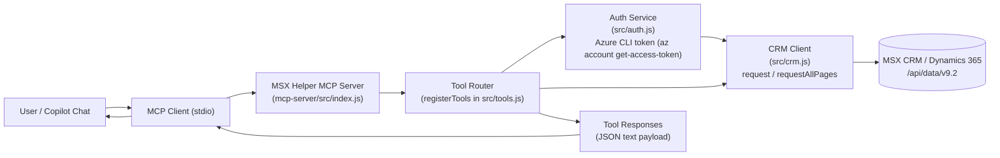
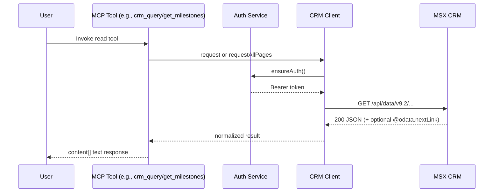
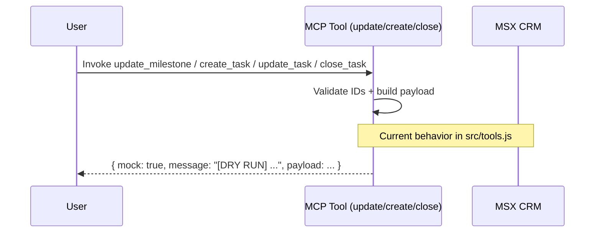

# MSX Helper MCP — Architecture (CRM + WorkIQ MCP usage)

This document describes how MCP-based workflows should split retrieval between MSX (Dynamics 365 CRM) and WorkIQ (Microsoft 365 data such as Teams, meetings, Outlook, and SharePoint/OneDrive).

## System Overview

## MCP Routing Model (Recommended)

- Use `msx-crm` tools for structured CRM entities and write-intent planning:
  - opportunities, milestones, tasks, owners, statuses, dates, and dry-run updates.
- Use WorkIQ MCP (`ask_work_iq`) for M365 collaboration evidence:
  - Teams chats/channels, meeting transcripts/notes, Outlook email/calendar, SharePoint/OneDrive files.
- Keep systems distinct in outputs:
  - CRM = system-of-record state.
  - WorkIQ = supporting evidence and context.

## Read Path (Current)

Read tools call `crmClient.request(...)` or `crmClient.requestAllPages(...)`, which:
- Ensure auth through `authService.ensureAuth()`.
- Build CRM OData URL: `<crmUrl>/api/data/v9.2/<entityPath>`.
- Execute GET with retry/timeout handling.
- Return parsed JSON payload to MCP client.

### Primary Read Tools
- `crm_auth_status`, `crm_whoami`
- `crm_query`, `crm_get_record`
- `list_accounts_by_tpid`, `list_opportunities`
- `get_milestones`, `get_milestone_activities`
- `get_task_status_options`

## Update Path (Current Implementation)

Update-oriented tools validate inputs and build payloads but currently return dry-run previews (`mock: true`) and do **not** write to CRM.

### Update-Oriented Tools (Dry Run)
- `create_task`
- `update_task`
- `close_task`
- `update_milestone`

## Planned Approval-Based Write Flow

`mcp-server/STAGED_OPERATIONS.md` describes a staged pattern (`stage -> review -> execute`) for safe production writes:
- Stage operation with preview.
- User approves/cancels.
- Execute approved operation against CRM.

This is design guidance and not yet wired into `src/tools.js`.

## Key Implementation Files
- `mcp-server/src/index.js` — server bootstrap and stdio transport.
- `mcp-server/src/tools.js` — MCP tool contracts and dry-run update behavior.
- `mcp-server/src/auth.js` — Azure CLI token acquisition and token metadata.
- `mcp-server/src/crm.js` — OData request layer, retries, pagination.

## Companion WorkIQ Pattern

When user asks for cross-source evidence (for example, “summarize customer blockers from meetings + Teams + docs + email”):
1. Build a scoped fact map (goal, entities, timeframe, source types).
2. Run WorkIQ retrieval first for M365 evidence.
3. Read CRM milestones/tasks with `msx-crm` tools.
4. Return a joined output with explicit sections for `CRM facts` and `M365 evidence`.
