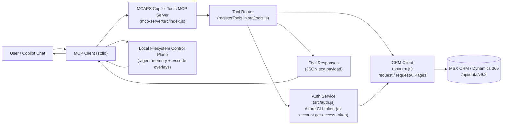
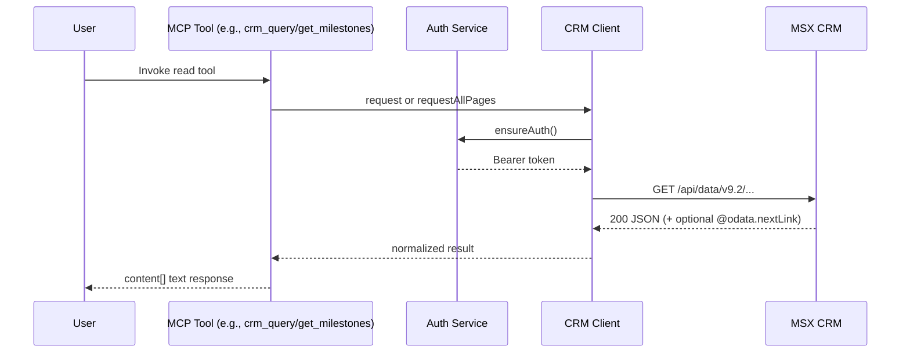
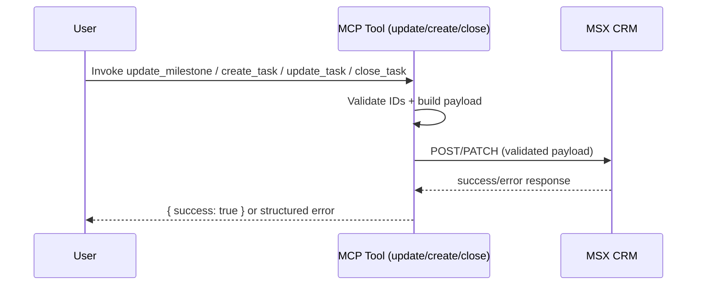

# MCAPS Copilot Tools — Architecture (CRM + WorkIQ MCP usage)

This document describes how MCP-based workflows should split retrieval between MSX (Dynamics 365 CRM) and WorkIQ (Microsoft 365 data such as Teams, meetings, Outlook, and SharePoint/OneDrive).

Copilot CLI is an ideal integration point for these workflows, where role skills, `msx-crm` tools, and WorkIQ retrieval (`ask_work_iq`) can be composed in one operational loop.

## System Overview

## Local Filesystem as Orchestration Substrate

For this repository, orchestration state is intentionally local-first and workspace-bound.

- `.agent-memory/` stores session/working/durable memory used to continue and shape runs.
- `.vscode/mcp.json` is the MCP baseline and `.vscode/mcp.runtime.overlay.json` is runtime delta.
- Copilot CLI session continuity and UI hydration rely on these files, not a remote persistence service.

### Reliability Constraints

- Use atomic file updates for JSON state artifacts (write temp then rename).
- Guard concurrent writes with per-resource locks and deterministic same-thread queue behavior.
- Validate and sanitize all filesystem paths to remain under repo root.
- If a persistence file is corrupt/unavailable, continue read-only/degraded and surface diagnostics.

## MCP Routing Model (Recommended)

- Use `msx-crm` tools for structured CRM entities and write-intent planning:
  - opportunities, milestones, tasks, owners, statuses, dates, and dry-run updates.
- Use WorkIQ MCP (`ask_work_iq`) for M365 collaboration evidence:
  - Teams chats/channels, meeting transcripts/notes, Outlook email/calendar, SharePoint/OneDrive files.
- Keep systems distinct in outputs:
  - CRM = system-of-record state.
  - WorkIQ = supporting evidence and context.

## Role-Skill Binding + Context Stack Transparency

- Selected workflow role must map to local skill file under `.github/skills/<Role>_SKILL.md`.
- Execution context should explicitly include the resolved skill contract alongside user prompt and repo instructions.
- UI should expose a collapsible Context Stack panel showing:
  - active role and mapped skill file,
  - key prompt/context blocks used for orchestration,
  - provenance labels (`user input`, `repo instruction`, `skill`, `derived`).

## Read Path (Current)

Read tools call `crmClient.request(...)` or `crmClient.requestAllPages(...)`, which:
- Ensure auth through `authService.ensureAuth()`.
- Build CRM OData URL: `<crmUrl>/api/data/v9.2/<entityPath>`.
- Execute GET with retry/timeout handling.
- Return parsed JSON payload to MCP client.

### Primary Read Tools
- `crm_auth_status`, `crm_whoami`
- `crm_query`, `crm_get_record`
- `list_accounts_by_tpid`, `list_opportunities`
- `get_milestones`, `get_milestone_activities`
- `get_task_status_options`

## Update Path (Current Implementation)

Update-oriented tools validate inputs and execute CRM write operations.

### Update-Oriented Tools
- `create_task`
- `update_task`
- `close_task`
- `update_milestone`

## Planned Approval-Based Write Flow

`mcp-server/STAGED_OPERATIONS.md` describes a staged pattern (`stage -> review -> execute`) for safe production writes:
- Stage operation with preview.
- User approves/cancels.
- Execute approved operation against CRM.

This is design guidance and not yet wired into `src/tools.js`.

## Key Implementation Files
- `mcp-server/src/index.js` — server bootstrap and stdio transport.
- `mcp-server/src/tools.js` — MCP tool contracts and dry-run update behavior.
- `mcp-server/src/auth.js` — Azure CLI token acquisition and token metadata.
- `mcp-server/src/crm.js` — OData request layer, retries, pagination.

## Companion WorkIQ Pattern

When user asks for cross-source evidence (for example, “summarize customer blockers from meetings + Teams + docs + email”):
1. Build a scoped fact map (goal, entities, timeframe, source types).
2. Run WorkIQ retrieval first for M365 evidence.
3. Read CRM milestones/tasks with `msx-crm` tools.
4. Return a joined output with explicit sections for `CRM facts` and `M365 evidence`.

## Copilot CLI Example Flow (Simple)

Use this when you want one practical loop with minimal setup overhead.

1. Open Copilot CLI in this repo (`copilot`) where MCP servers are already configured.
2. State role + objective in one line (example: “Role: Solution Engineer. Summarize blocker risk for Contoso this week.”).
3. Ask for WorkIQ evidence first (`ask_work_iq`) limited to timeframe + source types.
4. Ask for CRM facts second (`msx-crm` milestones/tasks/opportunity status).
5. Ask for a final merged brief in two sections only: `CRM facts` and `M365 evidence`.

For write-intent changes, keep the same flow but require explicit approval before any create/update/close action.

## References

- WorkIQ overview: https://learn.microsoft.com/en-us/microsoft-365-copilot/extensibility/workiq-overview
